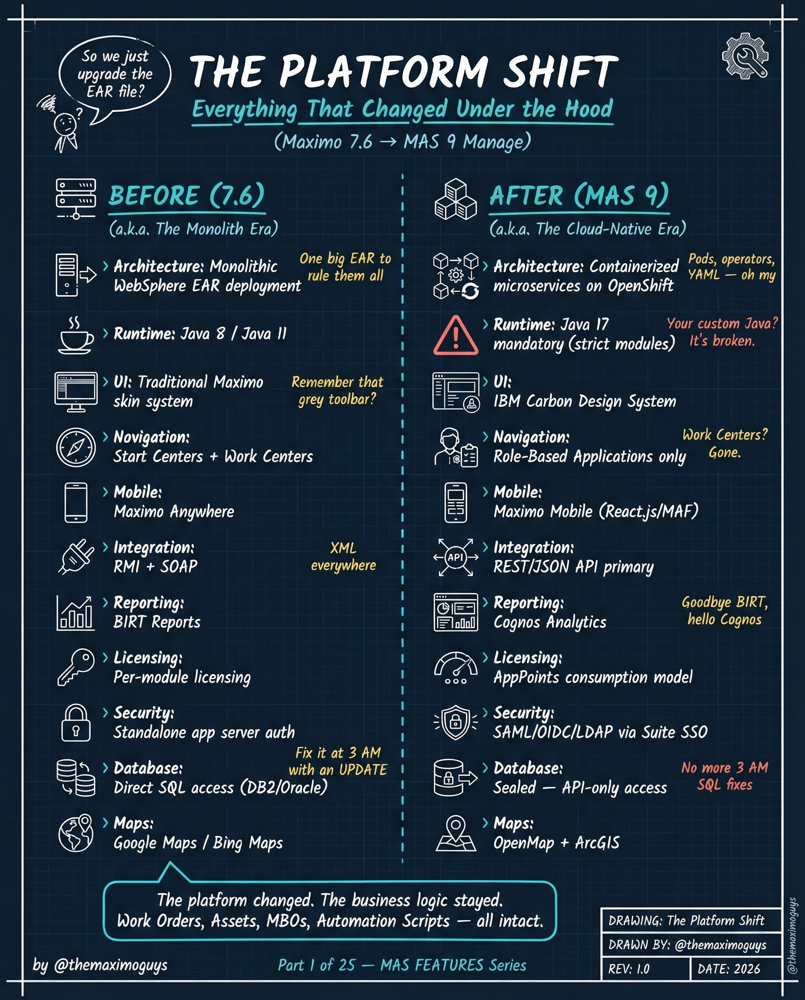

# Platform Shift

**Monday, 2026-03-30** | **MAS Features**

---

## Image



---

## Post Copy

```
Everything changed under the hood.

Maximo 7.6 to MAS 9 isn't an upgrade. It's a re-architecture.

Here's what shifted:

→ Monolithic EAR on WebSphere → Containerized microservices on OpenShift
→ Java 8 runtime → Java 17 mandatory (strict modules)
→ Traditional skin system → IBM Carbon Design System
→ Start Centers + Work Centers → Role-Based Applications only
→ RMI + SOAP integration → REST/JSON API primary
→ BIRT Reports → Cognos Analytics
→ Direct SQL database access → Sealed, API-only access
→ Google Maps / Bing Maps → OpenMap + ArcGIS

The business logic stayed. Work Orders, Assets, MBOs, Automation Scripts — all intact.

But the platform beneath them? Completely different.

Save this. Share it with your team.

#IBMMaximo #MAS #DigitalTransformation #TheMaximoGuys
```

---

## First Comment

```
Full deep-dive: https://themaximoguys.ai/blog/mas-features-platform-shift

This is Part 1 of our 25-part MAS Features series — the most comprehensive breakdown of what changed between Maximo 7.6 and MAS 9.

@IBM @IBM Maximo

What was the biggest surprise when you first opened MAS 9?

#AssetManagement #EAM #CloudMigration #CMMS
```

---

## Blog Link

https://themaximoguys.ai/blog/mas-features-platform-shift

---

## Publishing Checklist

- [ ] Review post copy
- [ ] Review image
- [ ] Approve in Notion
- [ ] Publish via tool
- [ ] Verify post live
- [ ] Update Notion → POSTED
