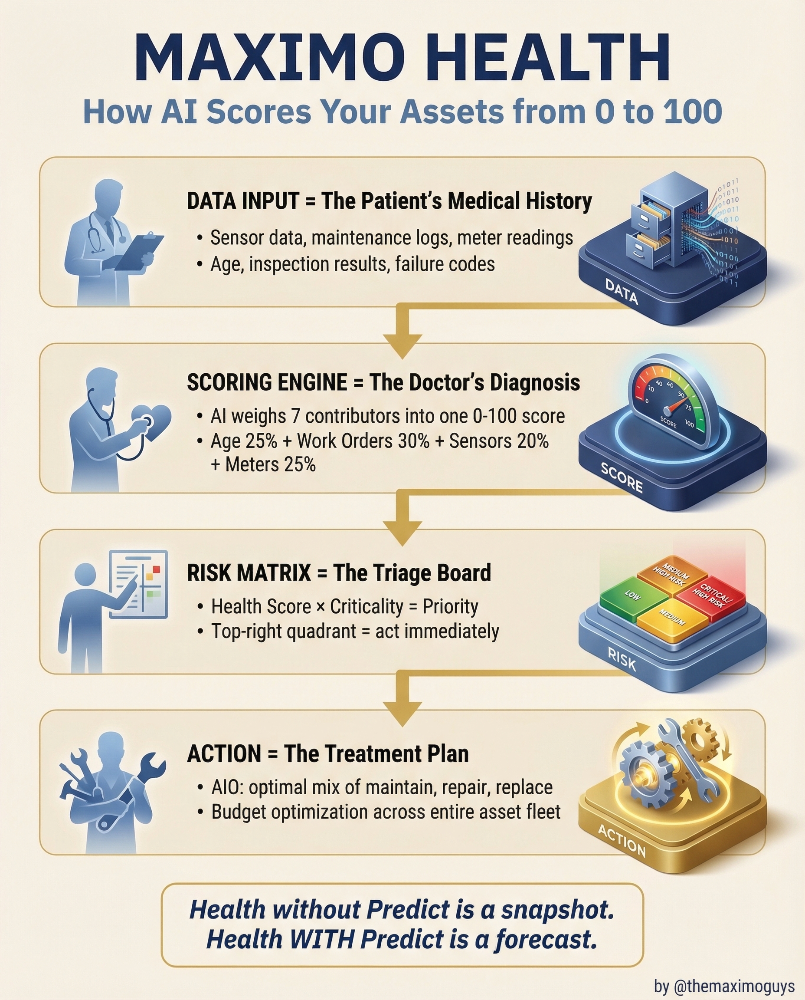

# Maximo Health

**Tuesday, 2026-03-31** | **MAS Features**

---

## Image



---

## Post Copy

```
Your assets have a health score. Are you using it?

Maximo Health scores every asset from 0 to 100 — like a doctor's checkup for your equipment.

Here's how the pipeline works:

→ Data Input: Sensor data, maintenance logs, meter readings, inspection results, failure codes
→ Scoring Engine: AI weighs 7 contributors — Age 25% + Work Orders 30% + Sensors 20% + Meters 25%
→ Risk Matrix: Health Score x Criticality = Priority (top-right quadrant = act immediately)
→ Action: AIO calculates optimal mix of maintain, repair, or replace across your fleet

The key insight most teams miss:

Health without Predict is a snapshot.
Health WITH Predict is a forecast.

Save this. Share it with your team.

#IBMMaximo #PredictiveMaintenance #AssetManagement #TheMaximoGuys
```

---

## First Comment

```
Full deep-dive: https://themaximoguys.ai/blog/mas-features-maximo-health

Part 10 of our MAS Features series covering Health scoring, risk matrices, and investment optimization.

@IBM @IBM Maximo

Are you using Health scores to drive maintenance decisions, or still relying on calendar-based PMs?

#EAM #ReliabilityEngineering #IndustrialIoT #Industry40
```

---

## Blog Link

https://themaximoguys.ai/blog/mas-features-maximo-health

---

## Publishing Checklist

- [ ] Review post copy
- [ ] Review image
- [ ] Approve in Notion
- [ ] Publish via tool
- [ ] Verify post live
- [ ] Update Notion → POSTED
