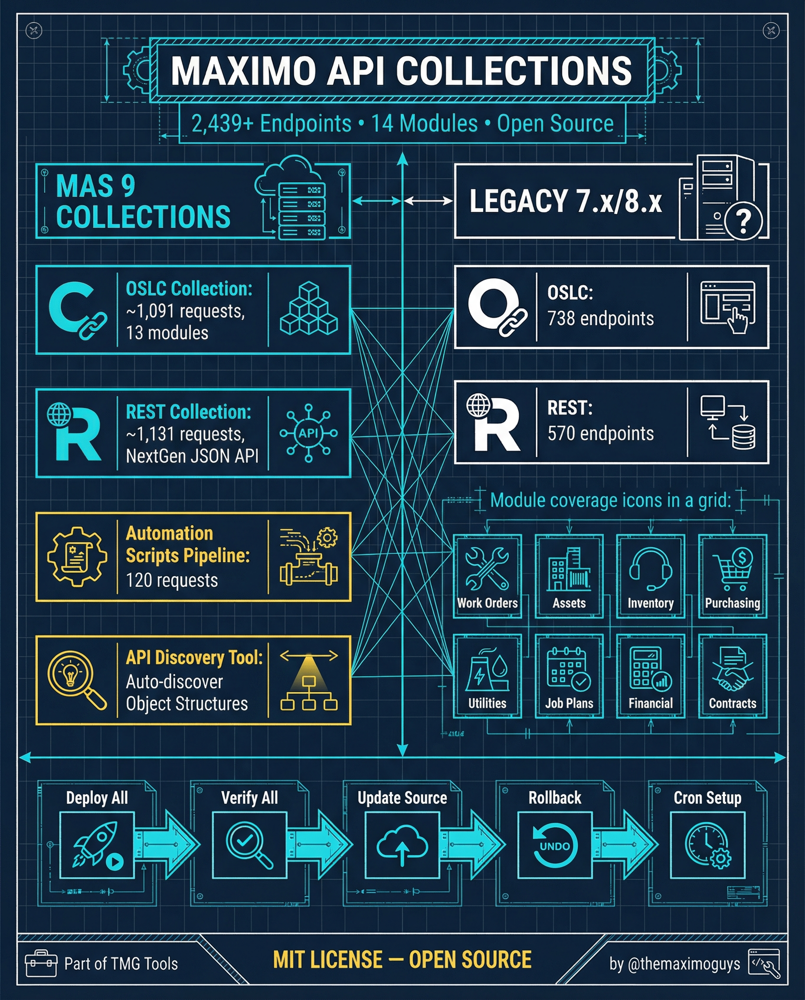

# Maximo API Collections

**Wednesday, 2026-04-01** | **TMG Tools**

---

## Image



---

## Post Copy

```
2,439+ endpoints. 14 modules. 2 generations. MIT license.

We built the most comprehensive Postman collection for IBM Maximo APIs — and it's open source.

What's inside:

→ MAS 9 OSLC Collection: ~1,091 requests across 13 modules
→ MAS 9 REST Collection: ~1,131 requests, NextGen JSON API
→ Original 7.x/8.x OSLC: 738 endpoints for legacy systems
→ Original 7.x/8.x REST: 570 endpoints
→ Automation Scripts Pipeline: 120 requests — deploy, verify, validate, rollback
→ API Discovery Tool: Auto-discover all Object Structures

Module coverage spans Work Orders, Assets, Inventory, Service Desk, Purchasing, Utilities, PM, Job Plans, Financial, Contracts, and more.

Deploy All → Verify All → Update Source → Rollback → Cron Setup

Save this. Share it with your team.

#IBMMaximo #API #AssetManagement #TheMaximoGuys
```

---

## First Comment

```
Full details and download: https://themaximoguys.ai/blog/mas-features-series-index

@IBM @IBM Maximo

If your Maximo dev team is still building API calls from scratch, send them this repo. You'll be their favorite person for a week.

#REST #OSLC #EAM #CMMS #OpenSource
```

---

## Blog Link

https://themaximoguys.ai/blog/mas-features-series-index

---

## Publishing Checklist

- [ ] Review post copy
- [ ] Review image
- [ ] Approve in Notion
- [ ] Publish via tool
- [ ] Verify post live
- [ ] Update Notion → POSTED
