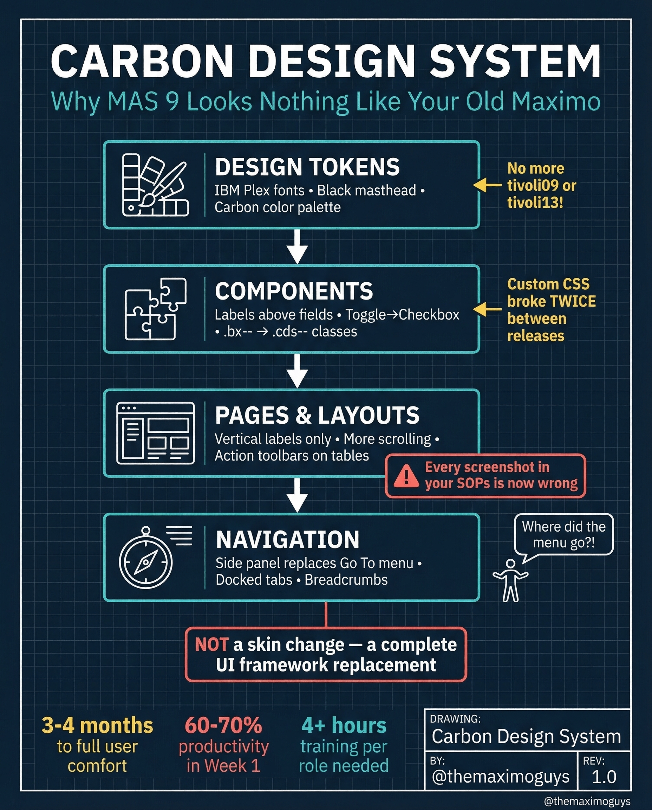

# Carbon Design System UI

**Thursday, 2026-04-02** | **MAS Features**

---

## Image



---

## Post Copy

```
MAS 9 looks nothing like your old Maximo. Here's why.

It's NOT a skin change. It's a complete UI framework replacement.

The Carbon Design System changed everything:

→ Design Tokens: IBM Plex fonts, black masthead, Carbon color palette
→ Components: Labels above fields, toggle replaces checkbox, .bx-- becomes .cds-- classes
→ Pages & Layouts: Vertical labels only, more scrolling, action toolbars on tables
→ Navigation: Side panel replaces Go To menu, docked tabs, breadcrumbs

What this means for your team:

→ 3-4 months to full user comfort
→ 60-70% productivity in Week 1
→ 4+ hours of training per role needed
→ Every screenshot in your SOPs is now wrong

Custom CSS broke TWICE between releases. Plan for it.

Save this. Share it with your team.

#IBMMaximo #MAS #EAM #TheMaximoGuys
```

---

## First Comment

```
Full deep-dive: https://themaximoguys.ai/blog/mas-features-carbon-design-ui

Part 2 of our 25-part MAS Features series — understanding the Carbon Design System impact.

@IBM @IBM Maximo

How long did it take your users to get comfortable with the new UI?

#DigitalTransformation #AssetManagement #CMMS
```

---

## Blog Link

https://themaximoguys.ai/blog/mas-features-carbon-design-ui

---

## Publishing Checklist

- [ ] Review post copy
- [ ] Review image
- [ ] Approve in Notion
- [ ] Publish via tool
- [ ] Verify post live
- [ ] Update Notion → POSTED
