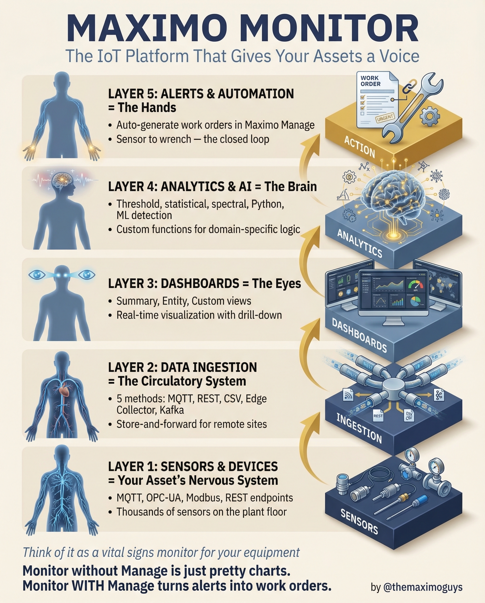

# Maximo Monitor

**Friday, 2026-04-03** | **MAS Features**

---

## Image



---

## Post Copy

```
Your assets are talking. Maximo Monitor lets you listen.

Monitor is the IoT platform that gives your equipment a voice — from sensor to work order in a closed loop.

The 5-layer architecture:

→ Layer 1 — Sensors & Devices: MQTT, OPC-UA, Modbus, REST endpoints, thousands on the plant floor
→ Layer 2 — Data Ingestion: 5 methods (MQTT, REST, CSV, Edge Collector, Kafka) with store-and-forward
→ Layer 3 — Dashboards: Summary, Entity, Custom views with real-time drill-down
→ Layer 4 — Analytics & AI: Threshold, statistical, spectral, Python, ML detection
→ Layer 5 — Alerts & Automation: Auto-generate work orders in Maximo Manage

The key insight:

Monitor without Manage is just pretty charts.
Monitor WITH Manage turns alerts into work orders.

Save this. Share it with your team.

#IBMMaximo #IndustrialIoT #PredictiveMaintenance #TheMaximoGuys
```

---

## First Comment

```
Full deep-dive: https://themaximoguys.ai/blog/mas-features-maximo-monitor

Part 11 of our MAS Features series covering the complete Monitor architecture.

@IBM @IBM Maximo

What's your biggest challenge with IoT data — getting it in, or getting value out?

#AssetManagement #Industry40 #EAM #ConditionMonitoring
```

---

## Blog Link

https://themaximoguys.ai/blog/mas-features-maximo-monitor

---

## Publishing Checklist

- [ ] Review post copy
- [ ] Review image
- [ ] Approve in Notion
- [ ] Publish via tool
- [ ] Verify post live
- [ ] Update Notion → POSTED
