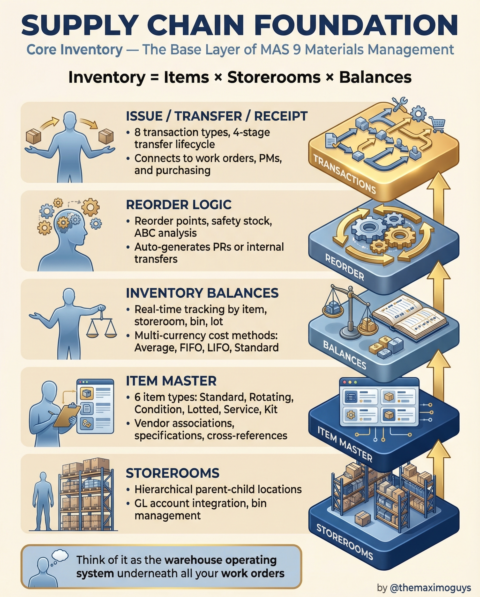

# Supply Chain Foundation

**Saturday, 2026-04-04** | **MAS Features**

---

## Image



---

## Post Copy

```
Every work order depends on parts. Every part depends on this.

Maximo's supply chain foundation is the warehouse operating system underneath all your maintenance operations.

The core building blocks:

→ Item Master: 6 item types (Standard, Rotating, Condition, Lotted, Service, Kit) with vendor associations and cross-references
→ Storerooms: Hierarchical parent-child locations, GL account integration, bin management
→ Inventory Balances: Real-time tracking by item, storeroom, bin, lot with multi-currency cost methods
→ Reorder Logic: Reorder points, safety stock, ABC analysis — auto-generates PRs or internal transfers
→ Issue / Transfer / Receipt: 8 transaction types, 4-stage transfer lifecycle connecting to work orders and purchasing

Inventory = Items x Storerooms x Balances.

Save this. Share it with your team.

#IBMMaximo #SupplyChain #AssetManagement #TheMaximoGuys
```

---

## First Comment

```
Full deep-dive: https://themaximoguys.ai/blog/mas-features-supply-chain-core-inventory

Part 21 of our MAS Features series — the complete materials management foundation.

@IBM @IBM Maximo

Is your storeroom running you, or are you running your storeroom?

#EAM #MRO #InventoryManagement #CMMS
```

---

## Blog Link

https://themaximoguys.ai/blog/mas-features-supply-chain-core-inventory

---

## Publishing Checklist

- [ ] Review post copy
- [ ] Review image
- [ ] Approve in Notion
- [ ] Publish via tool
- [ ] Verify post live
- [ ] Update Notion → POSTED
