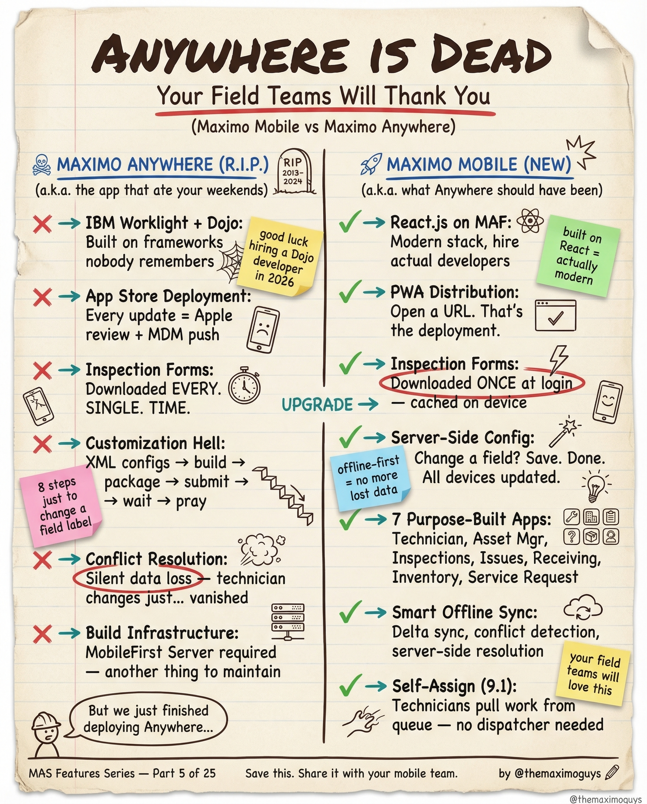

# Maximo Mobile

**Sunday, 2026-04-05** | **MAS Features**

---

## Image



---

## Post Copy

```
Maximo Anywhere is dead. Your field teams will thank you.

Maximo Mobile isn't just a replacement — it's what Anywhere should have been from day one.

What died (good riddance):

→ IBM Worklight + Dojo frameworks nobody remembers
→ App Store deployments — every update needed Apple/MDM approval
→ Inspection Forms downloaded EVERY. SINGLE. TIME.
→ Customization Hell: XML configs → build → package → submit → wait → pray
→ MobileFirst Server required — another thing to maintain

What replaced it:

→ React.js on MAF: Modern stack, built-in offline, hire actual developers
→ PWA Distribution: Open a URL, that's the deployment
→ Server-Side Config: Change a field? Save. Done. All devices updated.
→ 7 Purpose-Built Apps: Technician, Asset Mgr, Inspections, Issues, Receiving, Inventory, Service Request
→ Smart Offline Sync: Delta sync, conflict detection, server-side resolution

Save this. Share it with your mobile team.

#IBMMaximo #MobileMaintenance #EAM #TheMaximoGuys
```

---

## First Comment

```
Full deep-dive: https://themaximoguys.ai/blog/mas-features-maximo-mobile

Part 5 of our MAS Features series — the complete Maximo Mobile breakdown.

@IBM @IBM Maximo

How many hours per week does your team waste on Anywhere deployment issues?

#AssetManagement #FieldService #CMMS #DigitalTransformation
```

---

## Blog Link

https://themaximoguys.ai/blog/mas-features-maximo-mobile

---

## Publishing Checklist

- [ ] Review post copy
- [ ] Review image
- [ ] Approve in Notion
- [ ] Publish via tool
- [ ] Verify post live
- [ ] Update Notion → POSTED
