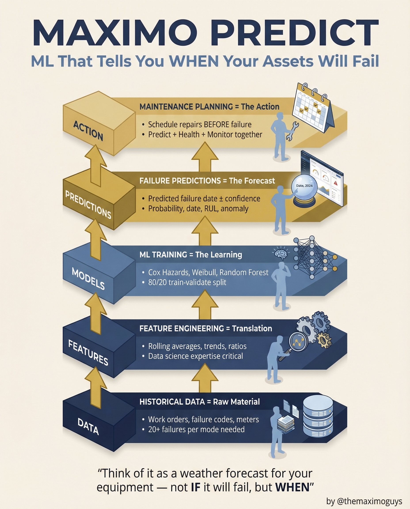

# Maximo Predict

**Monday, 2026-04-06** | **MAS Features**

---

## Image



---

## Post Copy

```
Stop asking IF your assets will fail. Start asking WHEN.

Maximo Predict is machine learning that tells you when your equipment will fail — before it happens.

The 5-stage pipeline:

→ Historical Data: Work orders, failure codes, meters — need 20+ failures per mode
→ Feature Engineering: Rolling averages, trends, ratios — data science expertise critical
→ ML Training: Cox Hazards, Weibull, Random Forest with 80/20 train-validate split
→ Failure Predictions: Predicted failure date + confidence, probability, RUL, anomaly detection
→ Maintenance Planning: Schedule repairs BEFORE failure, combining Predict + Health + Monitor

Think of it as a weather forecast for your equipment.

Not IF it will fail, but WHEN.

Save this. Share it with your team.

#IBMMaximo #PredictiveMaintenance #ArtificialIntelligence #TheMaximoGuys
```

---

## First Comment

```
Full deep-dive: https://themaximoguys.ai/blog/mas-features-maximo-predict

Part 12 of our MAS Features series — the ML pipeline behind predictive maintenance.

@IBM @IBM Maximo

What's stopping your organization from moving beyond calendar-based PMs?

#MachineLearning #IndustrialIoT #AssetManagement #ReliabilityEngineering
```

---

## Blog Link

https://themaximoguys.ai/blog/mas-features-maximo-predict

---

## Publishing Checklist

- [ ] Review post copy
- [ ] Review image
- [ ] Approve in Notion
- [ ] Publish via tool
- [ ] Verify post live
- [ ] Update Notion → POSTED
