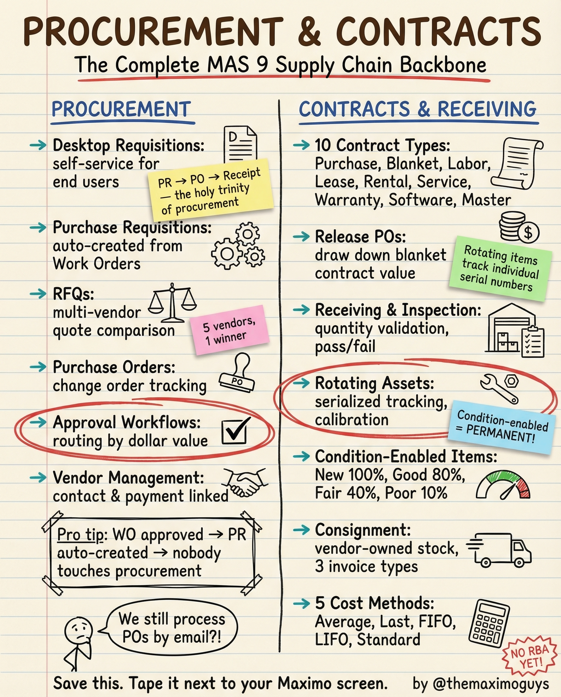

# Procurement & Contracts

**Tuesday, 2026-04-07** | **MAS Features**

---

## Image



---

## Post Copy

```
Procurement in Maximo is more powerful than most teams realize.

From desktop requisitions to 10 contract types to 5 cost methods — here's the complete supply chain backbone.

Procurement side:

→ Desktop Requisitions: Self-service for end users
→ Purchase Requisitions: Auto-created from Work Orders
→ RFQs: Multi-vendor quote comparison
→ Purchase Orders: Change order tracking
→ Approval Workflows: Routing by dollar value
→ Vendor Management: Contact & payment linked

Contracts & Receiving:

→ 10 Contract Types: Purchase, Blanket, Labor, Lease, Rental, Service, Warranty, Software, Master
→ Receiving & Inspection: Quantity validation, pass/fail
→ Rotating Assets: Serialized tracking, calibration
→ Condition-Enabled Items: New 100%, Good 80%, Fair 40%, Poor 10%
→ 5 Cost Methods: Average, Last, FIFO, LIFO, Standard

Pro tip: WO approved → PR auto-created → nobody touches procurement.

Save this. Share it with your team.

#IBMMaximo #Procurement #SupplyChain #TheMaximoGuys
```

---

## First Comment

```
Full deep-dive: https://themaximoguys.ai/blog/mas-features-procurement-contracts-receiving

Part 22 of our MAS Features series — procurement, contracts, and receiving.

@IBM @IBM Maximo

Are you still processing POs by email?

#EAM #AssetManagement #MRO #CMMS
```

---

## Blog Link

https://themaximoguys.ai/blog/mas-features-procurement-contracts-receiving

---

## Publishing Checklist

- [ ] Review post copy
- [ ] Review image
- [ ] Approve in Notion
- [ ] Publish via tool
- [ ] Verify post live
- [ ] Update Notion → POSTED
