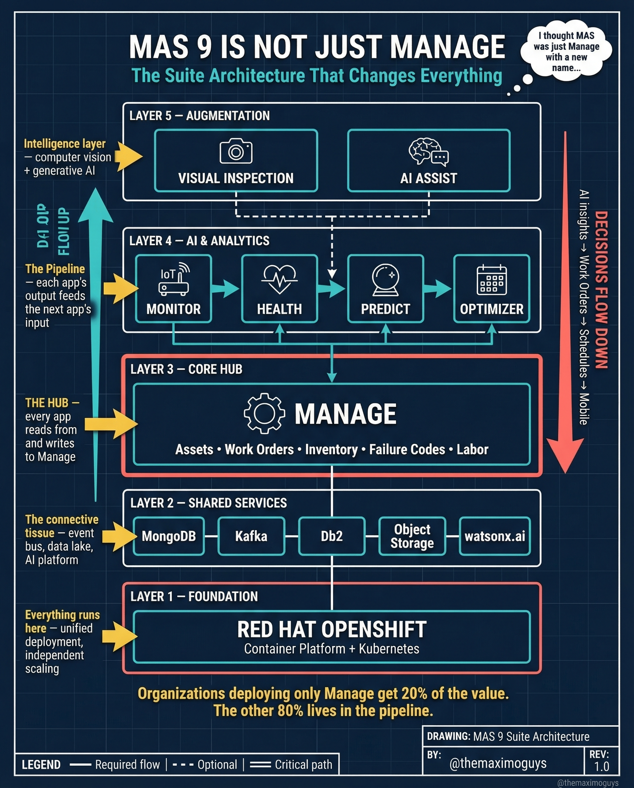

# Suite Architecture

**Wednesday, 2026-04-08** | **MAS Features**

---

## Image



---

## Post Copy

```
MAS 9 is not just Manage. And if you're only deploying Manage, you're getting 25% of the value.

The suite architecture has 5 layers:

→ Layer 1 — Foundation: Red Hat OpenShift (Container Platform + Kubernetes)
→ Layer 2 — Shared Services: MongoDB, Kafka, DB2, Object Storage, watsonx.ai
→ Layer 3 — Core Hub: Manage (Assets, Work Orders, Inventory, Failure Codes, Labor)
→ Layer 4 — AI & Analytics: Monitor, Health, Predict, Optimizer
→ Layer 5 — Augmentation: Visual Inspection, AI Assist

Every app reads and writes to Manage. Every output feeds the next app's input.

The pipeline flows UP — data enters through Manage, gets enriched by Monitor, scored by Health, predicted by Predict, and optimized by Optimizer.

Organizations deploying only Manage get 25% of the value. The other 80% lives in the pipeline.

Save this. Share it with your team.

#IBMMaximo #MAS #AssetManagement #TheMaximoGuys
```

---

## First Comment

```
Full deep-dive: https://themaximoguys.ai/blog/mas-features-suite-architecture-pipeline

Part 9 of our MAS Features series — the complete suite architecture explained.

@IBM @IBM Maximo

How many MAS modules is your organization actually using today?

#EAM #DigitalTransformation #Industry40 #CMMS
```

---

## Blog Link

https://themaximoguys.ai/blog/mas-features-suite-architecture-pipeline

---

## Publishing Checklist

- [ ] Review post copy
- [ ] Review image
- [ ] Approve in Notion
- [ ] Publish via tool
- [ ] Verify post live
- [ ] Update Notion → POSTED
