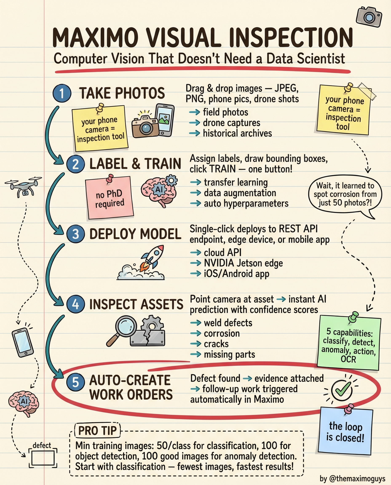

# Visual Inspection

**Thursday, 2026-04-09** | **MAS Features**

---

## Image



---

## Post Copy

```
Computer vision that doesn't need a data scientist.

Maximo Visual Inspection takes you from photo to automated work order in 5 steps:

→ Step 1 — Take Photos: Drag & drop images — JPEG, PNG, phone pics, drone shots, field photos, historical archives
→ Step 2 — Label & Train: Assign labels, draw bounding boxes, click TRAIN. Transfer learning + data augmentation + auto hyperparameters
→ Step 3 — Deploy Model: Single-click deploys to REST API, edge device, or mobile app (cloud, NVIDIA Jetson, iOS/Android)
→ Step 4 — Inspect Assets: Point camera at asset → instant AI prediction with confidence scores for weld defects, corrosion, cracks, missing parts
→ Step 5 — Auto-Create Work Orders: Defect found → evidence attached → follow-up work triggered automatically in Maximo

The loop is closed. No PhD required.

Pro tip: Start with classification — fewest images, fastest results.

Save this. Share it with your team.

#IBMMaximo #ComputerVision #ArtificialIntelligence #TheMaximoGuys
```

---

## First Comment

```
Full deep-dive: https://themaximoguys.ai/blog/mas-features-visual-inspection

Part 13 of our MAS Features series — the complete Visual Inspection workflow.

@IBM @IBM Maximo

Have you deployed visual inspection in the field yet? What was your biggest challenge?

#PredictiveMaintenance #Industry40 #IndustrialIoT #AssetManagement
```

---

## Blog Link

https://themaximoguys.ai/blog/mas-features-visual-inspection

---

## Publishing Checklist

- [ ] Review post copy
- [ ] Review image
- [ ] Approve in Notion
- [ ] Publish via tool
- [ ] Verify post live
- [ ] Update Notion → POSTED
