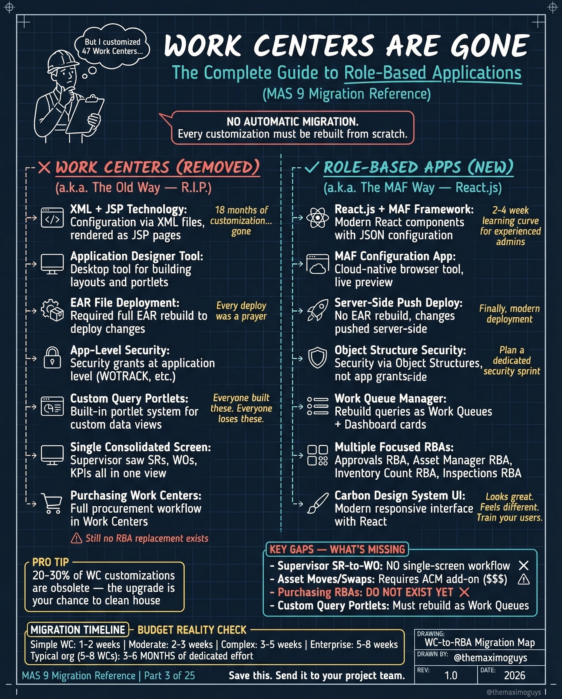

# Work Centers to RBAs

**Friday, 2026-04-10** | **MAS Features**

---

## Image



---

## Post Copy

```
Work Centers are gone. Every customization must be rebuilt from scratch.

MAS 9 replaced Work Centers with Role-Based Applications (RBAs). No automatic migration.

What was removed:

→ XML + JSP Technology: Configuration via XML files, rendered as JSP pages
→ Application Designer Tool: Desktop tool for building layouts and portlets
→ EAR File Deployment: Traditional EAR rebuild for every deploy change
→ App-Level Security: Security grants at application level (WOTRKACK, etc.)
→ Custom Query Portlets & Single Consolidated Screens

What replaced it:

→ React.js + MAF Framework: Modern React components with JSON configuration
→ MAF Configuration App: Cloud-native browser tool with live preview
→ Server-Side Push Deploy: No EAR rebuild, changes pushed server-side
→ Object Structure Security: Security via Object Structures, not app grants
→ Work Queue Manager & Carbon Design System UI

Pro tip: 20-50% of WC customizations are obsolete — the upgrade is your chance to clean house.

Save this. Share it with your team.

#IBMMaximo #MAS #EAM #TheMaximoGuys
```

---

## First Comment

```
Full deep-dive: https://themaximoguys.ai/blog/mas-features-work-centers-rbas

Part 3 of our MAS Features series — the complete Work Centers to RBA migration reference.

@IBM @IBM Maximo

How many Work Center customizations does your organization have? How many are still needed?

#DigitalTransformation #AssetManagement #CMMS
```

---

## Blog Link

https://themaximoguys.ai/blog/mas-features-work-centers-rbas

---

## Publishing Checklist

- [ ] Review post copy
- [ ] Review image
- [ ] Approve in Notion
- [ ] Publish via tool
- [ ] Verify post live
- [ ] Update Notion → POSTED
