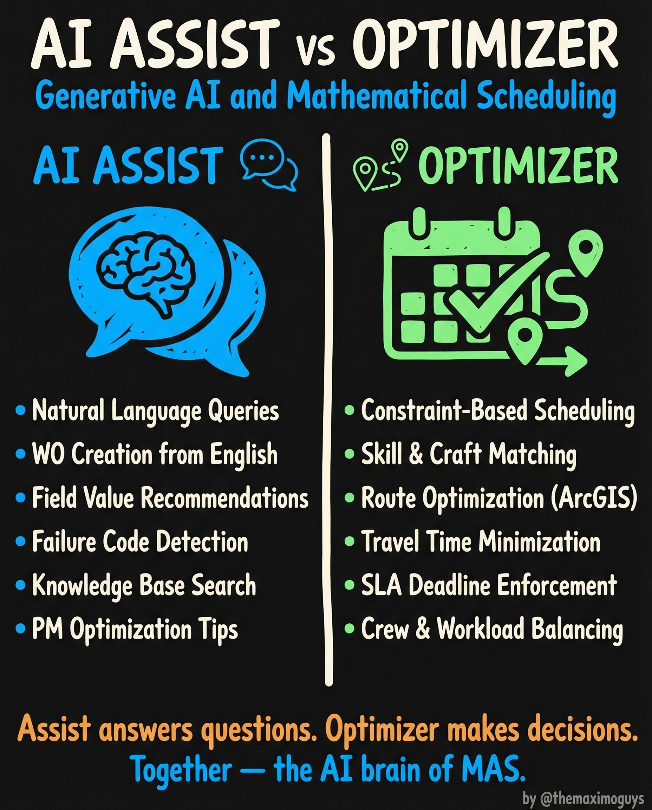

# AI Assist vs Optimizer

**Saturday, 2026-04-11** | **MAS Features**

---

## Image



---

## Post Copy

```
Two AI tools. Completely different jobs.

MAS 9 has AI Assist AND Optimizer. Most teams confuse them. Here's the difference:

AI Assist (the brain that answers):

→ Natural Language Queries
→ Work Order Creation from English
→ Field Value Recommendations
→ Failure Code Detection
→ Knowledge Base Search
→ PM Optimization Tips

Optimizer (the brain that decides):

→ Constraint-Based Scheduling
→ Skill & Craft Matching
→ Route Optimization (ArcGIS)
→ Travel Time Minimization
→ SLA Deadline Enforcement
→ Crew & Workload Balancing

Assist answers questions. Optimizer makes decisions.

Together — the AI brain of MAS.

Save this. Share it with your team.

#IBMMaximo #ArtificialIntelligence #AssetManagement #TheMaximoGuys
```

---

## First Comment

```
Full deep-dive: https://themaximoguys.ai/blog/mas-features-ai-assist-optimizer

Part 14 of our MAS Features series — generative AI and mathematical scheduling in MAS.

@IBM @IBM Maximo

Which would deliver more value for your team first — AI Assist or Optimizer?

#PredictiveMaintenance #Industry40 #EAM #Scheduling
```

---

## Blog Link

https://themaximoguys.ai/blog/mas-features-ai-assist-optimizer

---

## Publishing Checklist

- [ ] Review post copy
- [ ] Review image
- [ ] Approve in Notion
- [ ] Publish via tool
- [ ] Verify post live
- [ ] Update Notion → POSTED
