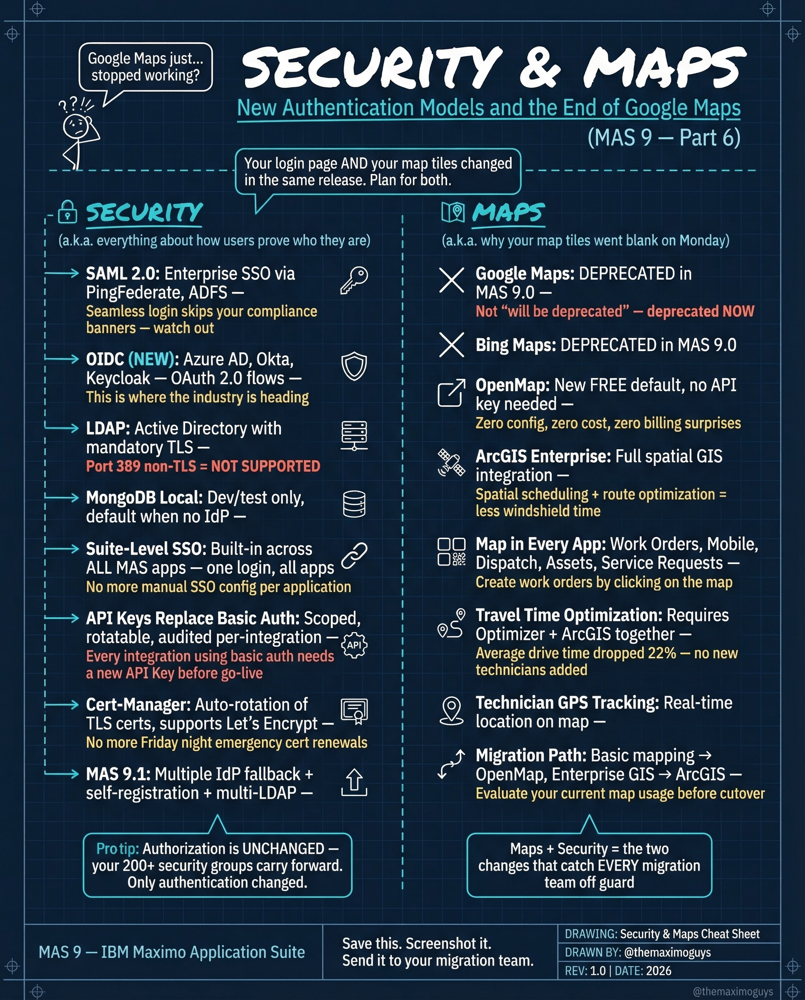

# Security & Maps

**Sunday, 2026-04-12** | **MAS Features**

---

## Image



---

## Post Copy

```
Your login page AND your map tiles changed in the same release. Plan for both.

MAS 9 overhauled authentication AND deprecated Google Maps and Bing Maps.

Security changes:

→ SAML 2.0: Enterprise SSO via PingFederate, ADFS — SaaS-first, watch banners
→ OIDC (NEW): Azure AD, Okta, KeyCloak — OAuth 2.0 flows, where the industry is heading
→ LDAP: Active Directory with replication TLS — but SP8 was NOT SUPPORTED
→ MongoDB Local: DevTest only, disabled when no DP
→ Suite-Level SSO: Built-in across ALL MAS apps — one login, all apps
→ API Key Replace Basic Auth: Scoped, rotatable, audited per-integration
→ Cert-Manager: Auto-rotation of TLS certs via Let's Encrypt

Maps migration:

→ Google Maps: DEPRECATED in MAS 9.0
→ Bing Maps: DEPRECATED in MAS 9.0
→ OpenMap: NOW FREE, no API key needed
→ ArcGIS Enterprise: Full spatial GIS integration

Save this. Send it to your migration team.

#IBMMaximo #CyberSecurity #AssetManagement #TheMaximoGuys
```

---

## First Comment

```
Full deep-dive: https://themaximoguys.ai/blog/mas-features-security-maps

Part 6 of our MAS Features series — authentication models and the end of Google Maps.

@IBM @IBM Maximo

Is your organization ready for OIDC, or still planning around LDAP?

#EAM #CloudMigration #DigitalTransformation #CMMS
```

---

## Blog Link

https://themaximoguys.ai/blog/mas-features-security-maps

---

## Publishing Checklist

- [ ] Review post copy
- [ ] Review image
- [ ] Approve in Notion
- [ ] Publish via tool
- [ ] Verify post live
- [ ] Update Notion → POSTED
