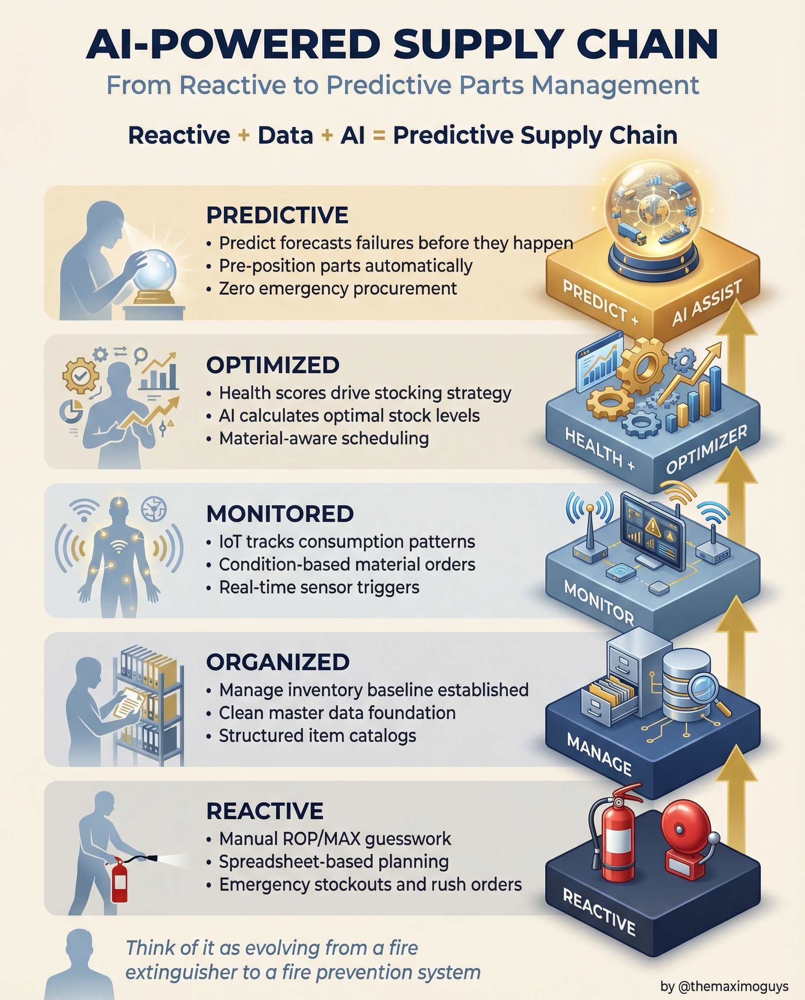

# AI Supply Chain

**Monday, 2026-04-13** | **MAS Features**

---

## Image



---

## Post Copy

```
Your supply chain is a fire extinguisher. It should be a fire prevention system.

AI-Powered Supply Chain in MAS takes you from reactive to predictive parts management in 5 stages:

→ Reactive: Manual ROP/MAX guesswork, spreadsheet-based planning, emergency stockouts and rush orders
→ Organized: Manage inventory baseline established, clean master data foundation, structured item catalogs
→ Monitored: IoT tracks consumption patterns, condition-based material orders, real-time sensor triggers
→ Optimized: Health scores drive stocking strategy, AI calculates optimal stock levels, material-aware scheduling
→ Predictive: Predict forecasts failures before they happen, pre-position parts automatically, zero emergency procurement

Reactive + Data + AI = Predictive Supply Chain.

Save this. Share it with your team.

#IBMMaximo #SupplyChain #ArtificialIntelligence #TheMaximoGuys
```

---

## First Comment

```
Full deep-dive: https://themaximoguys.ai/blog/mas-features-ai-supply-chain-pipeline

Part 24 of our MAS Features series — the AI-powered supply chain maturity pipeline.

@IBM @IBM Maximo

What stage is your supply chain at today — reactive, organized, or somewhere in between?

#PredictiveMaintenance #MRO #AssetManagement #EAM
```

---

## Blog Link

https://themaximoguys.ai/blog/mas-features-ai-supply-chain-pipeline

---

## Publishing Checklist

- [ ] Review post copy
- [ ] Review image
- [ ] Approve in Notion
- [ ] Publish via tool
- [ ] Verify post live
- [ ] Update Notion → POSTED
