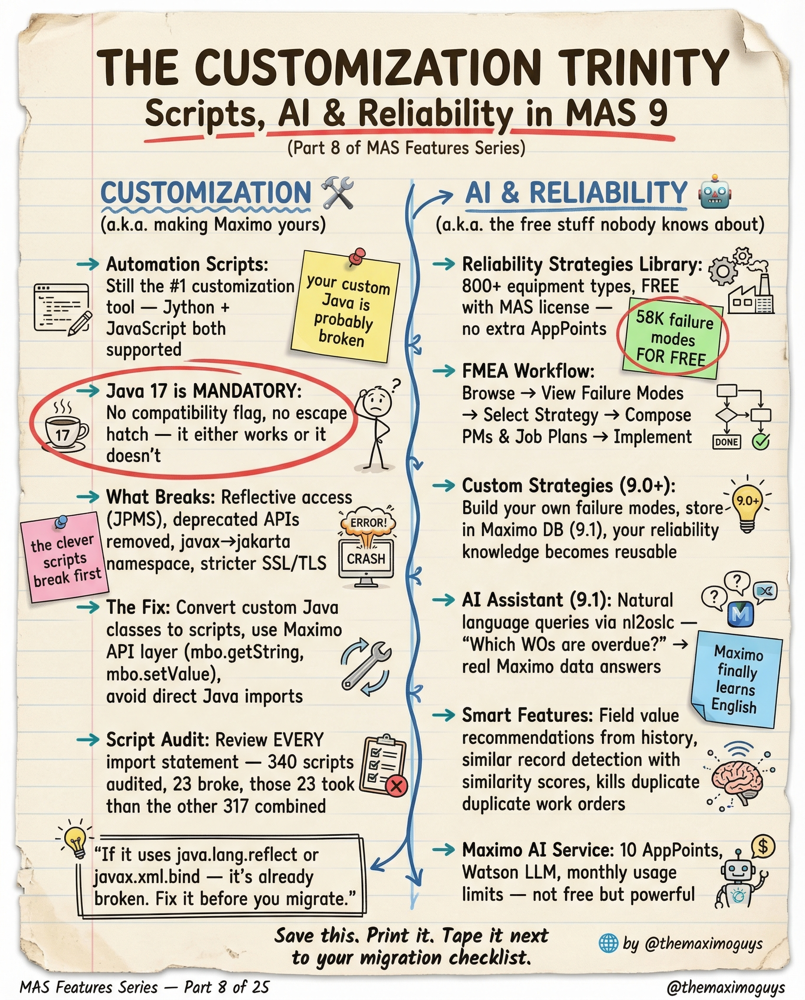

# Scripts, AI & Reliability

**Tuesday, 2026-04-14** | **MAS Features**

---

## Image



---

## Post Copy

```
The Customization Trinity: Scripts, AI, and Reliability in MAS 9.

Customization in MAS looks nothing like 7.6. And the free AI tools nobody knows about? Game-changing.

Customization (making Maximo yours):

→ Automation Scripts: Still the #1 tool — Python AND JavaScript both supported
→ Java 17 is MANDATORY: No compatibility flag, no escape hatch — it either works or it doesn't
→ What Breaks: Reflective access (JPMS), removed java.xml.*, stricter SSL/TLS
→ Script Audit: Review EVERY import statement — 340 scripts audited, 23 broke, 23 took less than the other 317 combined

AI & Reliability (the free stuff nobody knows about):

→ Reliability Strategies Library: 800+ equipment types, FREE with MAS license
→ FMEA Workflow: Browser → View Failure Modes → Select Strategy → Complete
→ AI Assistant (9.1): Natural language queries via watsonx
→ Smart Features: Field value recommendations, failure code detection, duplicate work order elimination

Save this. Print it. Tape it next to your migration checklist.

#IBMMaximo #MAS #ReliabilityEngineering #TheMaximoGuys
```

---

## First Comment

```
Full deep-dive: https://themaximoguys.ai/blog/mas-features-scripts-ai-reliability

Part 8 of our MAS Features series — customization, AI capabilities, and reliability strategies.

@IBM @IBM Maximo

Have you audited your automation scripts for Java 17 compatibility yet?

#ArtificialIntelligence #EAM #AssetManagement #CMMS
```

---

## Blog Link

https://themaximoguys.ai/blog/mas-features-scripts-ai-reliability

---

## Publishing Checklist

- [ ] Review post copy
- [ ] Review image
- [ ] Approve in Notion
- [ ] Publish via tool
- [ ] Verify post live
- [ ] Update Notion → POSTED
