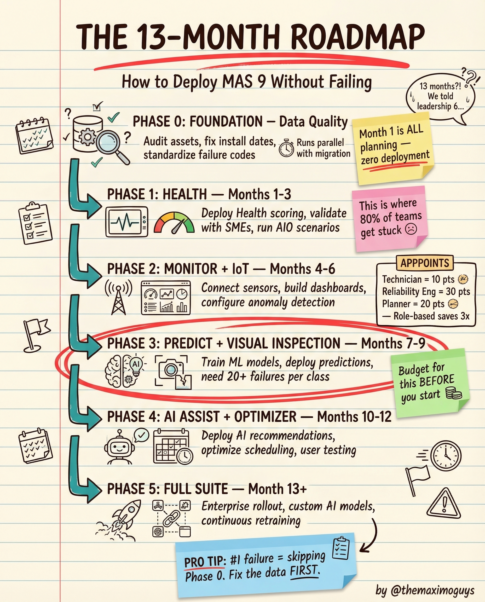

# AppPoints & Deployment Roadmap

**Wednesday, 2026-04-15** | **MAS Features**

---

## Image



---

## Post Copy

```
13 months. 5 phases. Here's how to deploy MAS 9 without failing.

Most teams skip Phase 0. That's where 80% of them get stuck.

The roadmap:

→ Phase 0 — Foundation (Pre-deployment): Data quality audit, fix install dates, standardize failure codes. Run parallel with migration.
→ Phase 1 — Health (Months 1-3): Deploy Health scoring, validate with SMEs, run AIO scenarios
→ Phase 2 — Monitor + IoT (Months 4-6): Connect sensors, build dashboards, configure anomaly detection
→ Phase 3 — Predict + Visual Inspection (Months 7-9): Train ML models, deploy predictions, need 20+ failures per class
→ Phase 4 — AI Assist + Optimizer (Months 10-12): Deploy AI recommendations, optimize scheduling, user testing
→ Phase 5 — Full Suite (Month 13+): Enterprise rollout, custom AI models, continuous retraining

Pro tip: AI failure = data failure. Fix the data FIRST.

Budget for AppPoints BEFORE you start.

Save this. Share it with your team.

#IBMMaximo #MAS #DigitalTransformation #TheMaximoGuys
```

---

## First Comment

```
Full deep-dive: https://themaximoguys.ai/blog/mas-features-apppoints-roadmap

Part 15 of our MAS Features series — the realistic deployment timeline nobody gives you.

@IBM @IBM Maximo

What phase is your MAS deployment in right now?

#AssetManagement #EAM #CloudMigration #ProjectManagement
```

---

## Blog Link

https://themaximoguys.ai/blog/mas-features-apppoints-roadmap

---

## Publishing Checklist

- [ ] Review post copy
- [ ] Review image
- [ ] Approve in Notion
- [ ] Publish via tool
- [ ] Verify post live
- [ ] Update Notion → POSTED
