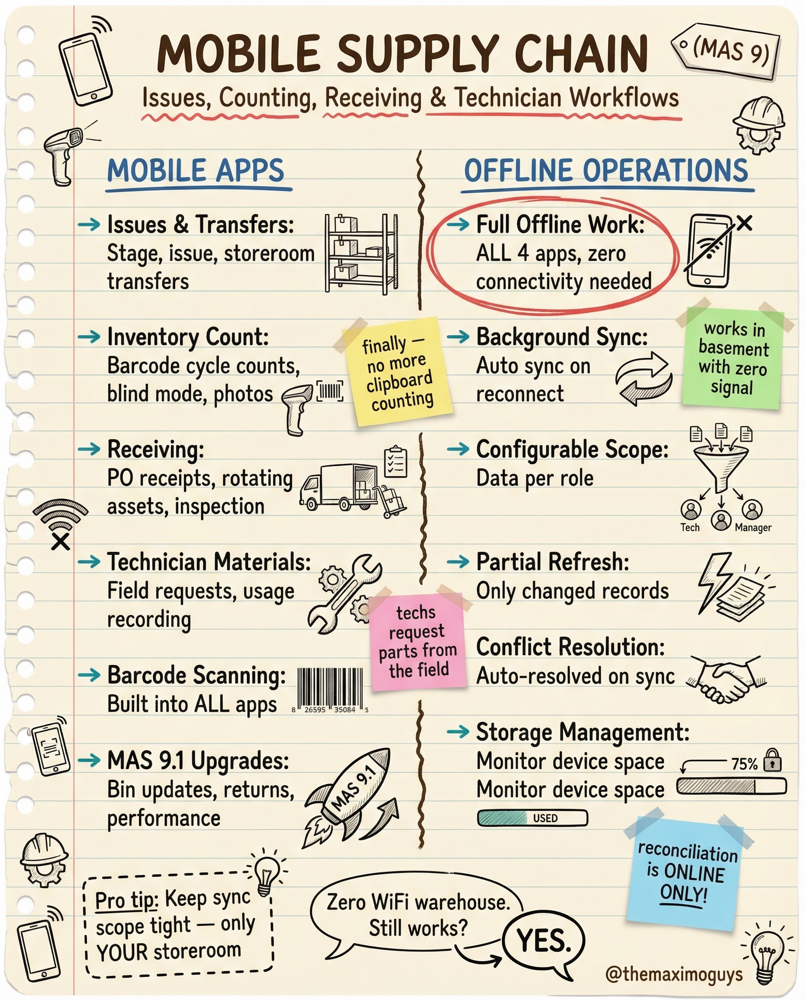

# Mobile Supply Chain

**Thursday, 2026-04-16** | **MAS Features**

---

## Image



---

## Post Copy

```
Zero WiFi warehouse. Still works? YES.

Mobile Supply Chain in MAS 9 finally killed clipboard counting.

Mobile apps:

→ Issues & Transfers: Stage, issue, storeroom transfers
→ Inventory Count: Barcode cycle counts, blind mode, photos
→ Receiving: PO receipts, rotating assets, inspection
→ Technician Materials: Field requests, usage recording
→ Barcode Scanning: Built into ALL apps

Offline operations (the real breakthrough):

→ Full Offline Work: ALL 4 apps, zero connectivity needed
→ Background Sync: Auto sync on reconnect
→ Configurable Scope: Data per role
→ Partial Refresh: Only changed records
→ Conflict Resolution: Auto-resolved on sync
→ Storage Management: Monitor device space

Pro tip: Keep sync scope tight — only YOUR storeroom.

Reconciliation is ONLINE ONLY.

Save this. Share it with your team.

#IBMMaximo #SupplyChain #MobileMaintenance #TheMaximoGuys
```

---

## First Comment

```
Full deep-dive: https://themaximoguys.ai/blog/mas-features-mobile-supply-chain

Part 23 of our MAS Features series — mobile supply chain with full offline capability.

@IBM @IBM Maximo

Are your storeroom teams still using paper for cycle counts?

#EAM #InventoryManagement #AssetManagement #CMMS
```

---

## Blog Link

https://themaximoguys.ai/blog/mas-features-mobile-supply-chain

---

## Publishing Checklist

- [ ] Review post copy
- [ ] Review image
- [ ] Approve in Notion
- [ ] Publish via tool
- [ ] Verify post live
- [ ] Update Notion → POSTED
