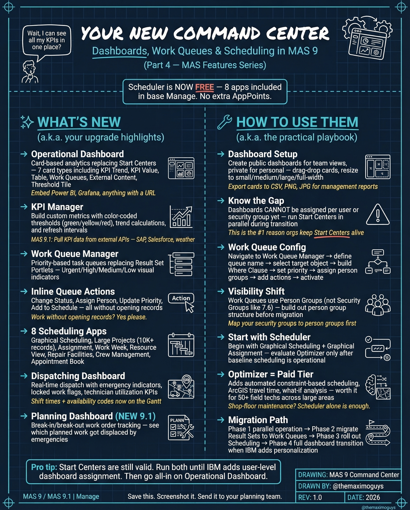

# Dashboards & Scheduling

**Friday, 2026-04-17** | **MAS Features**

---

## Image



---

## Post Copy

```
Start Centers are still valid. But Run BOTH until your RBA users have level dashboard assignment.

MAS 9 gave us dashboards, work queues, and 8 free scheduling apps — all included in base Manage.

What's new:

→ Operational Dashboard: Card-based analytics replacing Start Centers, 7+ card types including KPI, Work Queue, Threshold Bar
→ KPI Manager: Build custom KPIs with automated thresholds, trend calculations
→ Work Queue Manager: Priority-based queues replacing legacy Result Sets
→ Inline Queue Actions: Update status, priority, owner directly from the queue
→ 8 Scheduling Apps: Graphical scheduling, dispatching, planning — all FREE
→ Dispatching Dashboard: Drag-and-drop with emergency walk-in capabilities
→ Planning Dashboard (NEW 9.1): Which planned work gets dispatched by which craft

Migration path: Start with Graphical Scheduling → Phase 1. Roll out dashboards per person group → Phase 2.

Save this. Share it with your team.

#IBMMaximo #MAS #AssetManagement #TheMaximoGuys
```

---

## First Comment

```
Full deep-dive: https://themaximoguys.ai/blog/mas-features-dashboard-scheduling

Part 4 of our MAS Features series — dashboards, work queues, and scheduling.

@IBM @IBM Maximo

Are you still using Start Centers, or have you migrated to Operational Dashboards?

#EAM #CMMS #DigitalTransformation #WorkManagement
```

---

## Blog Link

https://themaximoguys.ai/blog/mas-features-dashboard-scheduling

---

## Publishing Checklist

- [ ] Review post copy
- [ ] Review image
- [ ] Approve in Notion
- [ ] Publish via tool
- [ ] Verify post live
- [ ] Update Notion → POSTED
