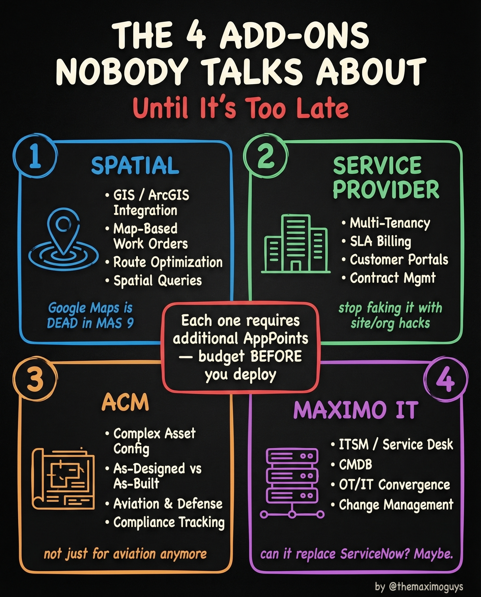

# Spatial, ACM, Service Provider & IT

**Saturday, 2026-04-18** | **MAS Features**

---

## Image



---

## Post Copy

```
The 4 add-ons nobody talks about. Until it's too late.

Each one requires additional AppPoints. Budget BEFORE you deploy.

1. Spatial:
→ GIS / ArcGIS integration, map-based work orders, route optimization, spatial queries
→ Google Maps is DEAD in MAS 9

2. Service Provider:
→ Multi-tenancy, SLA billing, customer portals, contract management
→ Stop faking it with site/org hacks

3. ACM (Asset Configuration Manager):
→ Complex asset config, as-designed vs as-built, aviation & defense, compliance tracking
→ Not just for aviation anymore

4. Maximo IT:
→ ITSM / Service Desk, CMDB, OT/IT convergence, change management
→ Can it replace ServiceNow? Maybe.

These aren't optional extras. For many organizations, they're the reason MAS makes sense in the first place.

Save this. Share it with your team.

#IBMMaximo #MAS #AssetManagement #TheMaximoGuys
```

---

## First Comment

```
Full deep-dive: https://themaximoguys.ai/blog/mas-features-spatial-provider-acm-it

Part 18 of our MAS Features series — the premium add-ons that change everything.

@IBM @IBM Maximo

Which of these 4 add-ons would have the biggest impact on your organization?

#EAM #DigitalTransformation #GIS #ITSM #CMMS
```

---

## Blog Link

https://themaximoguys.ai/blog/mas-features-spatial-provider-acm-it

---

## Publishing Checklist

- [ ] Review post copy
- [ ] Review image
- [ ] Approve in Notion
- [ ] Publish via tool
- [ ] Verify post live
- [ ] Update Notion → POSTED
