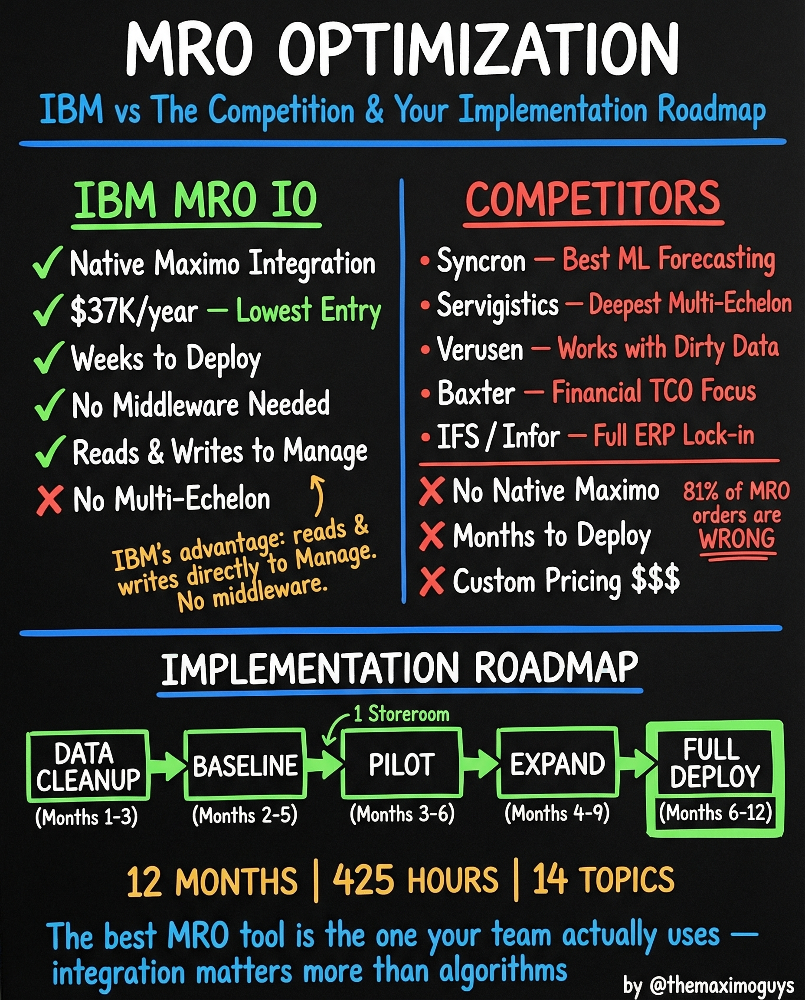

# MRO Optimization vs Competitors

**Sunday, 2026-04-19** | **MAS Features**

---

## Image



---

## Post Copy

```
IBM MRO IO vs the competition. The honest comparison.

12 months. 425 hours. 14 topics. Here's what we found.

IBM MRO IO advantages:

→ Native Maximo Integration — reads and writes directly to Manage
→ $37K/year — lowest entry point in the market
→ Weeks to deploy, no middleware needed
→ No multi-echelon (the one limitation)

Competitors:

→ Syncron: Best ML forecasting
→ Servigistics: Deepest multi-echelon
→ Verusen: Works with dirty data
→ Baxter: Financial TCO focus
→ IFS / Infor: Full ERP lock-in

But competitors share common gaps:
→ No native Maximo integration
→ Months to deploy
→ Custom pricing $$$

The implementation roadmap: Data Cleanup (Months 1-3) → Baseline (Months 2-5) → Pilot 1 Storeroom (Months 3-6) → Expand (Months 4-9) → Full Deploy (Months 6-12)

The best MRO tool is the one your team actually uses — integration matters more than algorithms.

Save this. Share it with your team.

#IBMMaximo #MRO #SupplyChain #TheMaximoGuys
```

---

## First Comment

```
Full deep-dive: https://themaximoguys.ai/blog/mas-features-mro-competitors-roadmap

Part 25 of our MAS Features series — the honest MRO optimization comparison.

@IBM @IBM Maximo

Are you evaluating MRO tools right now? What's your top priority — cost, integration, or algorithm quality?

#EAM #AssetManagement #InventoryOptimization #PredictiveMaintenance
```

---

## Blog Link

https://themaximoguys.ai/blog/mas-features-mro-competitors-roadmap

---

## Publishing Checklist

- [ ] Review post copy
- [ ] Review image
- [ ] Approve in Notion
- [ ] Publish via tool
- [ ] Verify post live
- [ ] Update Notion → POSTED
