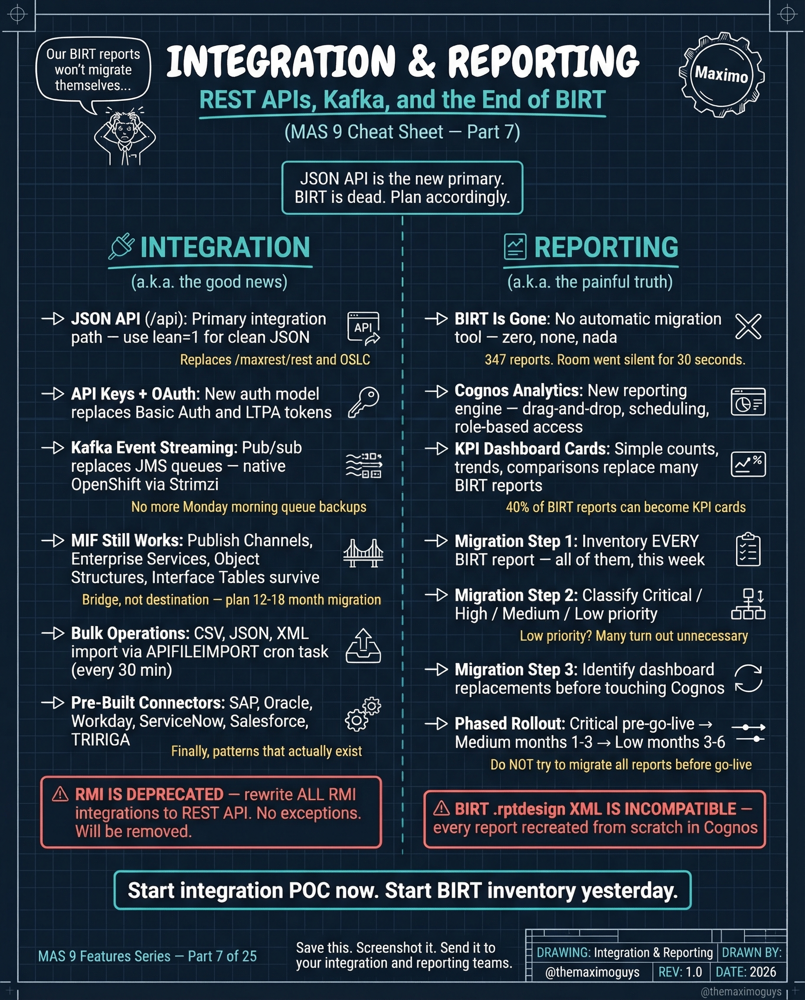

# Integration & Reporting

**Monday, 2026-04-20** | **MAS Features**

---

## Image



---

## Post Copy

```
JSON API is the new primary. BIRT is dead. Plan accordingly.

MAS 9 changed both integration AND reporting. Here's the full picture.

Integration:

→ JSON API (NEW): Primary integration path — use lean/1 for clean JSON
→ API Keys & OAuth: New auth model replaces Basic Auth and LTPA tokens
→ Kafka Event Streaming: Pub/Sub replaces JMS queues — native OpenShift via Strimzi
→ MIF Still Works: Publish Channels, Enterprise Services, Interface Tables survive
→ Bulk Operations: CRON, CSV, XML import via APILINKIMPORT cron task
→ Pre-Built Connectors: Workday, ServiceNow, Salesforce, TRIRIGA

Reporting:

→ BIRT is Done: No automatic migration tool — zero, none, nada
→ Cognos Analytics: New reporting engine — drag-and-drop, scheduling, email distribution
→ KPI Dashboard Cards: Simple counts, trends, comparisons replace many operational reports
→ 60% of BIRT reports can become KPI cards

Migration Step 1: Inventory EVERY BIRT report — all of them, this week.

Save this. Share it with your team.

#IBMMaximo #API #EAM #TheMaximoGuys
```

---

## First Comment

```
Full deep-dive: https://themaximoguys.ai/blog/mas-features-integration-reporting

Part 7 of our MAS Features series — REST APIs, Kafka, and the end of BIRT.

@IBM @IBM Maximo

How many BIRT reports does your organization run today? Have you started the Cognos migration?

#AssetManagement #CMMS #DigitalTransformation #Integration
```

---

## Blog Link

https://themaximoguys.ai/blog/mas-features-integration-reporting

---

## Publishing Checklist

- [ ] Review post copy
- [ ] Review image
- [ ] Approve in Notion
- [ ] Publish via tool
- [ ] Verify post live
- [ ] Update Notion → POSTED
