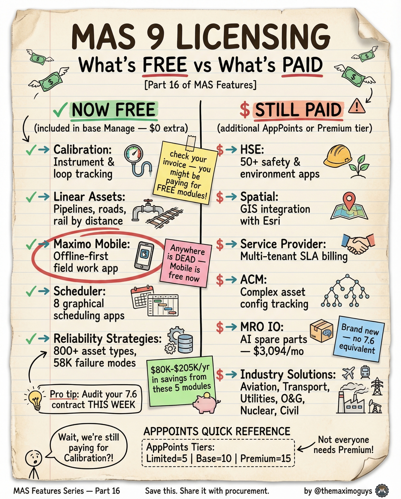

# MAS 9 Licensing Free vs Paid

**Tuesday, 2026-04-21** | **MAS Features**

---

## Image



---

## Post Copy

```
5 modules that used to cost real money are now included in base Manage.

That's $80K-$300K/yr in savings from these 5 modules.

Now FREE in base Manage:

→ Calibration: Instrument & loop tracking, compliance docs
→ Linear Assets: Pipelines, roads, rail — distance-based asset management
→ Maximo Mobile: Offline-first field work app — replaces Maximo Anywhere
→ Scheduler: 8 graphical scheduling apps, drag-and-drop
→ Reliability Strategies: 800+ asset types, 58K failure modes, RCM library

Still requires separate licensing:

→ HSE: 50+ safety & environment apps
→ Spatial: GIS/ArcGIS integration, map-based work orders
→ Service Provider: Multi-tenant, SLA billing
→ ACM: Complex asset config tracking
→ MRO IO: AI spare parts — $3,094/mo
→ Maximo IT: ITSM/Service Desk, separate licensing
→ Industry Solutions: Aviation, Transport, Utilities, O&G, Nuclear, Civil

Pro tip: Audit your 7.6 contract THIS WEEK.

Save this. Share it with your procurement team.

#IBMMaximo #Licensing #EAM #TheMaximoGuys
```

---

## First Comment

```
Full deep-dive: https://themaximoguys.ai/blog/mas-features-licensing-free-paid

Part 16 of our MAS Features series — what's free, what's paid, and how AppPoints work.

@IBM @IBM Maximo

Did you know Calibration is free now? How many modules are you paying for that are now included?

#AssetManagement #CMMS #DigitalTransformation #Procurement
```

---

## Blog Link

https://themaximoguys.ai/blog/mas-features-licensing-free-paid

---

## Publishing Checklist

- [ ] Review post copy
- [ ] Review image
- [ ] Approve in Notion
- [ ] Publish via tool
- [ ] Verify post live
- [ ] Update Notion → POSTED
