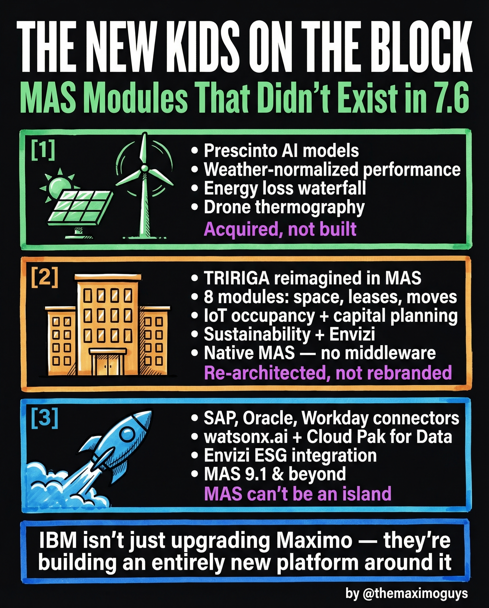

# Renewables, TRIRIGA & New Modules

**Wednesday, 2026-04-22** | **MAS Features**

---

## Image



---

## Post Copy

```
IBM isn't just upgrading Maximo. They're building an entirely new platform around it.

Three new arrivals that didn't exist in 7.6:

1. Prescriptive Analytics (Health 2.0):
→ Prescinto AI models, weather-normalized performance
→ Energy loss waterfall, drone thermography
→ Acquired, not built

2. TRIRIGA Reimagined in MAS:
→ 8 modules: space, leases, moves, IoT occupancy + capital planning
→ Sustainability + Envizi
→ Native MAS — no middleware
→ Re-architected, not rebranded

3. Enterprise Connectors (MAS 9.1+):
→ SAP, Oracle, Workday connectors
→ watsonx.ai + Cloud Pak for Data
→ Envizi ESG integration
→ MAS can't be an island

The direction is clear: MAS is becoming the enterprise asset intelligence platform, not just a CMMS.

Save this. Share it with your team.

#IBMMaximo #MAS #DigitalTransformation #TheMaximoGuys
```

---

## First Comment

```
Full deep-dive: https://themaximoguys.ai/blog/mas-features-renewables-tririga-new

Part 19 of our MAS Features series — new modules that never existed in Maximo 7.6.

@IBM @IBM Maximo

Is your organization tracking sustainability metrics alongside asset performance?

#AssetManagement #Sustainability #Industry40 #EAM
```

---

## Blog Link

https://themaximoguys.ai/blog/mas-features-renewables-tririga-new

---

## Publishing Checklist

- [ ] Review post copy
- [ ] Review image
- [ ] Approve in Notion
- [ ] Publish via tool
- [ ] Verify post live
- [ ] Update Notion → POSTED
