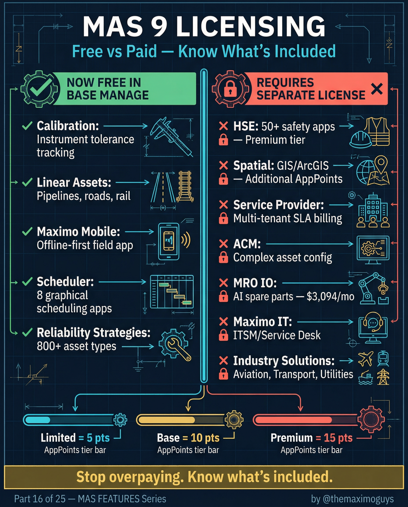

# MAS Licensing Comparison

**Thursday, 2026-04-23** | **MAS Features**

---

## Image



---

## Post Copy

```
Stop overpaying. Know what's included.

MAS 9 licensing changed dramatically. 5 modules moved to FREE in base Manage that used to require separate licenses.

Now FREE in base Manage ($0 extra):

→ Calibration: Instrument tolerance tracking, compliance docs
→ Linear Assets: Pipelines, roads, rail — distance-based asset management
→ Maximo Mobile: Offline-first field work app, replaces Anywhere
→ Scheduler: 8 graphical scheduling apps, drag-and-drop
→ Reliability Strategies: 800+ asset types, 58K failure modes

Still requires separate licensing:

→ HSE: 50+ safety apps — Premium tier + 13 education
→ Spatial: GIS/ArcGIS — Additional AppPoints
→ Service Provider: Multi-tenant SLA billing — Additional AppPoints
→ ACM: Complex asset config — Additional AppPoints
→ MRO IO: AI spare parts — $3,094/mo
→ Maximo IT: ITSM/Service Desk — Separate licensing
→ Industry Solutions: Aviation, Transport, Utilities — Premium tier 15+ AppPoints/user

AppPoints tiers: Limited=5, Base=10, Premium=15.

Save this. Send it to your procurement team. Thank me later.

#IBMMaximo #Licensing #EAM #TheMaximoGuys
```

---

## First Comment

```
Full licensing breakdown: https://themaximoguys.ai/blog/mas-features-licensing-free-paid

The MAS 9 Licensing Program Guide from IBM docs has the complete AppPoints breakdown.

@IBM @IBM Maximo

Are you still paying for modules that are now included in base Manage?

#AssetManagement #CMMS #Procurement #DigitalTransformation
```

---

## Blog Link

https://themaximoguys.ai/blog/mas-features-licensing-free-paid

---

## Publishing Checklist

- [ ] Review post copy
- [ ] Review image
- [ ] Approve in Notion
- [ ] Publish via tool
- [ ] Verify post live
- [ ] Update Notion → POSTED
