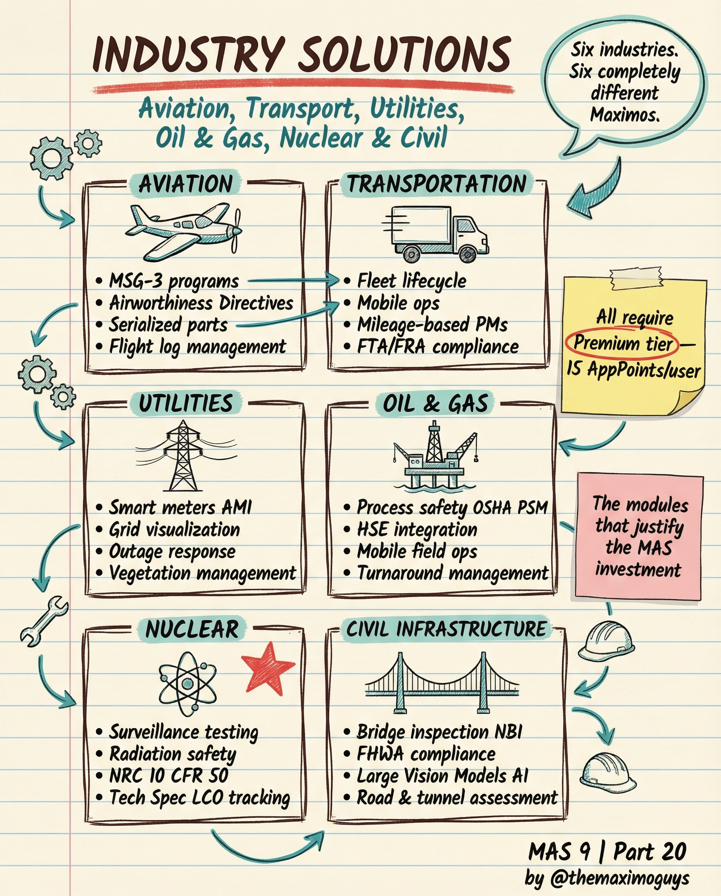

# Industry Solutions

**Friday, 2026-04-24** | **MAS Features**

---

## Image



---

## Post Copy

```
Six industries. Six completely different Maximos.

MAS Industry Solutions aren't add-ons. They're purpose-built configurations for regulated and specialized industries.

All require Premium tier — 15 AppPoints/user.

Aviation:
→ MSG-3 programs, airworthiness directives, serialized parts, flight log management

Transportation:
→ Fleet lifecycle, mobile ops, mileage-based PMs, FTA/FRA compliance

Utilities:
→ Smart meters AMI, grid visualization, outage response, vegetation management

Oil & Gas:
→ Process safety OSHA PSM, HSE integration, mobile field ops, turnaround management

Nuclear:
→ Surveillance testing, radiation safety, NRC 10 CFR 50, Tech Spec LCO tracking

Civil Infrastructure:
→ Bridge inspection NBI, FHWA compliance, large vision models AI, road & tunnel assessment

These modules justify the entire MAS investment for regulated industries.

Save this. Share it with your team.

#IBMMaximo #IndustrySolutions #AssetManagement #TheMaximoGuys
```

---

## First Comment

```
Full deep-dive: https://themaximoguys.ai/blog/mas-features-industry-solutions

Part 20 of our MAS Features series — industry-specific MAS configurations.

@IBM @IBM Maximo

Which industry vertical do you work in? Does your Maximo deployment use industry-specific modules?

#EAM #Aviation #Utilities #OilAndGas #Nuclear #CMMS
```

---

## Blog Link

https://themaximoguys.ai/blog/mas-features-industry-solutions

---

## Publishing Checklist

- [ ] Review post copy
- [ ] Review image
- [ ] Approve in Notion
- [ ] Publish via tool
- [ ] Verify post live
- [ ] Update Notion → POSTED
