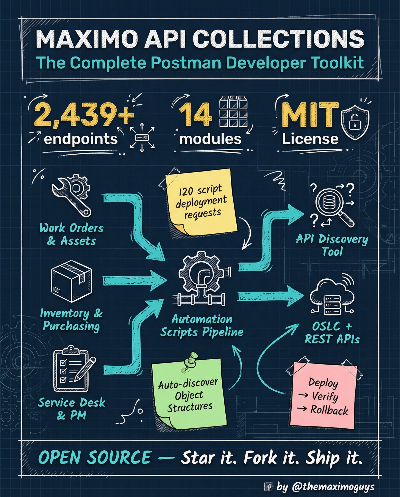

# Maximo API Collections (SketchNote)

**Saturday, 2026-04-25** | **TMG Tools**

---

## Image



---

## Post Copy

```
2,439 endpoints. 14 modules. Open source. MIT license.

We spent months building the Postman collection your Maximo dev team needs.

What's inside:

→ MAS 9 OSLC Collection: ~1,091 requests across 13 modules
→ MAS 9 REST Collection: ~1,131 requests, NextGen JSON API
→ Original 7.x/8.x OSLC: 738 endpoints for legacy systems
→ Original 7.x/8.x REST: 570 endpoints
→ Automation Scripts Pipeline: 120 requests — deploy, verify, validate, rollback
→ API Discovery Tool: Auto-discover all Object Structures

3 tiers of module coverage:

→ Tier 1 Core: Work Orders (160), Assets (118), Inventory (60), Service Desk (52)
→ Tier 2 Extended: Purchasing (45), Utilities (57), PM (6), Job Plans (9)
→ Tier 3 Admin: Financial, Contracts, CI, Company, Analytics, Scheduler

Deployment pipeline: Deploy All → Verify All → Update Source → Rollback → Cron Setup

29 scripts per step — works with GitHub Actions, Jenkins, Azure DevOps.

Save this. Share it with your team.

#IBMMaximo #API #OpenSource #TheMaximoGuys
```

---

## First Comment

```
Star it. Fork it. Send it to your Maximo dev team.

https://themaximoguys.ai/blog/mas-features-series-index

@IBM @IBM Maximo

Pro tip: If your Maximo dev team is still building API calls from scratch, send them this repo. You'll be their favorite person for a week.

#REST #OSLC #EAM #CMMS #AssetManagement
```

---

## Blog Link

https://themaximoguys.ai/blog/mas-features-series-index

---

## Publishing Checklist

- [ ] Review post copy
- [ ] Review image
- [ ] Approve in Notion
- [ ] Publish via tool
- [ ] Verify post live
- [ ] Update Notion → POSTED
