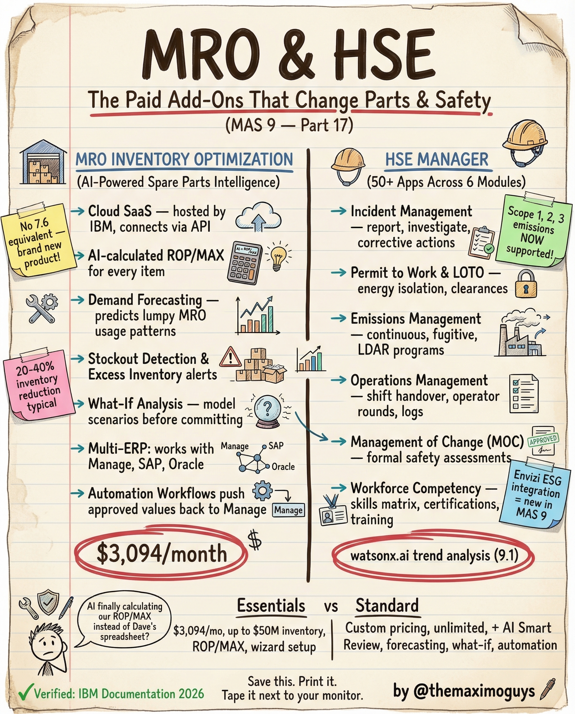

# MRO & HSE

**Sunday, 2026-04-26** | **MAS Features**

---

## Image



---

## Post Copy

```
The paid add-ons that change parts and safety. MRO IO + HSE Manager.

These two modules live outside base Manage. Here's what they do.

MRO Inventory Optimization (AI-Powered Spare Parts Intelligence):

→ Cloud SaaS — hosted by IBM, connects via API
→ AI-calculated ROP/MAX for every item
→ Demand Forecasting — predicts lumpy MRO usage patterns
→ Stockout Detection & excess inventory alerts
→ What-If Analysis — model automation before committing
→ Multi-ERP: Works with Manage, SAP, Oracle
→ $3,094/month

HSE Manager (50+ Apps Across 6 Modules):

→ Incident Management: Report, investigate, corrective actions
→ Permit to Work & LOTO: Energy isolation, clearances
→ Emissions Management: Continuous, fugitive, LDAR programs
→ Operations Management: Shift handover, operator rounds, logs
→ Management of Change (MOC): Formal safety assessments
→ Workforce Competency: Skills, certifications, training
→ watsonx.ai trend analysis (9.1)

Save this. Print it. Tape it next to your procurement plan.

#IBMMaximo #MRO #HSE #TheMaximoGuys
```

---

## First Comment

```
Full deep-dive: https://themaximoguys.ai/blog/mas-features-mro-optimization-hse

Part 17 of our MAS Features series — MRO IO and HSE Manager deep-dive.

@IBM @IBM Maximo

Is your organization spending more on emergency parts orders than on MRO optimization software?

#AssetManagement #Safety #SupplyChain #EAM #CMMS
```

---

## Blog Link

https://themaximoguys.ai/blog/mas-features-mro-optimization-hse

---

## Publishing Checklist

- [ ] Review post copy
- [ ] Review image
- [ ] Approve in Notion
- [ ] Publish via tool
- [ ] Verify post live
- [ ] Update Notion → POSTED
