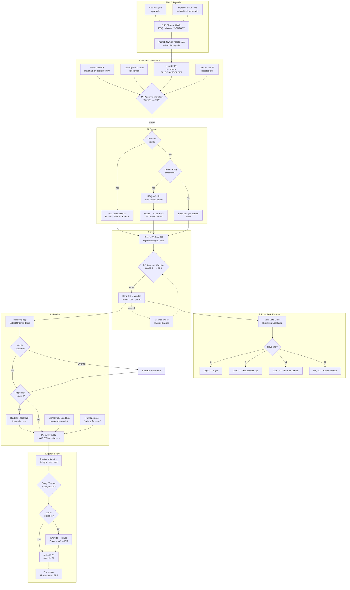
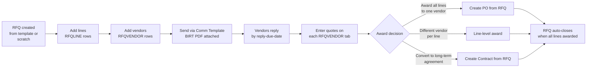

# MAS 9 Purchasing Lifecycle — End-to-End Process Flow

**Document:** DOC10 — Purchasing Lifecycle Process Flow (OOB MAS 9)

**Version:** 1.0

**Date:** April 30, 2026

**Audience:** Procurement leads, buyers, storekeepers, AP, supply chain architects, Maximo admins

**Scope:** The full out-of-the-box (OOB) MAS 9 procurement-to-pay lifecycle — Plan → Demand → Source → Order → Expedite → Receive → Match → Pay — plus vendor escalations for overdue parts and the receiving "bells and whistles" you actually get from MAS 9.1.x without any custom code.

**Upgrade Context:** Maximo 7.6.1.3 → MAS 9 Manage 9.0 / 9.1

**Companion Reading (deep dives — do NOT re-read this doc for those):**
- **DOC4** — Supply Chain Management Roadmap (architecture + every feature in detail)
- **DOC9** — Purchasing Quick Wins (operator-level, click-by-click)
- **DOC8** — Storekeeper Quick Wins (storeroom side of receiving / put-away)
- **Auto-reorder maturity ladder** — manual → semi → full auto reorder progression
- **Late-delivery tracking** — escalation engine + vendor scorecard
- **RFQ process** — 3-bid discipline
- **Receiving discipline** — receiving + tolerance policy
- **Invoice matching** — 3-way match exception triage

**This document is the FLOW.** It does not repeat feature tables from DOC4 or step-by-step click flows from DOC9. It threads them together end-to-end so anyone — buyer, storekeeper, architect — can read it once and see how a part goes from "we need it" to "we paid for it" in stock MAS 9.

---

## 1. The Lifecycle at a Glance

### Seven Phases, OOB

| # | Phase | What happens | Primary OOB app(s) | Primary objects |
|---|-------|--------------|--------------------|----------------|
| 1 | **Plan & Replenish** | System (or planner) decides "we need X qty of Y by date Z" | Inventory, Reorder, Item Master, ABC Analysis report | INVENTORY, ITEM, ITEMVENDOR |
| 2 | **Demand Generation** | A purchase requisition (PR) is created — by WO, reorder cron, desktop user, or planner | Work Order Tracking, Reorder, Desktop Requisitions, Purchase Requisitions | PR, PRLINE |
| 3 | **Source** | The PR is matched to a vendor — via contract, RFQ 3-bid, or buyer judgment | Contracts, RFQ, Companies | RFQ, RFQVENDOR, RFQLINE, CONTRACT |
| 4 | **Order** | A PO is issued to the vendor (or, in external-ERP environments, the PR flows to the ERP and the ERP issues the PO) | Purchase Orders | PO, POLINE |
| 5 | **Expedite & Escalate** | Late vendors get nudged via the OOB Escalation engine | Escalations, Comm Templates, Start Center | ESCALATION, COMMTEMPLATE |
| 6 | **Receive** | Goods land at the dock; inventory increments | Receiving (classic + RBA), Inspection, Mobile Inventory Receiving | MATRECTRANS, INVENTORY, INVBALANCES |
| 7 | **Match & Pay** | Invoice ↔ PO ↔ Receipt 3-way match; AP voucher posts | Invoices | INVOICE, INVOICELINE, INVOICETRANS |

### End-to-End Flow Diagram



### Status State Map (the four objects)

```
PR     :  DRAFT  →  WAPPR  →  APPR  →  CLOSE   (CAN at any point; HISTEDIT if reopened)
PO     :  DRAFT  →  WAPPR  →  APPR  →  INPRG  →  CLOSE   (CAN; CHANGE-orders create revision rows)
RECEIPT:  WINSP (if inspection)  →  COMP            (line-level: matrectrans.issuetype = RECEIPT, RETURN, TRANSFER, REJECT)
INVOICE:  ENTERED  →  WAPPR  →  APPR  →  PAID  →  CLOSE  (HOLD; status transitions audited)
```

---

## 2. Phase 1 — Plan & Replenish

This is where demand originates *without anyone thinking about it*. The point of doing it well is so the buyer's day is "exception handling," not "scrolling through a 500-row reorder list and trusting nothing."

### What MAS 9 ships, OOB

| Field on INVENTORY | Purpose | OOB behavior |
|--------------------|---------|--------------|
| `minlevel` (ROP) | Reorder Point — when current balance drops below, reorder triggers | Compared to `currentbal` on every reorder run |
| `maxlevel` | Maximum stock level | Caps reorder qty so you don't over-stock |
| `orderqty` (ROQ) | Default qty per order | Used by Reorder app unless overridden |
| `safetystock` | Safety buffer above ROP | Buffer for demand variability |
| `eoq` | Economic Order Quantity | Optimal qty balancing order cost + carrying cost |
| `item.leadtime` | Lead time in days | **Auto-refined on every receipt** (Dynamic Lead Time) |
| `abc` | A / B / C / N | Drives review cadence + cycle count frequency |

### Dynamic Lead Time formula (DOC4 §3.13)

```
newLeadTime = currentLeadTime × (1 - recentLeadTimeWeight)
            + lastPODays      × recentLeadTimeWeight
```

Default `recentLeadTimeWeight = 0.20` (20% recent / 80% historical). Maximo recalculates on every PO receipt. **You don't write a cron** — you just receive cleanly and the lead-time field improves itself.

### Reorder formulas (the math the buyer's brain has been doing manually for a decade)

```
SAFETY_STOCK = Z × STDDEV_DEMAND × SQRT(LEAD_TIME_DAYS)
  Z = 2.326 (A) / 1.645 (B) / 1.282 (C)

ROP          = (AVG_DAILY_DEMAND × LEAD_TIME_DAYS) + SAFETY_STOCK

EOQ          = SQRT( (2 × ANNUAL_DEMAND × ORDER_COST) / (UNIT_COST × CARRYING_PCT) )
```

These can be seeded one-time from MATUSETRANS history. After that, MAS maintains lead time dynamically; you reclassify ABC quarterly using the **Inventory ABC Analysis** stock BIRT report, which auto-writes `INVENTORY.abc` and `INVENTORY.ccf` (cycle count frequency) when you flip the "Database Update" parameter on.

### The two reorder paths (DOC4 §3.15)

| Path | What it does | Trigger |
|------|--------------|---------|
| **Internal Reorder** | Replenishes Storeroom A from Storeroom B (a designated "reorder storeroom") via inventory transfer — no vendor PO needed | `currentbal < minlevel` and `ITEMSTRUCT.replenishfromstoreroom` is set |
| **External Reorder** | Auto-creates a PR for vendor purchase | `currentbal < minlevel` and the item has an active vendor (ITEMVENDOR or `item.vendor`) |

### `PLUSPINVREORDER` cron (the engine)

- Scheduled task in **Cron Task Setup** (default name `PLUSPINVREORDER`).
- Walks each storeroom + item where `currentbal < minlevel`.
- For internal items → creates an Inventory Transfer.
- For external items → creates a PR in WAPPR with vendor + qty pre-filled.
- Runs nightly (recommended) so buyers see fresh exceptions in the morning.

### Multi-vendor reorder

If `ITEMVENDOR` has multiple active rows for an item, MAS picks per the Item Vendor *priority* and *catalog code*. You can override at the storeroom level by setting `INVVENDOR.vendor` (the preferred vendor for that item *at that storeroom*).

### Specialized inventory types feeding the loop

| Type | What it adds to planning |
|------|--------------------------|
| **Rotating** | Each unit has its own asset record + serial — reorder logic respects unique-serial constraints |
| **Condition-enabled** | Same item exists at different conditions (New 100% → Poor 10%); cost rolls up by condition % |
| **Consignment** | Vendor-owned stock in your storeroom — no PR triggered until consumption (see §7) |
| **Service items** | Treated as time/incident requisitions, not stock; reorder N/A |

### Variant: external-ERP environments

Where Maximo feeds an external ERP, external reorder PRs run through Maximo, but the actual PO is issued by the **ERP** (e.g., SAP) after the PR flows out via integration. MAS owns reorder logic; the ERP owns vendor dispatch. Internal reorder (storeroom-to-storeroom) stays 100% in Maximo.

---

## 3. Phase 2 — Demand Generation (Purchase Requisitions)

A PR is the unit of demand. There are four OOB ways one comes into existence:

### 3.1 Work-Order-driven PR

When a planner adds a non-stock material to a WO and the WO is approved, MAS auto-creates a PR (or a PR line on a buyer-pooled PR) for the materials. Behavior is governed by:

- **Item record**: `item.purchasethrucent` flag — if Yes, the item is "central-stocking" and stays as a reservation, not a PR.
- **Storeroom availability**: if the qty exists in the storeroom, MAS reserves it; if not, it spawns a PR.
- **Direct issue**: if PR line `directissue = 1`, it bypasses the storeroom — receive-and-issue on the same transaction.

### 3.2 Desktop Requisition (DESKREQ)

A self-service portal-style app for non-buyers. They pick from a personal "Frequently Ordered" list or templates, hit Submit, and an approval chain runs. On final approval the DESKREQ rolls into a PR automatically.

| DESKREQ feature (DOC4 §3.8) | Why it matters |
|------------------------------|----------------|
| Personal Frequently-Ordered list | Office supplies / repeat-buy items reorder in 4 clicks |
| Templates | Saved "Lab supply standard order" template |
| Status tracking | Submitter sees approval + receipt status without nagging buyer |
| Auto-PR creation | Approved DESKREQs become PRs without buyer intervention |

### 3.3 Reorder PR

Created by `PLUSPINVREORDER` (see §2). Lands in WAPPR with vendor, qty, lead time, and last-known price already filled. Buyer reviews exceptions, bulk-approves the rest.

### 3.4 Direct-Issue / Spot Buy PR

Buyer types a PR by hand for a one-off — typically a non-stock item or a service. Approval chain runs the same way.

### 3.5 PR Approval Workflow (WF_PRSTATUS or similar)

OOB workflow with thresholded approval routing. Typical policy (adjust to your org):

| PR Total | Approvers (in order) |
|----------|----------------------|
| < $1,000 | Buyer self-approves |
| $1,000 – $9,999 | Buyer + Supervisor |
| $10,000 – $49,999 | Buyer + Procurement Manager |
| $50,000 – $99,999 | + Director |
| ≥ $100,000 | + CFO |
| Capital / project | Add capital project sponsor |

Conditions are SQL on the PR record (`pr.totalcost`, `pr.glaccount LIKE 'CAP%'`, etc). All routing config lives in the **Workflow Designer** — no Java required.

### Status flow

```
DRAFT  →  WAPPR  →  APPR  →  CLOSE
                ↘    ↗
                CANCEL / REJECTED
```

---

## 4. Phase 3 — Source (RFQ & Contracts)

Now that the PR is approved, the buyer (or the system, if a contract exists) decides *who* to buy from.

### 4.1 The Sourcing Decision Tree

```
PR APPR
   │
   ├─ Has active contract for item/vendor? ──Yes──▶ Use contract price → Release PO
   │
   └─ No contract
        │
        ├─ Spend < RFQ threshold? ──Yes──▶ Buyer assigns vendor (judgment)
        │
        └─ Spend ≥ RFQ threshold ──▶ Run RFQ (3-bid)
```

### 4.2 RFQ Trigger Policy (example policy — adjust to your org)

| PR Trigger | RFQ Required? | # Bids | Extra |
|------------|---------------|--------|-------|
| Contract PR (any $) | No | — | Contract price applies |
| Non-contract PR < $5k | No | — | Buyer judgment |
| Non-contract $5k–$24,999 | **Yes** | 3 | Award summary attached |
| Non-contract $25k–$99,999 | **Yes** | 3 | + Procurement Mgr review |
| Non-contract ≥ $100k | **Yes** | 3+ | + CFO sign-off + Legal T&C review |
| Emergency (priority=1) | Waiver | — | Post-facto justification within 5 BD |
| Sole-source | Waiver | — | Sole-source justification form |

Enforcement is a conditional node in `WF_PRSTATUS` blocking WAPPR→APPR if `totalcost ≥ 5000` and (`contractrefnum` is null) and (`rfqnum` is null) and (`sole_source_waiver_id` is null) and `priority <> 1`.

### 4.3 RFQ Lifecycle (OOB MAS 9.1.x)



### 4.4 RFQ Application — what's OOB

| RFQ feature (DOC4 §3.8) | OOB behavior |
|--------------------------|--------------|
| Create from template | Pre-loads default vendors, terms, reply window |
| Multi-vendor quotes | Each vendor on its own RFQVENDOR tab |
| Quote comparison | Side-by-side unit cost / EOQ / lead time view |
| Award & Convert | Action menu → Create PO or Create Contract |
| Auto-close | All lines awarded → status closes itself |
| Comm Template integration | `RFQ_SEND` template fires email + BIRT PDF |
| Overdue-reply Escalation | OOB Escalation on RFQ object — no custom cron |

### 4.5 The Nine OOB Contract Types (DOC4 §3.9)

| Contract Type | Use case |
|---------------|----------|
| **Purchase Contract** | Negotiated price for a specific item — used as the price source on every PO |
| **Blanket (Volume)** | Total $ ceiling; create release POs against it as needed |
| **Pricing Contract** | Schedule of prices (services or materials) over a period |
| **Labor Contract** | Craft + skill rate combos; auto-invoices approved labor |
| **Lease** | Equipment lease, fixed term, with buy-out option |
| **Rental** | Equipment rental, terminate-at-will |
| **Service Contract** | Scheduled service delivery; per-incident billing |
| **Warranty** | Coverage scope + duration for an asset / part |
| **Software** | License + maintenance terms |
| **Master Contract** | Umbrella associating multiple sub-contracts under one vendor agreement |

### 4.6 Blanket Contract → Release PO flow

```
Blanket Contract (CONTRACT type=BLANKET)
   ├─ totalcost = $500,000 ceiling
   ├─ effective dates: 2026-01-01 → 2026-12-31
   └─ contracted lines (item + price + max qty)
        │
        └─▶ "Create Release PO" action (any time within effective window)
                │
                ├─ pulls contract price (validated against PO unit cost)
                ├─ decrements remaining ceiling on each release
                └─ closes when ceiling exhausted or end date reached
```

### Variant: external-ERP environments

Where Maximo feeds an external ERP, the RFQ award produces a **PR** (not a Maximo PO). The PR flows to the ERP and the ERP issues the PO. The RFQ record (with all responses, award summary, T&C references) is the audit artifact and stays in Maximo.

---

## 5. Phase 4 — Order (Purchase Order)

The PR is approved and sourced — now it becomes a PO.

### 5.1 PR → PO Conversion

| Trigger | Behavior |
|---------|----------|
| Action: **Create PO** from approved PR | Copies all unassigned PR lines onto a new PO with vendor, prices, delivery info |
| Multi-vendor split | One PR with lines for multiple vendors → multiple POs auto-created |
| Vendor pre-assignment | If `prline.vendor` is populated on the PR, that's the PO's vendor |
| Unassigned lines stay on PR | If only 3 of 5 lines have a vendor, those 3 become a PO; the other 2 remain on the PR for the buyer to source |

### 5.2 PO Application — what's OOB

| PO feature (DOC4 §3.8) | OOB behavior |
|------------------------|--------------|
| Auto-numbering | Site / org-level sequence; or manual entry |
| Multi-line | Each POLINE has its own item, qty, requested delivery date |
| Delivery management | `polocation`, `requireddate`, `paymentterms` |
| Status tracking | Pending qty, received qty, invoiced qty per line |
| Change order / Revision | Action: **Revise PO** creates a new revision while preserving prior versions |
| Approval workflow | Same dollar-tier model as PR; configurable per buyer pool |
| Vendor send | Comm Template + BIRT (or EDI / portal) — fires on APPR |

### 5.3 PO Approval Workflow

Same dollar-threshold pattern as PR. Most orgs let the PO follow a lighter chain than the PR (since the PR was already vetted), but high-dollar POs and any change order add re-approval.

### 5.4 Change Orders

```
PO APPR  →  Action: Revise PO  →  PO_REV2 (DRAFT) → WAPPR → APPR
                                       ↑
                                       └── prior PO_REV1 marked HISTEDIT
                                           but kept in DB for audit
```

Use cases: vendor calls back to say "lead time is 8 weeks, not 4" → buyer revises required date. Vendor short-ships → buyer reduces qty. New tax line added → revise total.

### 5.5 Status flow

```
DRAFT  →  WAPPR  →  APPR  →  INPRG  →  CLOSE
                       ↘
                       CANCEL
```

`INPRG` = "in progress" — at least one receipt has happened, but not all qty received yet.

### Variant: external-ERP environments

Where Maximo feeds an external ERP, PR-to-PO conversion happens **inside the ERP**, not Maximo. Maximo's PR goes via integration to the ERP; the ERP creates the PO; the ERP returns the PO number (`pr.externalponum`) and updates `pr.sap_po_status` (`OPEN`/`CONFIRMED`/`PARTIAL_RECV`/`CLOSED`/`CANCELLED`). All Phase-5 escalations key off these ERP-fed fields.

---

## 6. Phase 5 — Expedite & Vendor Escalation (overdue parts)

This is where MAS 9 earns its keep on the buyer-experience side. The OOB **Escalation engine** + **Comm Templates** + **Person Groups** is exactly the toolset for vendor-overdue chasing — without writing one line of custom code.

### 6.1 The "Late" definition (precedence-ordered)

A PO/PR line is **late** when ALL of the following are true:

1. PO status in `('OPEN','APPR','INPRG')` — i.e., not closed or cancelled (external-ERP: also `sap_po_status` in `('OPEN','CONFIRMED','PARTIAL_RECV')`).
2. `receivedqty < orderqty` on the line.
3. The **effective expected date** is in the past, where effective date = first non-null of:
   - `poline.sap_promised_date` (external-ERP — vendor-confirmed ship date) ←  highest precedence
   - `poline.requireddate` (buyer's required date)
   - `poline.orderdate + item.leadtime` (fallback)

`Days late = SYSDATE − effective_expected_date`.

### 6.2 Escalation Tiers (the policy)

| Days Late | Automated action | Owner to act |
|-----------|------------------|--------------|
| **−2 (approaching)** | Inbox reminder fires to buyer ("order X due in 2 days") | Buyer (nudge vendor proactively) |
| **1–2** | Daily inbox reminder | Buyer |
| **3** | Escalation email to buyer: "PO X is 3 days late — expedite, confirm new date, or cancel" | Buyer |
| **7** | Escalation copies Procurement Manager. Vendor scorecard "Late Deliveries" counter increments | Procurement Manager (review) |
| **14** | Alternate-vendor suggestion list surfaces. PM reviews for re-source | Procurement Manager (decide) |
| **30** | PO flagged for cancellation review. Vendor on watch list | Procurement Manager (decide) |

### 6.3 Escalation Timeline

```mermaid
gantt
    title Vendor Escalation Timeline
    dateFormat  X
    axisFormat  Day %s

    section Buyer
    Pre-due reminder (−2)            :a0, 0, 2
    Daily reminder (1–2 late)        :a1, 3, 2
    Day-3 escalation                 :crit, a2, 5, 1
    Day-7 escalation                 :crit, a3, 9, 1

    section Procurement Mgr
    CC on Day-7                      :b1, 9, 1
    Day-14 alt-vendor suggestion     :crit, b2, 16, 1
    Day-30 cancel review             :milestone, b3, 32, 0
```



### 6.4 OOB Escalation engine — the wiring (per DOC9 §15)

Configure four (or five, with daily digest) **Escalation** records on the **PO** object (or PR for SAP-integrated environments):

| Escalation name | Object | Condition (SQL) | Schedule | Action |
|-----------------|--------|-----------------|----------|--------|
| `LATE_DAILY_DIGEST` | PO | Any line where effective expected date < SYSDATE and not fully received | Daily 07:00 M-F | Comm Template `LATE_ORDER_DIGEST` → buyer (one digest email per buyer, listing all their late lines) |
| `LATE_3D_BUYER` | PO | line late ≥ 3 and < 7 days | Daily 07:00 M-F | Comm Template `LATE_ORDER_ESC_3` → buyer |
| `LATE_7D_PM` | PO | line late ≥ 7 and < 14 days | Daily 07:00 M-F | Comm Template `LATE_ORDER_ESC_7` → buyer + Procurement Mgr |
| `LATE_14D_ALT` | PO | line late ≥ 14 and < 30 days | Daily 07:00 M-F | Comm Template `LATE_ORDER_ESC_14` (with alt-vendor list) → Procurement Mgr |
| `LATE_30D_CANCEL` | PO | line late ≥ 30 days | Daily 07:00 M-F | Comm Template `LATE_ORDER_ESC_30` → Procurement Mgr (cancel review) |

Each Escalation record carries:
- **Object:** `PO` (or `PR` for SAP-integrated)
- **Condition:** the SQL fragment
- **Schedule:** `0 0 7 ? * MON-FRI` (07:00 weekdays)
- **Repeat:** Yes (one fire per matching record per day)
- **Actions tab:** Comm Template
- **Assignments tab:** Person Group (`PG_BUYER_LEAD`, `PG_PROCUREMENT_MGR`)

History is auto-logged in the **Escalation history** table — that's your audit trail. **No custom log table required.**

### 6.5 Daily Digest Comm Template (`LATE_ORDER_DIGEST`)

```
Subject: [Maximo] Your late orders — {{COUNT}} items past expected delivery

Good morning {{BUYER}},

You have {{COUNT}} line(s) past expected delivery:

{{#each LINES}}
  • PO {{ponum}} — {{description}}
    Vendor: {{vendor}}
    Expected: {{expected_date}} ({{days_late}} days late)
    Qty open: {{open_qty}} of {{order_qty}}
{{/each}}

Click each PO to review. Escalation thresholds:
  3d → buyer | 7d → procurement | 14d → alt-vendor | 30d → cancel review
```

### 6.6 Alternate-Vendor Suggestion Query (Day-14)

Embed in the Day-14 escalation email body. For each late line, suggest other active vendors who have shipped this item in the last 24 months:

```sql
SELECT
  iv.vendor,
  c.name,
  iv.lastprice,
  iv.leadtime AS vendor_lead_time,
  (SELECT MAX(transdate) FROM matrectrans mrc
    WHERE mrc.itemnum = iv.itemnum AND mrc.vendor = iv.vendor) AS last_receipt
FROM itemvendor iv
JOIN companies c ON c.company = iv.vendor AND c.disabled = 0
WHERE iv.itemnum = :itemnum
  AND iv.vendor <> :current_vendor
  AND EXISTS (SELECT 1 FROM matrectrans mrc
              WHERE mrc.itemnum = iv.itemnum
                AND mrc.vendor = iv.vendor
                AND mrc.transdate > SYSDATE - 730)
ORDER BY last_receipt DESC;
```

### 6.7 Vendor Scorecard (monthly)

OOB BIRT report — keep BIRT for monthly emailed scorecards (its strength). Four metrics per vendor:

| Metric | SQL |
|--------|-----|
| **On-Time Delivery Rate (90d)** | `COUNT(on-time receipts) / COUNT(all receipts)` |
| **Avg Days Late (of late ones)** | `AVG(receiptdate − promised_date)` where receipt > promised |
| **Total Open Late Lines** | row count from late-order query |
| **Escalation Hits (90d)** | count of fires on `LATE_7D_PM` + `LATE_14D_ALT` + `LATE_30D_CANCEL` per vendor |

Email to Procurement Manager 1st of each month. Drives the quarterly vendor review conversation.

### 6.8 Start-Center Portlet — *My Late Orders*

| Column | Source |
|--------|--------|
| PO# (or PR# / external-ERP-PO# in ERP-terminus environments) | PO.PONUM |
| Vendor | PO.VENDOR + COMPANIES.NAME |
| Item | POLINE.ITEMNUM + DESCRIPTION |
| Expected Date | derived per §6.1 |
| Days Late | derived |
| Last Contact | last comm-template fire on this PO |

Conditional formatting: 3–6 days = yellow, 7+ days = red.

### 6.9 What you do NOT need to build

- Custom cron task for late-order detection — use the **Escalation engine**.
- Custom log table for escalation history — use the **native Escalation history table**.
- Custom email service — use **Comm Templates**.
- Custom BIRT to chase by hand — retire it; the digest replaces it.

The whole escalation stack is config + templates + SQL conditions. Zero Java.

---

## 7. Phase 6 — Receive (the bells and whistles)

This is where MAS 9 has the most "I didn't know it could do that" features. The Receiving app + Inspection app + Mobile Inventory Receiving app + tolerance config together cover everything from "hand-key one PO line" to "rotating-asset receipt with serialization, photo capture, condition code, lot number, and offline sync."

### 7.1 Receiving app — the core flow

```
1. Open Receiving (classic or RBA).
2. Enter PO number (or scan barcode from packing slip).
3. Action menu → Select Ordered Items.
   → Bulk-loads every open POLINE.
4. For each line:
   - Confirm received qty (defaults to ordered qty).
   - Set bin location (default = item's primary bin).
   - Set lot number (if LOT item).
   - Set rotating-asset serial (if rotating).
   - Set condition code (if condition-enabled).
5. Save.
   → MATRECTRANS rows post.
   → INVENTORY.currentbal increments (or HOLDING if inspection required).
   → POLINE.receivedqty updates.
   → If receivedqty = orderqty, line goes to COMP.
   → If all lines COMP, PO moves to CLOSE (or stays APPR pending invoice).
```

A 10-line PO should receive in under 3 minutes when everything's clean.

### 7.2 Bell #1 — Receive Tolerance (Org-level config)

Location: **Organizations → Inventory Options → Receipt Tolerances**

| Setting | Typical value | Effect |
|---------|---------------|--------|
| Receive qty tolerance % | ±2% | Auto-accept ±2% of ordered qty |
| Receive qty tolerance abs | ±1 unit | Whichever is larger |
| Receive price tolerance % | ±1% | Price drift accepted |
| Over-tolerance action | Supervisor override required | Forces a documented exception |
| Default holding location | `HOLDING` | Inspection-required items route here |

Within tolerance → auto-accept. Over-tolerance → supervisor override with reason code (audit trail).

### 7.3 Bell #2 — Inspection on Receipt

Set `item.inspection = 1` on items requiring inspection. On receipt:

```
Receipt → status = WINSP → routed to Inspection app
                                │
                                ├─ Quality reviews → Accept → moves to primary bin → COMP
                                │
                                └─ Reject → Return-to-vendor + debit memo
```

Inspection app supports:
- Pass / fail per line
- Partial accept (e.g., 8 of 10 units accepted, 2 rejected)
- Inspector identity captured
- Photos / attachments via the Mobile app
- Reason codes on reject

### 7.4 Bell #3 — 4-Way Match (the Inspection gate on Invoicing)

For high-spec / regulated items, set match level = 4-way (Org → Purchasing Options). This adds **Inspection acceptance** as a fourth gate before the invoice can match:

```
Invoice ↔ PO ↔ Receipt ↔ Inspection.acceptqty
```

So even if the qty/price match the PO + receipt, the invoice can't auto-approve until Inspection has passed the goods. This prevents you paying for material that's sitting at HOLDING with a failed inspection.

### 7.5 Bell #4 — Lot / Rotating-Serial / Condition required-at-receipt

| Item type | Required field at receipt | What if blank |
|-----------|---------------------------|---------------|
| **Lot-tracked** (`item.lottype = 'LOT'`) | `matrectrans.lotnum`, mfg date, expiration | Receipt **fails fast** — vendor must provide lot |
| **Rotating** (`item.rotating = 1`) | `matrectrans.assetnum` (serial) | Receipt waits for asset; status = "waiting for asset" until serialized |
| **Condition-enabled** (`item.condition_enabled = 1`) | `matrectrans.conditioncode` | Receipt **fails fast** — defaults to '100' (full value) on most setups but configurable |

**Rotating "waiting for asset" status** (DOC4 §3.10): receipt creates the MATRECTRANS row but in a sub-status until the asset record is created and the serial assigned. Lets receiving start the receipt process even when the storeroom hasn't pre-generated asset numbers.

### 7.6 Bell #5 — Mobile Inventory Receiving app

Native iOS / Android / Windows. No build/redeploy. Capabilities (DOC4 §4.3):

| Mobile feature | Why it matters |
|----------------|----------------|
| PO list with images | Receiving clerk picks the PO from a visual scrollable list |
| Quantity entry | Enter received qty, can differ from ordered |
| Item image verification | View item images to confirm correct items received |
| Rotating asset receipt | Creates "waiting for asset" status mobile-side |
| Real-time sync | Receipt visible on desktop within seconds |
| Inspection on receipt | Pass/fail captured on phone |
| **Offline mode** | Process receipts without connectivity; sync when reconnected |
| **Barcode scanning** | Built into every screen |

### 7.7 Bell #6 — MAS 9.1 Receiving Enhancements

Released in MAS 9.1.x:

| Enhancement | Effect |
|-------------|--------|
| Receiving Bin Updates | Update bin + additional attributes during receipt (without exiting the screen) |
| Enhanced Item Identification | More fields on screen to help clerks confirm "is this the right thing?" |
| Performance | Faster data load + better sort/filter/search on PO list |
| Return Processing | Process returns (RTV) directly from Mobile Receiving |

### 7.8 Bell #7 — Receipt Reversal & Void

| Action | Use case | Effect |
|--------|----------|--------|
| **Void** | Receipt entered in error before put-away | Reverses MATRECTRANS, decrements INVENTORY.currentbal, audit row written |
| **Reverse** | Receipt after-the-fact correction (qty wrong, lot wrong, etc.) | Same effect, with reverse-of-original linkage in MATRECTRANS |
| **Return to Vendor (RTV)** | Damaged goods / wrong item | New MATRECTRANS issuetype = RETURN; debit memo can be auto-generated |

Every reversal writes an audit trail; nothing is silently deleted.

### 7.9 Bell #8 — Multi-line / Bulk receipt

Select Ordered Items pulls every open POLINE in one go. You can receive a 50-line PO in a single transaction — one Save, all lines post together, all INVENTORY balances update atomically.

### 7.10 Bell #9 — Put-Away to Bin

Receiving lets the clerk pick the destination bin per line — primary bin (default) or any bin in the storeroom. Bin balance increments on save. Drives the storeroom-side bin management workflow (DOC8).

### 7.11 Bell #10 — Consignment Receipt (vendor-owned stock)

Special case (DOC4 §3.11): receive into a **consignment** bin that doesn't post a financial transaction. The vendor still owns the stock until you consume it. On consumption (issue to a WO), the **ConsignmentInvoiceCronTask** auto-generates an invoice based on the configured trigger:

| Consignment invoice mode | When it fires |
|--------------------------|---------------|
| **CONSUMPTION** | Per issue — invoice line per material issue |
| **FREQUENCY** | Periodic (weekly/monthly) — consolidated invoice |
| **MANUAL** | Buyer triggers explicitly |

### 7.12 Bell #11 — Rotating Asset receipt → Asset record creation

On receiving a rotating item, the asset record is auto-created (or, for "waiting for asset," created when the serial is assigned). The asset inherits:
- `item.classstructureid` → asset classification
- `item.specifications` → asset attribute defaults
- `polocation` → asset location
- Calibration (if calibration-required item) → calibration WO triggers

### 7.13 Bell #12 — Condition-on-receipt (refurbs)

For condition-enabled items, the clerk picks the condition code at receipt. Same item arriving as "Used – 80%" vs "New – 100%" gets different inventory cost. Cost rolls up by condition percentage (DOC4 §3.11).

### 7.14 Bell #13 — Receipt status timeline

```
COMM (committed but not received yet, waiting to post)
   ↓
WINSP  →  inspection routes to HOLDING bin → Inspection app
   ↓ (Accept)
COMP (completed, INVENTORY balance updated)
   │
   ├─ partial: POLINE.receivedqty < orderqty → POLINE stays open
   └─ full   : POLINE goes to CLOSE
```

### Variant: external-ERP environments — Receiving

Where Maximo feeds an external ERP, receiving happens in Maximo (Phase 6 stays Maximo-side for the storekeeper) but the receipt event is fed back to the ERP so the ERP can match its invoice. The Maximo MATRECTRANS row is the storeroom-side truth; the ERP uses the qty + date for its 3-way match in the ERP's Logistics Invoice Verification (LIV) process.

---

## 8. Phase 7 — Match & Pay (Invoicing)

The final OOB phase. Invoice arrives — manually keyed or integration-posted — and Maximo runs the 3-way match and posts to GL.

### 8.1 Match Modes (DOC9 §16)

| Match | Compares | Use for |
|-------|----------|---------|
| **2-way** | Invoice ↔ PO | Low-value services, subscriptions, no physical receipt |
| **3-way** | Invoice ↔ PO ↔ Receipt | Standard materials — default |
| **4-way** | 3-way + Inspection acceptance | High-spec / regulated items |

Configured at **Organizations → Purchasing Options → Invoice Matching** — per PO type and per commodity.

### 8.2 Tolerance Config (Controller signs off)

| Tolerance | Default | Rationale |
|-----------|---------|-----------|
| Qty variance % | ±2% (or ±1 unit, whichever larger) | Short/over ship |
| Price variance % | ±1% | FX + rounding |
| Price variance $ (absolute) | ≤ $25 | Low-dollar auto-pass |
| Total invoice variance $ | ≤ $50 | Multi-line rollup |
| Freight allow-list | Named vendors allowed up to $X freight line | Logistics reality |
| Tax allow-list | Named tax codes auto-pass | Sales-tax variance |

**Within tolerance → auto-APPR → posts to GL → AP voucher to ERP.**
**Out of tolerance → WAPPR → routes to triage workflow.**

### 8.3 Three-Stage Triage Workflow (out-of-tolerance only)

```
Invoice WAPPR
   │
   ▼ Stage 1: Buyer (owns the PO) — 2 BD SLA
   │
   ├─ Resolved (price update / qty correction / freight added) ──▶ APPR
   │
   └─ Escalate
        ▼ Stage 2: AP Lead — 3 BD SLA
        │
        ├─ Resolved (short-pay / dispute memo) ──▶ APPR
        │
        └─ Escalate
             ▼ Stage 3: Procurement Mgr — decision
             │
             ├─ Authorize override ──▶ APPR
             ├─ Reject invoice (return to vendor)
             └─ Cancel invoice + dispute
```

OOB workflow is **WF_INVOICE** (or the pluspowf invoice variant). Each stage has an Escalation backing it that fires after the SLA expires (3 BD silence on Stage 1 → auto-escalate to Stage 2).

### 8.4 Reason codes (audit hygiene)

Every triage exit (resolve / escalate / reject) carries a reason code. Common library:

| Code | Meaning |
|------|---------|
| `PRICE_DRIFT` | Vendor price changed since PO; new contract price needed |
| `QTY_OVERSHIP` | Vendor shipped more than ordered |
| `QTY_SHORTSHIP` | Vendor shipped less than ordered (partial receipt) |
| `FREIGHT_NOT_ON_PO` | Freight line on invoice not present on PO |
| `TAX_VARIANCE` | Tax line differs from PO calculated tax |
| `WRONG_VENDOR_ID` | Invoice references wrong vendor record |
| `LUMPSUM_NEEDS_SPLIT` | Single invoice covering multiple POs — needs allocation |
| `VENDOR_TYPO` | Vendor-side data error |

Reason-code mix is a Tier 1 dashboard metric — tells you *why* invoices fail and where to fix upstream.

### 8.5 Freight / Tax allow-list pattern

Vendors who routinely ship freight as a separate invoice line: add to a freight allow-list. Same for tax codes. Within the allow-list, the line auto-passes even though it's not on the PO. Outside the list, it bounces to triage.

### 8.6 Consignment auto-invoice (DOC4 §3.11)

For consignment stock, **no manual invoice** — `ConsignmentInvoiceCronTask` generates invoices based on consumption (issues from the consignment bin). Three modes:

| Mode | Behavior |
|------|----------|
| `CONSUMPTION` | Invoice line per material issue |
| `FREQUENCY` | Periodic (weekly/monthly) consolidated invoice |
| `MANUAL` | Buyer triggers explicitly via action menu |

Configured per-vendor at **Companies → Consignment Account**.

### 8.7 Status flow

```
ENTERED  →  WAPPR  →  APPR  →  PAID  →  CLOSE
              ↘        ↘
              HOLD   REJECTED (returned to vendor)
```

`PAID` posts when the AP voucher comes back from the ERP. `CLOSE` is the final state once the period closes.

### 8.8 KPIs (Procurement Manager dashboard)

| KPI | Target |
|-----|--------|
| First-pass match rate | ≥ 90% (aspirational 95%) |
| Mismatch aging > 7 days | 0 at month close |
| Avg days from receipt → invoice match | ≤ 5 BD |
| Reason-code mix | Drives upstream fixes — top 1–2 reasons should change quarter-over-quarter |

### Variant: external-ERP environments — Invoicing

In external-ERP environments, the match scenario must be confirmed by AP Lead + ERP Integration Lead in advance:
- **Scenario A** — Maximo-side 3-way match (this section's main flow).
- **Scenario B** — SAP-side match; Maximo feeds the receipt only. Maximo's role becomes receipt-feed quality + reconciliation portlets.
- **Scenario C** — Mixed (Maximo-side for stocked, SAP-side for services).

Confirm the match-scenario gate before go-live.

---

## 9. Cross-Cutting Concerns

### 9.1 The RBA Gap (procurement)

MAS 8.9+ removed Work Centers in favor of **Role-Based Applications** (RBAs) on Carbon Design System. **Inventory Count, Issues & Transfers, Receiving, and Manage Inventory** all have modern RBAs. **Purchasing/Procurement does NOT.** Buyers still work in the classic Maximo apps for PO, PR, RFQ, Contracts. IBM has not announced a procurement RBA. Plan accordingly:

- Buyers: classic apps + Start Center portlets remain home base.
- Storekeepers: Receiving RBA + Mobile Inventory Receiving = the modern path.
- 7.6 procurement Work Center customizations: **no migration path** — they're gone. Must be rebuilt as classic-app extensions or wait for the RBA.

### 9.2 Carbon Design System

All RBAs and the modern UX run on Carbon. Implications:
- Numeric fields can eat leading zeros — use text-type for item numbers, or configure scanner prefix.
- Field labels and tab order differ from 7.6 — buyers need 30–60 minutes of orientation.
- Browser support: modern evergreen browsers only. IE 11 is gone.

### 9.3 Mobile capabilities at-a-glance

| OOB Mobile App | Supports |
|----------------|----------|
| **Inventory Receiving** | PO receipt + inspection + barcode + offline + return processing |
| **Issues and Transfers** | Storeroom issue / transfer / put-away |
| **Inventory Count** | Cycle count + offline + photo capture (online reconciliation only) |
| **Technician** | Material requests, material usage on WOs, parts lookup, planned material view |

All native iOS / Android / Windows. Server-side config only — no rebuild/redeploy.

### 9.4 What's NOT OOB (don't kid yourself)

- **Vendor portal for self-service PO acknowledgment.** Not in stock MAS — third-party / custom.
- **OCR'd invoice PDF intake.** Not OOB — needs an external IDP service feeding the Invoice integration.
- **Predictive lateness alerts** ("vendor X has been late 3 of last 4, expedite proactively"). Maximo Predict (paid add-on) can drive this; otherwise the scorecard is your trailing indicator, not a leading one.
- **Per-vendor SLAs in the workflow engine.** Maximo can flag late, but enforcement of contractual liquidated damages is contract-system territory.
- **Auto-RFQ generation from a PR.** OOB lets you create RFQ from PR (action menu), but it's not auto-fired from a workflow node — you build that with a workflow-launched script if you want it.

### 9.5 Cron tasks worth knowing

| Cron task | What it does |
|-----------|--------------|
| `PLUSPINVREORDER` | Reorder run — generates PRs / inventory transfers |
| `PLUSPINVHIST` | Snapshots INVENTORY for historical analytics |
| `ConsignmentInvoiceCronTask` | Auto-invoice on consumption for consignment items |
| `InvoiceMatchCronTask` | Sweeps WAPPR invoices and re-runs match (e.g., after a late receipt arrives) |
| `EscalationCronTask` | Drives the Escalation engine itself |

### 9.6 Pointers (deep dives)

| For details on… | Read |
|-----------------|------|
| Every supply chain feature in MAS 9 | DOC4 |
| Click-by-click buyer ops | DOC9 |
| Storeroom-side receiving / put-away | DOC8 |
| Auto-reorder maturity (manual → semi → full auto) | DOC4 |
| 3-bid RFQ discipline (with templates + Comm) | DOC4 |
| Late-order escalation engine (full SQL) | DOC4 |
| Vendor cleansing for RFQ readiness | DOC9 §9 |
| 3-way match exception triage workflow | DOC4 |
| WO-driven PR demand signals | DOC7 |
| Spend analytics post-BIRT | DOC5 (Databricks) |

---

## 10. Putting it All Together — A Day in the Life

A typical lifecycle, soup to nuts, with timing:

| Day | Event |
|-----|-------|
| **Day 0 (Mon)** | Storeroom A bin balance for bearing P/N 12345 drops below ROP. `PLUSPINVREORDER` runs that night, creates PR-9001 in WAPPR with the vendor + qty pre-filled. |
| **Day 1 (Tue)** | Buyer reviews `PR Approval Inbox` portlet at 8 AM. PR-9001 is below the RFQ threshold and has an active contract → buyer approves. |
| **Day 1** | Action: Create PO from PR → PO-7001 generated, status WAPPR. PO-Approval workflow auto-approves under $1k threshold. PO sent to vendor via Comm Template + BIRT PDF. |
| **Day 2** | Vendor confirms; `poline.requireddate = Day 16`. |
| **Day 14 (Mon)** | "−2 day" reminder fires to buyer — proactive nudge. Vendor confirms shipment is in transit. |
| **Day 16** | Goods land at dock. Storekeeper opens **Mobile Inventory Receiving**, scans PO barcode, Select Ordered Items → confirms qty 50 of 50, lot # `LB-2026-04-1234`, bin `A1-15`. Save. INVENTORY balance increments. POLINE COMP. PO CLOSE. |
| **Day 19** | Vendor invoice arrives via integration, posts to INVOICE. 3-way match runs. Within tolerance → auto-APPR → AP voucher to ERP. PAID flag set on invoice. |

**No human escalation needed in the happy path.**

The escalation lifecycle:

| Day | Event |
|-----|-------|
| **Day 17** | Goods didn't show. `LATE_DAILY_DIGEST` adds PO-7002 to buyer's morning email. |
| **Day 19** | `LATE_3D_BUYER` fires. Buyer calls vendor, gets "shipment delayed 1 week." |
| **Day 23** | `LATE_7D_PM` fires. Vendor's scorecard counter increments. Procurement Mgr is now CC'd. |
| **Day 30** | `LATE_14D_ALT` fires with alternate-vendor list. Procurement Mgr decides to re-source half the line to backup vendor. |
| **Day 46** | If still no resolution, `LATE_30D_CANCEL` fires; PO flagged for cancellation review. Vendor goes on watch list. |

Every event leaves an audit row. Every email is on the Comm Template log. The buyer's inbox is the timeline.

---

## 11. Summary — What This Doc Just Told You

1. **Plan & Replenish** runs itself: ROP/SS/EOQ/Max + Dynamic Lead Time + ABC + `PLUSPINVREORDER`.
2. **Demand** comes from four OOB sources: WO, Desktop Req, Reorder cron, Direct PR.
3. **Source** decides via contract → RFQ-3-bid → buyer judgment, in that order.
4. **Order** is PR → PO with thresholded approval and revision tracking.
5. **Escalate** runs entirely on the OOB **Escalation engine** + Comm Templates — no custom code. 3 / 7 / 14 / 30 day tiers + daily digest + alt-vendor query + scorecard.
6. **Receive** has 13 distinct OOB bells: tolerances, inspection, 4-way match, lot/serial/condition required-at-receipt, mobile + offline + barcode, reversal/void, multi-line, put-away, consignment, rotating-asset receipt, condition-on-receipt, MAS 9.1 enhancements.
7. **Match & Pay** runs 2/3/4-way match against tolerance, auto-APPRs the happy path, and triages out-of-tolerance through Buyer → AP → PM with reason codes.
8. The **RBA gap** for Procurement is the one structural caveat — buyers stay in the classic apps until IBM ships a procurement RBA.

The right MAS 9 procurement org doesn't write code. It configures Org options, builds Comm Templates, schedules Escalations, populates ITEMVENDOR, signs the tolerance policy, and trains the buyer + storekeeper on Carbon. Everything in this doc is achievable with admin-app config + workflow + reports.

---

*Generated: 2026-04-30 · Source synthesis: DOC4 + DOC9 + OOB MAS 9.1.x Manage*
