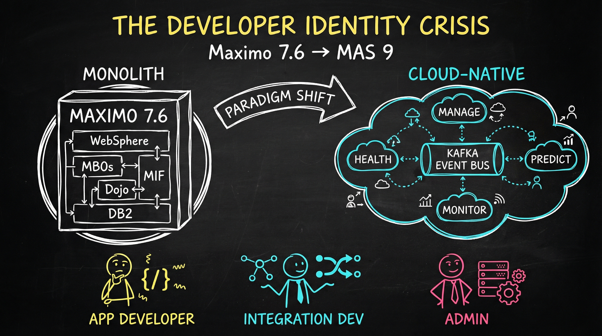

# The Maximo Developer's Identity Crisis: Why Cloud-Native Changes Everything

> **You've mastered Maximo 7.6. Congratulations—now forget half of what you know.**

That statement stings. If you've spent years—maybe a decade or more—becoming an expert in Maximo, the idea of "forgetting" anything feels like an insult. But here's the truth: the transition from Maximo 7.6 to IBM Maximo Application Suite (MAS) 9 isn't a version upgrade. It's an architectural paradigm shift.

The good news? You don't actually need to forget anything. But you do need to rewire how you think about building, integrating, and operating Maximo systems. This series is your guide to that mental transformation.

---

## The Platform Shift: Two Different Worlds

Let's start with a visual reality check. Here's what you've been working with versus where you're going:



### Maximo 7.6: The Monolith

```
┌─────────────────────────────────────────────────────────┐
│                    WebSphere App Server                  │
│  ┌─────────────────────────────────────────────────────┐│
│  │              Maximo EAR (Everything)                ││
│  │  ┌──────────┐ ┌──────────┐ ┌──────────┐            ││
│  │  │   MBOs   │ │ Services │ │   UI     │            ││
│  │  │  (Java)  │ │  (MIF)   │ │ (Dojo)   │            ││
│  │  └──────────┘ └──────────┘ └──────────┘            ││
│  │  ┌──────────────────────────────────────┐          ││
│  │  │      Automation Scripts (Python)     │          ││
│  │  └──────────────────────────────────────┘          ││
│  └─────────────────────────────────────────────────────┘│
└───────────────────────────┬─────────────────────────────┘
                            │
                    ┌───────▼───────┐
                    │   Database    │
                    │ (DB2/Oracle)  │
                    └───────────────┘
```

In 7.6, everything lives together. Your customizations, IBM's code, integrations, UI—all bundled in one deployable unit. You modify it directly. You own the infrastructure. When something breaks, you troubleshoot WebSphere thread dumps and database locks.

### MAS 9: The Distributed Cloud-Native Platform

```
┌─────────────────────────────────────────────────────────────────────┐
│                        Red Hat OpenShift                             │
│  ┌──────────┐ ┌──────────┐ ┌──────────┐ ┌──────────┐ ┌──────────┐  │
│  │  Manage  │ │  Health  │ │ Predict  │ │ Monitor  │ │  Assist  │  │
│  │ (pods)   │ │ (pods)   │ │ (pods)   │ │ (pods)   │ │ (pods)   │  │
│  └────┬─────┘ └────┬─────┘ └────┬─────┘ └────┬─────┘ └────┬─────┘  │
│       │            │            │            │            │         │
│       └────────────┴─────┬──────┴────────────┴────────────┘         │
│                          │                                           │
│  ┌───────────────────────▼───────────────────────────────────────┐  │
│  │                    Event Bus (Kafka)                           │  │
│  │              API Gateway │ Service Mesh                        │  │
│  └───────────────────────────────────────────────────────────────┘  │
│                                                                      │
│  ┌──────────┐  ┌──────────┐  ┌──────────┐  ┌──────────────────────┐│
│  │ MongoDB  │  │ Postgres │  │  DB2WH   │  │ Cloud Pak for Data   ││
│  └──────────┘  └──────────┘  └──────────┘  └──────────────────────┘│
└─────────────────────────────────────────────────────────────────────┘
```

In MAS, applications are decomposed. They communicate through APIs and events. You extend through supported patterns rather than modifying core code. Infrastructure is managed by operators and the platform. When something breaks, you look at pod logs, events, and distributed traces.

**This isn't just a technology change. It's a philosophy change.**

---

## Three Developer Archetypes: Which One Are You?

Not everyone experiences this shift the same way. Based on your role, the transformation journey looks different. We've identified three distinct technical archetypes, each with unique concerns and learning paths.

### The Application Developer

**You build custom functionality inside Maximo.**

In 7.6, you lived in automation scripts, custom MBOs, and maybe some JSP customizations. You thought in terms of object events—"When a work order saves, run this script." You might have written Java classes that extended MboSet. You knew MAXATTRIBUTE and MAXOBJECT like the back of your hand.

**Your fears:**
- "Will my automation scripts survive migration?"
- "Do I need to learn Kubernetes?"
- "What happens to my custom Java code?"
- "Is Python still relevant?"

**The reality:** Your automation scripts largely survive. Your Java MBOs need evaluation. Kubernetes is mostly invisible to you. Python is still there, but you'll also meet GraphQL and REST APIs as your new best friends.

**Your mindset shift:**
| From (7.6) | To (MAS) |
|------------|----------|
| Modify the product directly | Extend via supported patterns |
| Server-side everything | Client-side + API calls |
| Direct SQL when needed | GraphQL/REST APIs exclusively |
| WAR/EAR deployment knowledge | API and event publishing |

*In Blog 2, we'll dive deep into your specific journey—what to keep, what to modernize, and what new skills to prioritize.*

---

### The Integration Developer

**You connect Maximo to everything else.**

In 7.6, you were the MIF master. Object structures, publish channels, enterprise services—you could configure an integration in your sleep. You dealt with flat file processing, CRON tasks, and probably more SOAP web services than you'd like to admit. You might have written custom processing rules or integration beans.

**Your fears:**
- "Will MIF still work?"
- "Our integrations took years to build—do we start over?"
- "How do real-time events work in MAS?"
- "What about our scheduled batch jobs?"

**The reality:** MIF still exists in Manage, but it's no longer the center of the integration universe. You're entering a world of event streams, API gateways, and iPaaS tools like App Connect. The good news? You can migrate incrementally. The challenging news? Batch-first thinking needs to become event-first thinking.

**Your mindset shift:**
| From (7.6) | To (MAS) |
|------------|----------|
| Batch-first, scheduled | Event-driven, real-time |
| Point-to-point integrations | API gateway, event mesh |
| MIF for everything | App Connect, Kafka, modern iPaaS |
| SOAP/XML default | REST/JSON default |
| Polling for changes | Webhook subscriptions, pub/sub |

*In Blog 3, we'll map every MIF concept to its MAS equivalent and show you how to evolve integrations without starting from scratch.*

---

### The Legacy Maximo Admin

**You keep Maximo running.**

In 7.6, you were the WebSphere whisperer. You knew JVM tuning, connection pools, and thread dumps. You managed the database—whether DB2, Oracle, or SQL Server—and understood its query plans. You handled patches, upgrades, backups, and that one production issue at 3 AM. Security, LDAP, SSL certificates—all you.

**Your fears:**
- "What happens to my job if IBM runs everything?"
- "Do I need to learn Kubernetes from scratch?"
- "Who's responsible when things break in the cloud?"
- "How do I troubleshoot containers?"

**The reality:** Your job doesn't disappear—it transforms. Yes, IBM and Red Hat manage more of the low-level infrastructure. But someone needs to operate MAS within your organization: manage operators, configure observability, handle capacity planning, and understand the shared responsibility model. Your deep Maximo operational knowledge is invaluable. The tools change; the responsibility doesn't vanish.

**Your mindset shift:**
| From (7.6) | To (MAS) |
|------------|----------|
| Own the infrastructure | Operate on shared platform |
| Install and configure | Deploy via operators |
| Manual monitoring tools | Platform observability (Prometheus, Grafana) |
| Database DBA skills | Managed database services |
| Patching cycles | Continuous updates, GitOps |
| Vertical scaling | Horizontal pod autoscaling |

*In Blog 4, we'll address the existential questions head-on and show you where experienced admins add the most value in the MAS world.*

---

## The Common Thread: What Everyone Must Understand

Regardless of which archetype you identify with, certain concepts apply to everyone making this transition.

### 1. API-First Thinking

In 7.6, you could often bypass APIs—direct database access, server-side object manipulation, internal method calls. In MAS, APIs are the contract. Everything communicates through well-defined interfaces. This isn't a restriction; it's a feature. It means:

- Better versioning and backward compatibility
- Cleaner separation between components
- Easier testing and debugging
- Support for diverse client types (web, mobile, integrations)

**Start thinking:** "How would I do this through an API?" instead of "How would I do this in the code?"

### 2. Event-Driven Architecture

The traditional Maximo model was request-response: user clicks button, system processes, user sees result. MAS introduces event-driven patterns throughout:

- Work order created → Event published → Multiple systems react
- Sensor data arrives → Event triggers → Analytics process → Alerts generate

This enables real-time responsiveness and loose coupling between systems. Your integration doesn't need to know who else cares about a work order creation—it just publishes the event.

### 3. Observability Over Debugging

In 7.6, when something broke, you might connect a debugger, analyze thread dumps, or add logging and redeploy. In MAS, you work with:

- **Logs** aggregated across pods (not files on a server)
- **Metrics** collected automatically (Prometheus)
- **Traces** showing request flow through distributed services
- **Events** from Kubernetes showing what happened when

This requires learning new tools, but provides better visibility than the old approach—once you know where to look.

### 4. Infrastructure as Code

Manual server configuration doesn't scale in cloud-native environments. In MAS:

- Operators manage application deployment declaratively
- Configuration is version-controlled
- Environments are reproducible
- Changes are auditable

Even if you're not writing Ansible playbooks or Kubernetes manifests, understanding this model helps you work effectively with platform teams.

---

## What Stays the Same: Your Foundation Holds

Here's the reassuring part. The core Maximo domain model hasn't changed:

**Still the same:**
- Work orders, assets, locations, service addresses
- Preventive maintenance and job plans
- Workflow and escalations
- Security groups and organizations
- Inventory, purchasing, contracts
- Reporting and KPIs

**The concepts transfer directly.** If you understand how PM generation works, you understand it in MAS. If you know Maximo's condition-based workflow routing, that knowledge applies. The business logic, the domain expertise, the understanding of how asset management works—all that comes with you.

What changes is the technology layer *underneath* these concepts and the extension mechanisms *around* them.

---

## What Changes Fundamentally: The Paradigm Shifts

Beyond the technical specifics, three fundamental paradigm shifts affect everyone:

### From "Modify" to "Extend"

In 7.6, customization often meant changing IBM's delivered code—or at least interacting with it very closely. In MAS, the model is extension: you build *on top of* the platform using supported extensibility points. This feels constraining at first but leads to:

- Easier upgrades (your extensions survive)
- Better support (IBM can help you because you haven't broken their code)
- Clearer boundaries (your code, their code)

### From "Scheduled" to "Reactive"

The batch-processing mindset—"run this CRON job nightly"—gives way to event-driven thinking. Instead of asking "when does this run?" ask "what event should trigger this?" This enables real-time responses but requires rethinking process design.

### From "Control" to "Collaborate"

You no longer own the full stack. This feels like losing control, but it's actually gaining capability. IBM handles platform security patches. Red Hat manages Kubernetes upgrades. You focus on what matters most: making Maximo deliver value for your organization.

---

## What's Next: Your Learning Journey

This blog is the first in a four-part series designed to guide your transformation:

| Part | Title | For |
|------|-------|-----|
| 1 | The Maximo Developer's Identity Crisis (You are here) | Everyone |
| 2 | From MBOs to Microservices | Application Developers |
| 3 | Beyond MIF: The Event-Driven Awakening | Integration Developers |
| 4 | From WebSphere Admin to Platform Engineer | Legacy Admins |

Each subsequent blog dives deep into role-specific concerns with practical examples, learning paths, and honest assessments of what's harder, easier, and different.

---

## Identify Your Path

Before you move on, answer honestly: **Which archetype describes you best?**

Maybe you're a hybrid—many Maximo professionals wear multiple hats. That's fine. Read the blogs that apply to your responsibilities. But be honest about where your skills need the most development.

**The transition to MAS isn't optional.** IBM's direction is clear. The question isn't whether you'll make this shift, but how prepared you'll be when you do.

Your Maximo expertise isn't becoming obsolete. It's becoming the foundation for something more powerful—if you're willing to evolve how you apply it.

---

## Key Takeaways

- **MAS is a paradigm shift**, not a version upgrade—architecture, patterns, and tools all change
- **Three technical roles** face different journeys: App Developers, Integration Developers, and Admins
- **Core Maximo knowledge transfers**—work orders, assets, PM, workflow all work the same conceptually
- **What changes:** extension patterns, integration approaches, operational models
- **Your expertise is valuable**—the domain knowledge stays, the "how" evolves

---

## References

- [IBM MAS Documentation](https://www.ibm.com/docs/en/mas)
- [Red Hat OpenShift Documentation](https://docs.openshift.com/)
- [MAS on GitHub](https://github.com/ibm-mas)
- [Maximo Secrets Community](https://maximosecrets.com/)

---

*This is Part 1 of the "Developer Mindset Shift" series. Next: [From MBOs to Microservices: The Application Developer's Cloud-Native Journey](#)*

---

**Ready to dive deeper? Identify your role and follow the series that matches your journey. The transformation starts with understanding—and you've already begun.**
