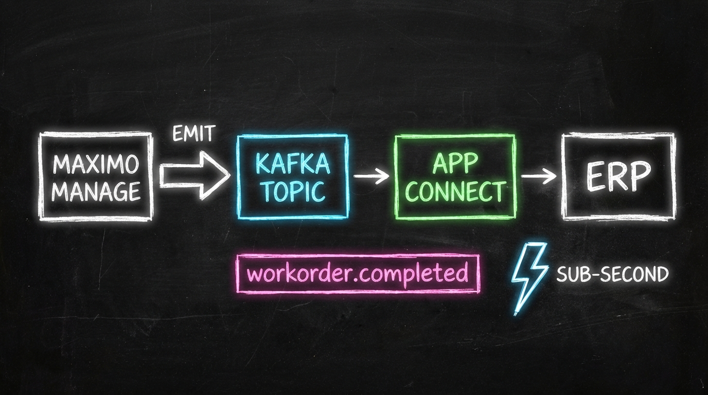
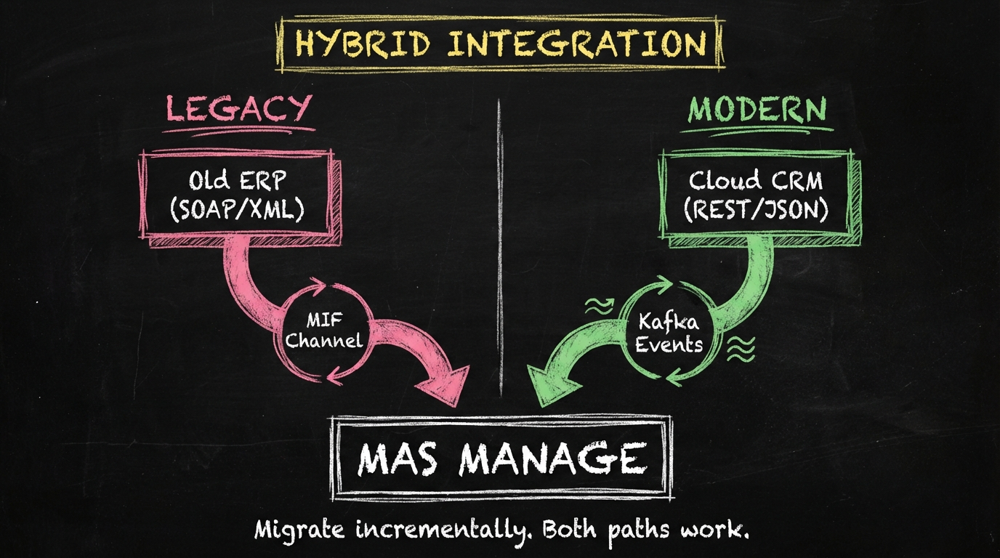

# Beyond MIF: The Integration Developer's Event-Driven Awakening

> **MIF isn't dead, but it's no longer the center of your universe.**

If you've spent years mastering the Maximo Integration Framework—object structures, publish channels, enterprise services, processing rules—the move to MAS might feel like a threat to your expertise. You've built complex integrations that took months to design and years to stabilize. The idea of "event-driven architecture" sounds like starting over.

Here's the truth: your integration knowledge is valuable, your existing integrations can migrate, and the new patterns are genuinely better. This blog bridges the gap between what you know and where you're going.

---

## The MIF Legacy: What We Built

Let's acknowledge the power of what you've created. MIF was—and in many ways still is—a sophisticated integration framework.

### The MIF Architecture


**The components you know:**

- **Object Structures**: Define what data moves (MXWO, MXASSET, custom structures)
- **Publish Channels**: Push data out when events occur
- **Enterprise Services**: Receive data from external systems
- **Integration Channels**: Protocol handlers (HTTP, JMS, flat file)
- **Processing Rules**: Transform and route data
- **CRON Tasks**: Schedule batch processing

**What worked:**
- Declarative configuration (mostly XML/database)
- Flexible data mapping
- Transaction support
- Error handling and retry mechanisms

**What didn't:**
- Batch-first mentality created latency
- Point-to-point connections became spaghetti
- SOAP/XML verbosity
- Debugging complexity
- Scaling challenges

---

## The Event-Driven Paradigm: How MAS Changes Integration

MAS introduces a fundamental shift in how systems communicate. Instead of "push data on a schedule" or "call a service when needed," the model becomes "announce what happened, let interested parties react."

### The New Architecture


### Key Differences

| Aspect | MIF (7.6) | Event-Driven (MAS) |
|--------|-----------|-------------------|
| **Trigger** | Schedule or explicit call | Data change emits event |
| **Coupling** | Point-to-point | Pub/sub, loose coupling |
| **Latency** | Batch intervals | Near real-time |
| **Scaling** | Vertical (bigger server) | Horizontal (more consumers) |
| **Protocol** | SOAP/XML, JMS, flat files | REST/JSON, Kafka, webhooks |
| **Error handling** | Retry queues, manual intervention | Dead letter queues, replay |

---

## Practical Mapping: MIF Concepts → MAS Equivalents

Let's translate what you know into what you'll use.

### Object Structures → GraphQL Schemas + Event Payloads

**MIF Object Structure (7.6):**
```xml
<MXWO>
  <WORKORDER>
    <WONUM/>
    <DESCRIPTION/>
    <STATUS/>
    <ASSET>
      <ASSETNUM/>
      <DESCRIPTION/>
    </ASSET>
  </WORKORDER>
</MXWO>
```

**MAS GraphQL Query:**
```graphql
query {
  workOrder(wonum: "1001") {
    wonum
    description
    status
    asset {
      assetnum
      description
    }
  }
}
```

**MAS Event Payload (Kafka):**
```json
{
  "eventType": "workorder.updated",
  "timestamp": "2026-02-05T10:30:00Z",
  "data": {
    "wonum": "1001",
    "description": "Pump maintenance",
    "status": "APPR",
    "previousStatus": "WAPPR"
  }
}
```

**Key insight:** You're still defining data structures, but the format and delivery mechanism change.

---

### Publish Channels → Event Topics + Webhooks

**MIF Publish Channel (7.6):**
- Triggered by object save/update
- Writes to JMS queue or calls HTTP endpoint
- Configured per object structure

**MAS Event Publishing:**
- Automatic event emission on data changes
- Events published to Kafka topics
- Subscribers register interest

**Configuration comparison:**

| MIF Publish Channel | MAS Event |
|---------------------|-----------|
| Enable publish on WORKORDER save | Events auto-publish when configured |
| Select object structure MXWO | Define event schema/payload |
| Configure JMS queue destination | Kafka topic (e.g., `mas.workorder.events`) |
| Add processing rules for filtering | Consumer-side filtering |

**Migration approach:**
1. Identify which publish channels exist
2. Map each to equivalent MAS event topic
3. Update consumers to subscribe to Kafka instead of JMS
4. Test event delivery and payload structure

---

### Enterprise Services → REST APIs + Event Consumers

**MIF Enterprise Service (7.6):**
- SOAP endpoint receives XML
- Processing rules validate and transform
- Creates/updates Maximo data

**MAS Equivalents:**

**Option A: REST API (Synchronous)**
```bash
POST /maximo/api/os/mxwo
Content-Type: application/json

{
  "wonum": "1001",
  "description": "New work order from ERP",
  "status": "WAPPR",
  "assetnum": "PUMP001"
}
```

**Option B: GraphQL Mutation (Synchronous)**
```graphql
mutation {
  createWorkOrder(input: {
    wonum: "1001"
    description: "New work order from ERP"
    status: "WAPPR"
    assetnum: "PUMP001"
  }) {
    wonum
    status
  }
}
```

**Option C: Event Consumer (Asynchronous)**
- External system publishes to shared Kafka topic
- MAS consumer picks up and processes
- Acknowledgment via event response

**When to use which:**
- **REST/GraphQL**: Need immediate response, request-reply pattern
- **Event Consumer**: Fire-and-forget, bulk processing, eventual consistency OK

---

### CRON Tasks → Event Triggers + Scheduled Functions

**MIF CRON Task (7.6):**
```
Name: ERPSYNC
Schedule: 0 */15 * * * ?  (Every 15 minutes)
Action: Run integration to sync with ERP
```

**MAS Equivalents:**

**Option A: Event-Triggered (Preferred)**
Instead of polling every 15 minutes, react to events:
```
When: workorder.status.changed to "COMP"
Then: Send completion notification to ERP
Latency: Seconds instead of up to 15 minutes
```

**Option B: Scheduled Function (When needed)**
For truly time-based requirements:
```yaml
# Kubernetes CronJob
apiVersion: batch/v1
kind: CronJob
metadata:
  name: daily-report-sync
spec:
  schedule: "0 2 * * *"  # 2 AM daily
  jobTemplate:
    spec:
      template:
        spec:
          containers:
          - name: sync-job
            image: my-sync-image:latest
            command: ["python", "run_sync.py"]
```

**Mindset shift:** Ask "what event should trigger this?" before defaulting to "what schedule should run this?"

---

## Integration Patterns in MAS

### Pattern 1: Real-Time Event Streaming

**Scenario:** ERP needs to know immediately when work orders complete.

**7.6 Approach:**
- CRON job every 15 minutes
- Query for completed work orders since last run
- Send batch to ERP
- Handle duplicates, ordering issues

**MAS Approach:**


**Benefits:**
- Sub-second latency
- No duplicate handling needed
- Automatic retry on failure
- Scales with volume

---

### Pattern 2: API Composition

**Scenario:** Mobile app needs work order with related assets, parts, and labor.

**7.6 Approach:**
- Multiple OSLC calls
- Client-side assembly
- Performance issues with chatty API

**MAS Approach (GraphQL):**
```graphql
query MobileWorkOrder($wonum: String!) {
  workOrder(wonum: $wonum) {
    wonum
    description
    status
    location {
      location
      description
      coordinates
    }
    asset {
      assetnum
      description
      specifications {
        name
        value
      }
    }
    wpmaterial {
      itemnum
      description
      quantity
    }
    labor {
      laborcode
      craft
      hours
    }
  }
}
```

**Benefits:**
- Single request, all data
- Client specifies exactly what it needs
- Reduced network overhead

---

### Pattern 3: Hybrid (MIF + Modern)

**Reality:** You won't rewrite everything at once. Hybrid patterns let you modernize incrementally.



**Strategy:**
1. Keep existing MIF integrations running
2. New integrations use modern patterns
3. Migrate legacy integrations when systems upgrade
4. Set deprecation timeline for MIF-based integrations

---

## The Learning Path: What Integration Developers Need

### Priority 1: REST API Fundamentals (Week 1)

If you've lived in SOAP/XML world, REST feels different:

| SOAP | REST |
|------|------|
| WSDL defines contract | OpenAPI/Swagger spec |
| POST for everything | HTTP verbs matter (GET, POST, PUT, DELETE) |
| XML payload | JSON payload |
| WS-Security | OAuth, API keys, JWT |

**Practice:**
- Explore MAS REST APIs using Postman
- Convert a simple MIF integration to REST

### Priority 2: Event-Driven Architecture (Weeks 2-3)

Understand the patterns:
- **Publishers** don't know subscribers
- **Events** are facts (something happened)
- **Commands** are requests (do something)
- **Eventual consistency** is acceptable

**Key Kafka concepts:**
- Topics (named channels)
- Producers (publish events)
- Consumers (subscribe to events)
- Consumer groups (load balancing)
- Offsets (tracking position)

### Priority 3: App Connect Basics (Weeks 3-4)

IBM App Connect provides:
- Pre-built connectors to SaaS apps
- Flow designer (low-code)
- Transformation capabilities
- Error handling

**When to use:**
- Connecting to Salesforce, SAP, ServiceNow
- Simple transformations
- Non-technical users need to manage

**When to code instead:**
- Complex business logic
- High-performance requirements
- Existing development team capacity

### Priority 4: GraphQL (Ongoing)

Even as an integration developer, GraphQL knowledge helps:
- Building API-based integrations
- Debugging data issues
- Understanding MAS data model

---

## Migration Strategy: Evolving Incrementally

### Phase 1: Assessment (Weeks 1-2)

Document all integrations:

| Integration | Type | Protocol | Frequency | Criticality | Migration Effort |
|-------------|------|----------|-----------|-------------|------------------|
| ERP WO Sync | Outbound | SOAP | 15 min | High | Medium |
| Asset Import | Inbound | Flat file | Daily | Medium | Low |
| IoT Meters | Inbound | HTTP | Real-time | High | High |

### Phase 2: Quick Wins (Weeks 3-6)

Start with:
- Low-criticality integrations
- Simple patterns (one-way, no transformation)
- New integrations (build modern from start)

### Phase 3: Strategic Migrations (Months 2-6)

For each high-value integration:
1. Design modern equivalent
2. Build and test in parallel
3. Run both (compare results)
4. Cut over when confident
5. Decommission legacy

### Phase 4: Deprecation (Ongoing)

Set clear timelines:
- "No new MIF integrations after Q2 2026"
- "All MIF integrations migrated by Q4 2027"

---

## Key Takeaways

1. **MIF survives** — but plan for evolution, not permanence
2. **Events beat batches** — real-time, loosely coupled, scalable
3. **REST/JSON is the new default** — SOAP/XML for legacy only
4. **App Connect handles common patterns** — save custom code for custom needs
5. **Migrate incrementally** — parallel runs, gradual cutover

---

## References

- [IBM MAS Integration Documentation](https://www.ibm.com/docs/en/mas)
- [Apache Kafka Documentation](https://kafka.apache.org/documentation/)
- [IBM App Connect Documentation](https://www.ibm.com/docs/en/app-connect)
- [Event-Driven Architecture Patterns](https://martinfowler.com/articles/201701-event-driven.html)

---

*This is Part 3 of the "Developer Mindset Shift" series. Previous: [From MBOs to Microservices](#) | Next: [From WebSphere Admin to Platform Engineer](#)*
