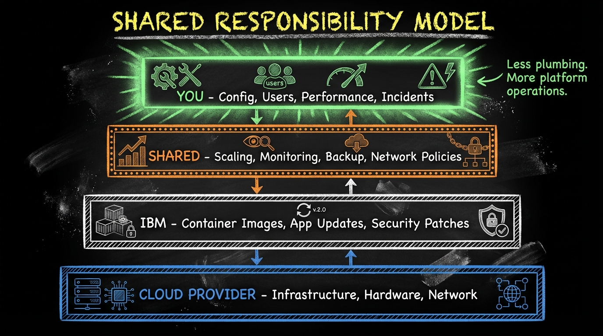

# From WebSphere Admin to Platform Engineer: The Maximo Admin's Evolution

> **Your job title might change, but you're more valuable than ever.**

If you've spent years as a Maximo administrator—managing WebSphere, tuning databases, handling upgrades, troubleshooting production issues—the move to MAS raises existential questions. If IBM runs the platform, what do you do? If containers replace servers, what happens to your skills?

This blog addresses these questions directly. Your role doesn't disappear; it evolves. The organizations that succeed with MAS will be those with people who understand both Maximo and cloud operations. That's you—if you're willing to learn.

---

## The Traditional Admin Role: What Defined You

Let's honor what you've built. Maximo administration in the 7.6 world was complex, demanding, and required deep expertise.

### Your Domain

**Infrastructure Management:**
- WebSphere Application Server configuration
- JVM tuning, garbage collection optimization
- Cluster management, session replication
- Load balancer configuration

**Database Administration:**
- DB2, Oracle, or SQL Server management
- Query optimization, index tuning
- Backup and recovery procedures
- Storage management

**Maximo Operations:**
- Patch application and upgrade planning
- Performance monitoring and troubleshooting
- Security configuration (LDAP, SSL, users, groups)
- CRON task management
- Log analysis and debugging

**The 3 AM Calls:**
- Application hung? Thread dump analysis
- Database slow? Execution plan review
- Integration failed? Queue investigation
- Users can't login? LDAP/security debugging

You were the person who kept Maximo running. That responsibility doesn't go away—but how you fulfill it changes.

---

## The Shared Responsibility Model: Who Does What

MAS operates on a shared responsibility model. Understanding the boundaries is crucial.

### The Responsibility Matrix



### What This Means for You

**You're not responsible for:**
- Patching WebSphere (there is no WebSphere)
- Building Maximo EAR files
- Managing JVM versions
- Container security scanning (IBM handles)

**You're still responsible for:**
- Ensuring MAS meets business SLAs
- Responding to incidents
- Planning capacity for growth
- Managing user access
- Configuring integrations
- Performance optimization

**The shift:** Less infrastructure plumbing, more platform operations and business alignment.

---

## New Responsibilities: What Admins Do in MAS

### Operator Management

MAS uses Kubernetes Operators—automated controllers that manage application lifecycle.

**Key operators you'll interact with:**
- **IBM Maximo Application Suite Operator**: Core MAS management
- **IBM Maximo Manage Operator**: Manage-specific functions
- **MongoDB Operator**: Database for some MAS components
- **Kafka Operator**: Event streaming infrastructure

**Your role:**
- Understand operator status and health
- Configure operator parameters
- Troubleshoot operator-related issues
- Plan and execute operator upgrades

**Example: Checking operator status**
```bash
# List operators
oc get csv -n mas-instance

# Check MAS operator health
oc get pods -n mas-instance | grep operator

# View operator logs
oc logs -n mas-instance deployment/ibm-mas-operator -f
```

### Platform Observability

Traditional monitoring tools (Tivoli, custom scripts) give way to platform-native observability.

**The Three Pillars:**

**1. Logs**
- Aggregated across all pods
- Searchable via OpenShift console or external tools (Elasticsearch, Splunk)
- No more SSH to find log files

```bash
# View Manage pod logs
oc logs -n mas-manage-instance deployment/manage-server -f

# Search logs for errors
oc logs -n mas-manage-instance deployment/manage-server | grep ERROR
```

**2. Metrics**
- Prometheus collects automatically
- Grafana dashboards visualize
- CPU, memory, request latency, custom metrics

```yaml
# Example Prometheus query: MAS response time
histogram_quantile(0.95,
  sum(rate(http_request_duration_seconds_bucket{app="manage"}[5m]))
  by (le)
)
```

**3. Traces**
- Request flow across services
- Identify bottlenecks
- Jaeger or similar for distributed tracing

### Capacity Planning in Kubernetes

Instead of "we need a bigger server," you think in terms of:

**Resource Requests and Limits:**
```yaml
resources:
  requests:
    memory: "4Gi"
    cpu: "2"
  limits:
    memory: "8Gi"
    cpu: "4"
```

**Horizontal Pod Autoscaling:**
```yaml
# Scale based on CPU usage
apiVersion: autoscaling/v2
kind: HorizontalPodAutoscaler
metadata:
  name: manage-hpa
spec:
  scaleTargetRef:
    apiVersion: apps/v1
    kind: Deployment
    name: manage-server
  minReplicas: 3
  maxReplicas: 10
  metrics:
  - type: Resource
    resource:
      name: cpu
      target:
        type: Utilization
        averageUtilization: 70
```

**Your planning questions:**
- How many concurrent users at peak?
- What's the resource profile of typical workloads?
- How quickly do we need to scale for demand spikes?
- What's our cost model for additional capacity?

### Security in Containerized Environments

Security model changes but doesn't simplify.

**What's different:**
- Pod security policies replace server hardening
- Network policies replace firewall rules
- Secrets management replaces file-based credentials
- RBAC (Role-Based Access Control) at Kubernetes level

**What you manage:**
- User authentication (SSO, LDAP integration)
- MAS security groups and permissions
- API access controls
- Encryption at rest and in transit configuration

```bash
# Check network policies
oc get networkpolicies -n mas-instance

# Review secrets
oc get secrets -n mas-instance

# Check RBAC
oc get rolebindings -n mas-instance
```

---

## Skills Transition: From Traditional Admin to Platform Engineer

### The Skills Map

| Traditional Skill | Transfers To | New Tools |
|-------------------|--------------|-----------|
| WebSphere tuning | Resource configuration | Pod specs, HPA |
| Database admin | Managed DB operations | Cloud DB consoles, operators |
| Log file analysis | Log aggregation | ELK, Splunk, oc logs |
| Performance monitoring | Observability | Prometheus, Grafana |
| Patch management | Operator upgrades | oc, GitOps |
| Load balancer config | Ingress/Route config | oc expose, routes |
| SSL certificate mgmt | Cert-manager | Let's Encrypt, cert-manager |
| Backup scripts | Velero, cloud snapshots | Backup operators |

### Priority Learning Path

**Week 1-2: Kubernetes Fundamentals**

You don't need to design clusters, but understand:

```bash
# Essential commands
oc get pods                    # List running workloads
oc describe pod <name>         # Detailed pod info
oc logs <pod>                  # View logs
oc exec -it <pod> -- /bin/bash # Shell into container
oc get events                  # Cluster events
oc top pods                    # Resource usage
```

**Key concepts:**
- Pods (smallest deployable unit)
- Deployments (manage pod replicas)
- Services (network access to pods)
- ConfigMaps and Secrets (configuration)
- Persistent Volumes (storage)

**Week 3-4: OpenShift Specifics**

OpenShift adds enterprise features:
- Routes (external access)
- Projects (namespaces with extras)
- Security Context Constraints
- Built-in monitoring
- Web console

**Practice:**
- Navigate OpenShift console
- Deploy a test application
- Set up resource quotas
- Configure routes

**Week 5-6: Observability Stack**

- Prometheus basics (metrics, queries)
- Grafana dashboard creation
- Alert configuration
- Log aggregation patterns

**Week 7-8: MAS-Specific Operations**

- MAS operator management
- Manage configuration
- Backup and restore procedures
- Upgrade processes

---

## A Day in the Life: Comparison

### 7.6 Admin Day

```
8:00  Check overnight batch job logs (SSH to server, grep log files)
8:30  Review WebSphere performance (PMI metrics, connection pools)
9:00  User reports slow performance → analyze thread dumps
10:00 Meeting: Capacity planning for new department
11:00 Apply Maximo fix pack to test environment
14:00 Troubleshoot failed integration → check JMS queues
15:00 Review database AWR report with DBA
16:00 Update SSL certificate expiring next week
17:00 Document changes for change management
```

### MAS Admin Day

```
8:00  Check Grafana dashboard for overnight metrics
8:30  Review alerts in PagerDuty/Prometheus AlertManager
9:00  User reports slow performance → check pod metrics, scale if needed
10:00 Meeting: Capacity planning (review HPA settings, cost projections)
11:00 Apply MAS operator update to test environment (oc apply)
14:00 Troubleshoot failed integration → check Kafka consumer lag
15:00 Review managed database metrics in cloud console
16:00 Cert-manager auto-renewed certificate → verify
17:00 Update GitOps repo with configuration changes
```

**What changed:**
- More dashboards, less SSH
- Automated scaling vs manual intervention
- GitOps for changes vs direct modification
- Cloud consoles vs local admin tools

**What didn't change:**
- Troubleshooting mindset
- Capacity planning responsibility
- Documentation requirements
- Being the person who keeps it running

---

## Career Path: Where Experienced Admins Add Value

### The Hybrid Expert

Organizations migrating to MAS desperately need people who understand:
- How Maximo works (business logic, configuration, data model)
- How cloud platforms work (containers, orchestration, observability)

This combination is rare. Pure cloud engineers don't understand Maximo. Long-time Maximo admins are learning cloud. You can become the bridge.

### Migration Project Leadership

Every MAS migration needs technical leadership from someone who:
- Knows what exists in the current environment
- Can assess migration risks
- Understands operational requirements
- Can train the team on new patterns

That's a senior role with significant impact.

### Operational Excellence in MAS

Post-migration, organizations need people who:
- Establish operational standards
- Build monitoring and alerting
- Create runbooks for common issues
- Optimize performance and cost
- Train others

---

## Getting Started: First Steps

### This Week

1. **Get access to a Kubernetes/OpenShift environment**
   - Developer sandbox (free)
   - Lab environment at work
   - Local minikube/kind

2. **Learn basic commands**
   ```bash
   kubectl get pods
   kubectl describe pod <name>
   kubectl logs <pod>
   ```

3. **Explore your MAS environment** (if you have one)
   - What's running?
   - Where are the logs?
   - What does the console show?

### This Month

1. **Complete OpenShift basics training**
   - Red Hat provides free learning paths
   - IBM SkillsBuild has relevant courses

2. **Set up local observability**
   - Run Prometheus locally
   - Create a Grafana dashboard

3. **Document your current environment**
   - What would need to migrate?
   - What skills gap do you have?

### This Quarter

1. **Pursue relevant certification**
   - IBM MAS certification
   - Red Hat OpenShift certification
   - CKA if you want deep Kubernetes

2. **Lead a migration workstream**
   - Volunteer for the MAS project
   - Own operational readiness

3. **Build expertise visibility**
   - Share learnings internally
   - Document patterns that work

---

## Key Takeaways

1. **Your job transforms, not disappears** — platform operations still need humans
2. **Shared responsibility changes your focus** — less infrastructure, more outcomes
3. **Kubernetes is practical knowledge** — learn what you'll use daily
4. **Observability replaces traditional debugging** — metrics, logs, traces
5. **Your Maximo expertise is irreplaceable** — combined with cloud skills, you're uniquely valuable

---

## References

- [Red Hat OpenShift Documentation](https://docs.openshift.com/)
- [Kubernetes Documentation](https://kubernetes.io/docs/)
- [IBM MAS Operations Guide](https://www.ibm.com/docs/en/mas)
- [Prometheus Documentation](https://prometheus.io/docs/)
- [Grafana Documentation](https://grafana.com/docs/)

---

*This is Part 4 of the "Developer Mindset Shift" series. Previous: [Beyond MIF: The Event-Driven Awakening](#) | Start: [The Maximo Developer's Identity Crisis](#)*

---

## Series Complete

Congratulations on completing this series. Whether you're an application developer, integration specialist, or administrator, the path forward requires learning—but builds on everything you already know.

The organizations that thrive with MAS will be those that invest in their people. You've already invested in yourself by reading this far. Keep going.

**Your Maximo expertise isn't becoming obsolete. It's becoming the foundation for something more powerful.**
