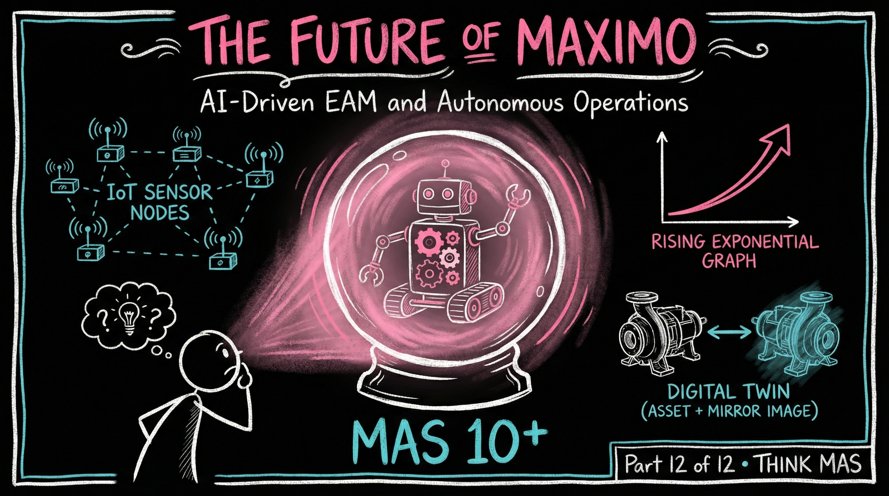

# The Future of Maximo: From Asset Management to Autonomous Operations



> **Who this is for:** Maximo professionals, IT strategists, reliability leaders, and anyone invested in the long-term future of enterprise asset management -- whether you are mid-migration or already running MAS 9 and planning what comes next.

**Read Time:** 18-20 minutes

---

## Introduction: The 2035 Vision

It's 2035. You wake to a notification: **"Pump P-104 self-corrected high vibration condition. Work order auto-generated for preventive bearing lubrication in 45 days. Zero production impact."**

This isn't science fiction. The trajectory from Maximo 7.6 to MAS 9 to autonomous operations is already clear. This blog explores where we're going -- and how to prepare.

---

## Part 1: The Evolution of Asset Management

### Five Stages of EAM Maturity

**Stage 1: Reactive (1990s-2000s) - "Fix When Broken"**

```
Characteristics:
- Run to failure
- Emergency maintenance
- Paper-based work orders
- No historical data
- High downtime

Maximo Era: Maximo 4-5 (client-server)
Cost Impact: Highest
Downtime: 15-20% of operational time
```

**Stage 2: Preventive (2000s-2010s) - "Fix on Schedule"**

```
Characteristics:
- Time-based maintenance
- PM schedules
- CMMS adoption
- Basic reporting
- Over-maintenance common

Maximo Era: Maximo 6-7.6
Cost Impact: High (unnecessary PM)
Downtime: 8-12% of operational time
```

**Stage 3: Predictive (2015-2025) - "Fix Before Failure"**

```
Characteristics:
- Condition-based maintenance
- IoT sensors
- AI/ML predictions
- Integration with SCADA
- Optimal timing

Maximo Era: MAS 8-9 (Predict, Monitor, Health)
Cost Impact: Medium
Downtime: 3-6% of operational time
```

**Stage 4: Prescriptive (2025-2030) - "AI Recommends Actions"**

```
Characteristics:
- AI suggests specific actions
- Digital twins simulate outcomes
- Multi-modal inspections
- Autonomous work order generation
- Human approves AI recommendations

Maximo Era: MAS 9.1-10 (Maximo Assistant, watsonx)
Cost Impact: Low
Downtime: 1-3% of operational time
```

**Stage 5: Autonomous (2030-2040) - "Self-Healing Assets"**

```
Characteristics:
- AI executes corrections automatically
- Self-healing systems
- Predictive + prescriptive + autonomous
- Human oversight only
- Near-zero unplanned downtime

Maximo Era: MAS 11+ (AI agents, autonomous operations)
Cost Impact: Minimal
Downtime: <1% of operational time
```

**We are currently between Stage 3 and Stage 4.**

> **Key insight:** The five-stage EAM evolution from Reactive to Autonomous is not speculation -- it is a trajectory already underway. Each stage cuts downtime roughly in half: from 15-20% (Reactive) to less than 1% (Autonomous). Organizations that begin positioning for Stage 4 (Prescriptive) today will have a 5-year head start on competitors who wait.

---

## Part 2: Near-Term Future (2025-2028)

### 1. Maximo Assistant Becomes Universal

**MAS 9.1 introduced watsonx-powered Maximo Assistant:**

```
Current Capabilities (2025):
- Natural language queries: "Which work orders are missing job plans?"
- Data analysis: "Show sum of total cost per site"
- Quick insights without leaving Maximo

Near-Term Evolution (2026-2028):
- Proactive suggestions: "3 critical WOs need attention"
- Mobile integration: Voice-based queries from field
- Role-specific: Tailored for technicians vs planners vs managers
- Multi-lingual: 50+ languages
- Contextual awareness: Knows your role, site, assets
```

**2028 Technician Experience:**

```
Technician: "Assistant, why did motor M-45 fail?"
Assistant: "Bearing failure. 3 similar failures in 18 months.
           Root cause: Inadequate lubrication.
           I've created a PM for quarterly lubrication.
           WO-54782 already generated for bearing replacement.
           Parts ordered, ETA 2 hours.
           Estimated repair time: 3.5 hours based on similar WOs."

Technician: "Show me the procedure."
Assistant: [Displays step-by-step with AR overlays]
```

### 2. Asset Investment Planning (AIP) Evolution

**Current (MAS 9.1):**

- Multi-scenario planning
- Weighted analysis
- Cost/risk/performance optimization
- "What-if" simulations

**Near-Term:**

```
- AI-recommended scenarios (not just analysis)
- Real-time budget constraints
- ESG impact quantification
- Automated business case generation
- Risk-adjusted ROI calculations
```

### 3. Work Order Intelligence Maturity

**Evolution Path:**

```
2025: AI suggests problem codes
2026: AI generates complete work orders
2027: AI creates linked PM schedules
2028: AI optimizes maintenance strategies
```

**2028 Capability:**

- Sensor detects anomaly
- AI analyzes failure mode
- AI generates work order with:
    - Root cause analysis
    - Parts list (auto-ordered)
    - Procedure (step-by-step)
    - Estimated duration
    - Required skills
    - Safety precautions
- AI schedules optimal time slot
- Human approves (5 seconds)

> **Key insight:** By 2028, the technician experience transforms fundamentally. Instead of searching for information (30-40 minutes today), AI will proactively deliver root cause analysis, auto-generated work orders with parts already ordered, and step-by-step AR-guided procedures -- all before the technician arrives at the asset.

---

## Part 3: Mid-Term Future (2028-2032)

### 1. Digital Twins Become Standard

**Digital Twin Integration:**

```
Physical Asset ↔ Digital Twin ↔ MAS
     ↑                  ↑           ↑
  Sensors           Simulation    Decisions
```

**Capabilities:**

- **Predictive simulation:** Test maintenance actions virtually before execution
- **"What-if" analysis:** "What happens if we delay this PM 30 days?"
- **Performance optimization:** "How do we maximize output while minimizing wear?"
- **Training simulations:** Train technicians on digital twin before touching real asset
- **Lifecycle planning:** Simulate asset behavior over 20-year lifespan

**Industry Examples (Already Happening):**

```
Sund & Baelt (Danish bridges):
- Digital twin of Great Belt Bridge
- Extended lifespan 100 years
- 750,000 tons CO2 emissions avoided

Downer (Australian trains):
- TrainDNA platform on MAS
- 200+ trains with digital twins
- Predictive maintenance
- 20% efficiency improvement
```

### 2. Multi-Modal Inspections

**Integration of Multiple Data Sources:**

```
Visual (Maximo Visual Inspection)
+
Thermal (Infrared cameras)
+
Acoustic (Sound analysis)
+
Vibration (Accelerometers)
+
Chemical (Oil analysis, gas detection)
+
Context (Weather, load, operating conditions)
↓
AI Fusion Model
↓
Comprehensive Asset Health Score
```

**Example: Wind Turbine Inspection (2030)**

```
1. Drone captures:
   - Visual images (blade damage)
   - Thermal images (bearing heat)
   - Acoustic data (abnormal sounds)
   - Vibration measurements

2. AI analyzes:
   - Blade erosion: 23% (acceptable <30%)
   - Bearing temperature: +15 C (alert)
   - Gearbox noise: Abnormal frequency detected
   - Tower vibration: Within limits

3. AI prescribes:
   - Action 1: Replace bearing (priority high)
   - Action 2: Monitor blade erosion (schedule in 6 months)
   - Action 3: Investigate gearbox (diagnostic needed)

4. MAS executes:
   - Work order generated
   - Parts ordered
   - Technician scheduled
   - Safety permits prepared
```

### 3. Autonomous Work Order Lifecycle

**2030 Autonomous Flow:**

```
1. DETECT (Sensors + AI)
   - Anomaly detected
   - Severity assessed
   - Failure mode classified

2. ANALYZE (Digital Twin + Predict)
   - Root cause identified
   - Impact simulated
   - Urgency determined

3. PRESCRIBE (AI + Historical Data)
   - Maintenance action recommended
   - Parts identified
   - Procedure selected
   - Resources estimated

4. SCHEDULE (AI Optimizer)
   - Optimal time slot calculated
   - Technician assigned (skills + availability)
   - Parts reserved
   - Permits generated

5. EXECUTE (Technician + AR Assistance)
   - Mobile work order with AR overlays
   - Step-by-step guidance
   - Real-time AI support
   - Quality validation

6. LEARN (AI Model Update)
   - Outcome recorded
   - Model retrained
   - Predictions improved

Human Involvement:
- Approve high-risk work orders (>$50K, safety-critical)
- Override AI decisions when necessary
- Provide feedback for model improvement
- Handle edge cases
```

---

## Part 4: Long-Term Future (2032-2040)

### 1. Self-Healing Assets

**Autonomous Corrective Actions:**

```
Level 1: Sensing
- Vibration sensor detects high reading

Level 2: Analysis
- AI identifies bearing wear pattern

Level 3: Prediction
- Failure predicted in 7 days

Level 4: Automated Correction
- Adjust motor speed (-10%)
- Increase lubrication frequency
- Monitor continuously

Level 5: If Correction Insufficient
- Generate work order
- Order replacement bearing
- Schedule maintenance

Level 6: Human Oversight
- Notified of actions taken
- Can override anytime
- Approves major interventions
```

**Industries Leading Self-Healing:**

- **Automotive:** Tesla vehicles self-diagnose and schedule service
- **Aerospace:** Aircraft systems auto-compensate for sensor failures
- **Data Centers:** Google's AI controls cooling (40% energy reduction)
- **Manufacturing:** Smart factories auto-adjust for quality deviations

### 2. AI Agents (Not Just Assistants)

**From Assistant to Agent:**

```
Assistant (2025):
- Responds to queries
- Provides information
- Suggests actions
- Human initiates

Agent (2035):
- Proactive monitoring
- Autonomous decision-making
- Executes actions
- Human oversees
```

**Agent Capabilities:**

```
Reliability Agent:
- Monitors all assets 24/7
- Predicts failures months in advance
- Optimizes maintenance schedules
- Auto-generates work orders
- Orders parts proactively

Cost Optimization Agent:
- Analyzes maintenance spend
- Identifies cost reduction opportunities
- Optimizes inventory levels
- Negotiates with suppliers (AI)
- Reallocates budget dynamically

Compliance Agent:
- Monitors regulatory requirements
- Ensures all inspections scheduled
- Generates compliance reports
- Alerts to upcoming deadlines
- Auto-documents evidence

Sustainability Agent:
- Tracks energy consumption
- Optimizes for carbon reduction
- Recommends green alternatives
- Reports ESG metrics
- Balances sustainability vs. cost
```

### 3. Industry-Specific Evolution

**Utilities & Energy:**

```
2025: Predictive maintenance via sensors
2030: Self-healing grid with AI optimization
2035: Fully autonomous distribution network
      - AI manages load balancing
      - Predictive generation capacity
      - Self-scheduling maintenance
      - Zero unplanned outages
```

**Manufacturing:**

```
2025: Condition-based maintenance
2030: Lights-out maintenance (automated)
2035: Autonomous factories
      - Self-optimizing production
      - Predictive quality control
      - AI-managed supply chains
      - Human oversight only
```

**Transportation:**

```
2025: Predictive vehicle maintenance
2030: Autonomous fleet management
2035: Self-maintaining vehicles
      - Auto-schedule service
      - Self-diagnose issues
      - Order own parts
      - Route to service centers
```

> **Key insight:** The shift from AI Assistants (respond to queries, human initiates) to AI Agents (proactive monitoring, autonomous execution, human oversees) is the defining transition of the 2025-2035 decade. Specialized agents for Reliability, Cost Optimization, Compliance, and Sustainability will operate 24/7 -- not replacing humans, but handling the 80% of routine decisions so humans can focus on the 20% that require judgment.

---

## Part 5: MAS 10+ Speculation

### The Platform Evolution

**MAS 9 (Current):**

- Manage, Health, Predict, Monitor, VI, Assist
- OpenShift-based microservices
- watsonx.ai integration
- Maximo Assistant (chat-based)

**MAS 10 (Estimated 2026-2027):**

```
Predicted Additions:
- Maximo Agent (proactive AI)
- Digital Twin Builder (native)
- Autonomous Work Order Engine
- ESG Impact Calculator
- Advanced AR/VR for remote assistance
- Blockchain for asset provenance
```

**MAS 11 (Estimated 2029-2030):**

```
Predicted Capabilities:
- Multi-agent orchestration
- Self-healing asset framework
- Quantum optimization (scheduling)
- Brain-computer interface support
- Holographic collaboration
- Autonomous compliance (full)
```

---

## Part 6: Governance for Autonomous Operations

### The New Governance Framework

**Traditional Governance (Maximo 7.6):**

```
- Access controls
- Change management
- Data backup
- Security policies
```

**AI-Era Governance (MAS 9+):**

```
- All traditional controls PLUS:
- AI model governance
- Algorithmic accountability
- Bias monitoring and mitigation
- Explainability requirements
- Human oversight thresholds
- Autonomous action limits
- Ethical AI principles
```

**Autonomous Action Authorization Matrix:**

| Risk Level | Cost | Safety | AI Authority | Human Required |
| --- | --- | --- | --- | --- |
| Low | &lt;$1K | None | Full Execute | Notification |
| Medium | $1-10K | Minor | Recommend | Approval |
| High | $10-50K | Moderate | Assist Only | Decision |
| Critical | >$50K | High | Monitor Only | Full Control |

---

## Part 7: Preparing for the Future

### Skills for 2030

**Declining Skills:**

```
- Manual data entry
- Basic report creation
- Routine troubleshooting
- Schedule optimization
- Repetitive analysis
```

**Emerging Skills:**

```
- AI/ML model management
- Digital twin development
- Multi-modal data analysis
- Algorithmic governance
- Ethical AI implementation
- Human-AI collaboration
- Autonomous system oversight
```

### Career Paths

**2025 Roles:**

- Maximo Administrator
- Maintenance Planner
- Reliability Engineer
- Integration Specialist

**2035 Roles:**

- AI Asset Manager (human-AI team leader)
- Digital Twin Architect
- Autonomous Operations Supervisor
- Algorithmic Compliance Officer
- Human-AI Interface Designer
- Ethical AI Auditor

---

## Conclusion: The Journey Ahead

### The Reality

We've completed a 12-part journey from legacy Maximo 7.6 to MAS 9, and now glimpsed the future through 2040.

**The trajectory is clear:**

- Reactive -> Preventive -> Predictive -> Prescriptive -> Autonomous

**We are currently at the Predictive/Prescriptive transition.**

### What Happens Next

**2025-2028: Prescriptive Era**

- Maximo Assistant becomes universal
- Work order intelligence matures
- Digital twins proliferate
- AI recommendations trusted

**2028-2032: Early Autonomous Era**

- Self-healing begins
- AI agents deploy
- Multi-modal standard
- Human oversight refined

**2032-2040: Mature Autonomous Era**

- Full self-healing
- AI agent orchestration
- Industry-specific autonomy
- Minimal human intervention

### The Choice

**Option 1: Wait and See**

- Risk: Fall behind competitors
- Cost: Play catch-up later (expensive)
- Timeline: Reactive transformation (painful)

**Option 2: Start Now**

- Benefit: Competitive advantage
- Cost: Manageable (phased approach)
- Timeline: Proactive evolution (smooth)

### The Action Plan

**2025: Foundation**

1. Complete MAS 9 migration (if not done)
2. Deploy Maximo Assistant (pilot)
3. Enable Monitor + Predict (IoT foundation)
4. Train team on AI basics
5. Establish AI governance

**2026-2027: Acceleration**

1. Scale Maximo Assistant enterprise-wide
2. Implement digital twins (critical assets)
3. Deploy Work Order Intelligence
4. Pilot autonomous work order generation
5. Build AI/ML competency

**2028-2030: Transformation**

1. Multi-modal inspections
2. AI agents (reliability, cost, compliance)
3. Self-healing (selected assets)
4. Autonomous scheduling
5. Human-AI teaming mastery

---

## Final Thoughts

This series began with a simple premise: **Legacy Maximo thinking doesn't work in MAS 9.**

We end with a bolder statement: **MAS 9 thinking won't work in the autonomous future.**

The organizations that thrive won't be those with the best technology -- they'll be those that successfully partner humans with AI, embrace autonomous operations, and continuously evolve their capabilities.

The future of asset management isn't about managing assets. It's about orchestrating autonomous systems that manage themselves, while humans provide oversight, ethics, and strategic direction.

**The transformation from Maximo 7.6 to autonomous operations is a 20-year journey. We're 5 years in. The next 15 will be extraordinary.**

Are you ready?

---

## Key Takeaways

1. **Five-stage EAM evolution: Reactive to Preventive to Predictive to Prescriptive to Autonomous** -- Currently transitioning from Predictive (Stage 3) to Prescriptive (Stage 4); full autonomy (Stage 5) by 2035.
2. **Maximo Assistant (MAS 9.1) is beginning of AI agent era** -- Natural language queries evolving to proactive suggestions (2026), role-specific copilots (2027), autonomous agents (2030+).
3. **Digital twins become standard by 2030** -- Sund & Baelt extended bridge lifespan 100 years; Downer achieved 20% efficiency with 200+ train digital twins; virtual simulation before physical execution.
4. **Multi-modal inspections fuse 6+ data sources** -- Visual + thermal + acoustic + vibration + chemical + context into AI fusion model for comprehensive health score; wind turbine example: drone captures all modalities, AI prescribes specific actions.
5. **Autonomous work order lifecycle by 2030** -- Six-stage flow: Detect (sensors + AI) to Analyze (digital twin) to Prescribe (AI) to Schedule (optimizer) to Execute (AR assistance) to Learn (model update); human approval only for high-risk.
6. **Self-healing assets by 2035** -- Six levels: Sensing to Analysis to Prediction to Automated Correction to Work Order Fallback to Human Oversight; Tesla, aircraft, Google data centers already implementing.
7. **AI agents replace assistants** -- Assistant (2025): responds to queries; Agent (2035): proactive monitoring, autonomous decisions, executes actions; specialized agents: Reliability, Cost Optimization, Compliance, Sustainability.
8. **MAS 10 (2026-2027) predictions** -- Maximo Agent (proactive), Digital Twin Builder (native), Autonomous Work Order Engine, ESG Calculator, Advanced AR/VR, Blockchain asset provenance.
9. **MAS 11 (2029-2030) vision** -- Multi-agent orchestration, self-healing framework, quantum scheduling optimization, brain-computer interface support, holographic collaboration, full autonomous compliance.
10. **Governance evolves for autonomous era** -- Traditional controls + AI model governance + algorithmic accountability + bias monitoring + explainability + autonomous action limits; authorization matrix: Low risk (AI executes) to Critical risk (human controls).
11. **Skills shift: manual to AI partnership** -- Declining: data entry, reports, routine troubleshooting; Emerging: AI/ML management, digital twins, multi-modal analysis, algorithmic governance, human-AI collaboration, autonomous system oversight.
12. **Three-phase action plan: Foundation (2025) to Acceleration (2026-2027) to Transformation (2028-2030)** -- Start with MAS 9 migration + Assistant pilot + Monitor/Predict + AI governance; scale to enterprise-wide AI + digital twins + Work Order Intelligence; transform to multi-modal + AI agents + self-healing + autonomous scheduling.

---

## Series Conclusion

We've covered:

1. **The Mindset Shift** - Why legacy thinking fails
2. **MAS Architecture** - Cloud-native foundation
3. **Migration Playbook** - Proven methodology
4. **Customization Modernization** - From Java to low-code
5. **Integration Patterns** - API-first architecture
6. **Change Management** - Human-centered transformation
7. **Modern Mobile** - Mobile-first operations
8. **SaaS Troubleshooting** - New paradigms
9. **Enterprise Architecture** - Platform foundation
10. **AI for Maximo** - Practical intelligence
11. **Real Migration** - $4.2M lessons learned
12. **The Future** - Autonomous operations

**The complete transformation: 2020-2040 (20 years)**

- 2020-2025: Migration to MAS 9 (Predictive)
- 2025-2030: AI adoption (Prescriptive)
- 2030-2035: Autonomous transition
- 2035-2040: Mature autonomous operations

**Thank you for joining this journey.**

---

## Resources for Your Journey

### IBM Official
- [MAS 9.0 Documentation](https://www.ibm.com/docs/en/mas-cd/continuous-delivery)
- [IBM watsonx Documentation](https://www.ibm.com/docs/watsonx)
- [Maximo Predict Implementation Guide](https://www.ibm.com/products/maximo/predictive-maintenance)
- [Maximo Visual Inspection Documentation](https://www.ibm.com/docs/en/mas-cd/maximo-vi)
- [IBM Maximo Application Suite Overview](https://www.ibm.com/products/maximo)

### Community
- [IBM Maximo Community](https://community.ibm.com/community/user/asset-facilities)
- [Maximo Secrets Blog](https://maximosecrets.com)
- [Red Hat OpenShift Documentation](https://docs.openshift.com)

### Training
- [IBM Training -- Maximo Application Suite](https://www.ibm.com/training/maximo)
- [Red Hat OpenShift Fundamentals](https://www.redhat.com/en/services/training/do180-introduction-containers-kubernetes-red-hat-openshift)
- [IBM AI Engineering Professional Certificate (Coursera)](https://www.coursera.org/professional-certificates/ai-engineer)

---

**Previous:** [Part 11 - A Real MAS Migration Case Study](/posts/THINK-MAS/real-mas-migration-case-study)

**Next:** This concludes the THINK MAS series.

**Series:** THINK MAS -- Modern Maximo | Part 12 of 12
