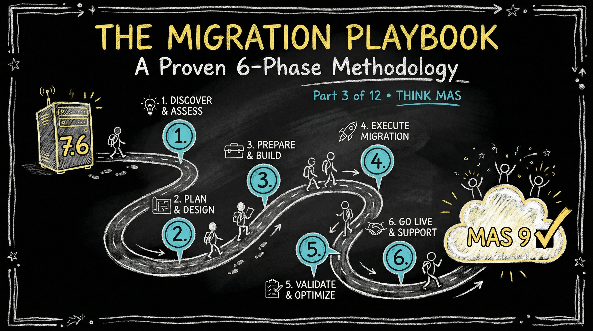

# The 7.6 to MAS Migration Playbook: A Proven 6-Phase Methodology



**Series:** Modern Maximo - Transforming from Legacy 7.x to MAS 9, Cloud-Native, and AI-Driven EAM | **Part 3 of 12**

**Read Time:** 25-30 minutes

> **Who this is for:** Maximo project managers, migration leads, solution architects, and IT directors responsible for planning or executing a 7.6.x to MAS 9 migration. Also valuable for consultants advising organizations on MAS transformation projects.

---

## Introduction: Why Most Migrations Fail (Or Drag on For Years)

You've read about the mindset shift. You understand the architecture. Now comes the hard part: actually migrating from Maximo 7.6.x to MAS 9.

Here's the uncomfortable truth: most MAS migration projects encounter serious problems. According to our field experience:

- **37% of migrations** significantly exceed their original timeline (by 6+ months)
- **28% of migrations** require emergency re-scoping after failed PoCs
- **19% of migrations** stall indefinitely in "pilot purgatory"
- **Only 16%** complete on time, on budget, with full scope delivered

Why such poor outcomes?

### The Fatal Mistakes

**Underestimating data complexity:** Teams discover their asset hierarchies, location structures, and classification schemas are fundamentally broken--six months into the project.

**Trying to "lift and shift" customizations:** Organizations attempt to replicate every 7.6.x customization in MAS without questioning whether they're still needed.

**Ignoring technical debt:** That custom Java class from 2009? The undocumented database trigger? The integration that "just works"? All become blockers.

**Skipping rationalization:** Everything from 7.6.x gets migrated, including retired workflows, obsolete reports, and unused integrations.

**Infrastructure surprises:** OpenShift requirements, storage configurations, and network policies emerge as blockers late in the project.

**Change management afterthought:** Training happens two weeks before go-live. Users rebel. Adoption fails.

But here's the good news: successful migrations follow a clear pattern. This blog gives you that proven playbook.

---

## The 6-Phase Migration Methodology

Successful MAS migrations follow this structure:

### Phase Overview

**Phase 1: Assessment** (4-6 weeks)

- Inventory current state
- Identify risks and gaps
- Define target architecture

**Phase 2: Rationalization** (6-8 weeks)

- Eliminate technical debt
- Modernize customizations
- Simplify integrations

**Phase 3: Data Preparation** (8-12 weeks)

- Cleanse master data
- Archive historical records
- Design migration strategy

**Phase 4: Build** (12-16 weeks)

- Configure MAS environment
- Develop integrations
- Create extensions

**Phase 5: Test** (8-10 weeks)

- Functional testing
- Performance validation
- Cutover rehearsals

**Phase 6: Go-Live & Hypercare** (4-8 weeks)

- Production cutover
- Intensive support period
- Stabilization

**Total duration:** 9-14 months for a typical mid-size implementation

*Note: These are full-time-equivalent (FTE) durations. Many phases overlap, and actual calendar time varies based on team availability and complexity.*

---

## Phase 1: Assessment (Weeks 1-6)

### Objective

Create a complete, honest inventory of your current Maximo environment and identify what will (and won't) work in MAS.

### Key Activities

**1. Application Landscape Inventory**

Document everything:

- Maximo version, fix pack level
- Application server (WebSphere/WebLogic version)
- Database (Oracle/SQL Server/DB2 version, size)
- Operating system and infrastructure
- Network architecture and security zones
- Disaster recovery and backup approach

**Deliverable:** Current state architecture diagram

**2. Customization Inventory**

Catalog all customizations:

- Custom Java classes (MBOs, app beans, handlers)
- Automation scripts
- Database triggers and stored procedures
- Custom applications and screens
- Workflow customizations
- Report templates
- Communication templates

**For each customization, document:**

- Purpose and business justification
- Last modified date
- Dependencies
- Complexity (simple/medium/complex)
- Usage frequency
- Owner/maintainer

**Tool:** Customization Inventory Spreadsheet

**3. Integration Inventory**

Map all integrations:

- Source/target systems
- Integration method (flat file, web service, database, MQ)
- Direction (inbound/outbound/bidirectional)
- Frequency (real-time, batch, scheduled)
- Data volume
- Business criticality
- Error handling approach

**Critical question:** Which integrations use direct database access?

**Tool:** Integration Inventory Spreadsheet

**4. Data Quality Assessment**

Evaluate master data quality:

- Asset hierarchy completeness
- Location structure integrity
- Classification schema usage
- Item master accuracy
- Person/labor records currency
- Duplicate detection
- Orphaned records

**Metrics to capture:**

- Asset records: total count, % with proper hierarchy
- Location records: total count, % with valid parent
- Work order records: total count, historical retention period
- Classification records: usage %, orphan count

**5. User Community Analysis**

Understand your users:

- User count by role (planners, supervisors, technicians, etc.)
- Geographic distribution
- Device types (desktop, mobile, tablet)
- Language requirements
- Accessibility needs
- Current training approach

**6. Infrastructure Assessment**

Evaluate infrastructure readiness for MAS:

- Current server capacity and utilization
- Storage configuration and performance
- Network bandwidth and latency
- Security policies and firewall rules
- Authentication systems (LDAP, AD, SSO)
- Monitoring and logging infrastructure

**For OpenShift:** Do you have it? Do you have expertise? Do you want to manage it?

**7. MAS Compatibility Analysis**

Run the compatibility check:

- Unsupported custom Java patterns
- Direct database access points
- Unsupported API usage
- Operating system/database compatibility
- Integration framework compatibility

**Tool:** IBM MAS Compatibility Checker (if available)

### Phase 1 Outputs

- Current state architecture diagram
- Customization inventory with complexity ratings
- Integration inventory with migration approach
- Data quality report with remediation needs
- Infrastructure gap analysis
- Risk register with mitigation strategies
- High-level migration roadmap
- Ballpark effort and cost estimate

### Common Phase 1 Pitfalls

**Rushing the assessment:** Teams eager to "start building" skip thorough discovery. They pay for it later.

**Incomplete customization inventory:** Undocumented database triggers and forgotten automation scripts surface mid-project.

**Ignoring data quality:** "We'll clean it up during migration" never works.

**Optimistic infrastructure assumptions:** "We'll just spin up OpenShift" underestimates the learning curve.

> **Key insight:** The Assessment phase is where migrations are won or lost. Teams that spend 4-6 weeks on thorough discovery avoid the 6-month surprises that derail projects. Every undocumented database trigger and forgotten automation script you find now is a crisis you prevent later.

---

## Phase 2: Rationalization (Weeks 7-14)

### Objective

Eliminate technical debt, simplify the environment, and design MAS-compatible solutions for legitimate requirements.

### The Rationalization Framework

For every customization, integration, and process, ask:

**1. Is it still needed?**

- When was it last used?
- Who depends on it?
- What happens if we turn it off?

**2. Can out-of-box MAS handle it?**

- Does MAS 9 have native capabilities?
- Can configuration replace customization?
- Can automation scripts replace Java?

**3. Should we redesign it?**

- Is the current approach MAS-compatible?
- Are there better patterns now?
- What's the cost vs. value?

**4. Must we retire it?**

- Is it technically incompatible with MAS?
- Does it create unacceptable risk?
- Can we live without it?

### Decision Tree

```
Customization/Integration
+-- Still needed?
|  +-- No -> RETIRE
|  +-- Yes -> Continue
|     +-- Out-of-box handles it?
|     |  +-- Yes -> REPLACE with configuration
|     |  +-- No -> Continue
|     |     +-- MAS-compatible approach exists?
|     |     |  +-- Yes -> REDESIGN
|     |     |  +-- No -> DEFER or escalate to IBM
```

### Key Activities

**1. Customization Rationalization**

Review each customization:

**Retire candidates:**

- Unused for 12+ months
- Duplicate functionality
- Workarounds for old product bugs
- Legacy integrations to decommissioned systems

**Replace with configuration candidates:**

- Simple field validations
- Workflow routing logic
- Conditional UI changes
- Report filters

**Redesign candidates:**

- Direct database access -> API calls
- Custom Java -> Automation scripts
- Database triggers -> Event handlers
- File-based integration -> REST API

**Keep as-is candidates (rare):**

- Complex, business-critical logic
- No MAS alternative yet
- High risk to change
- Plan: migrate carefully, test extensively

**2. Integration Rationalization**

For each integration:

**Assess current approach:**

- Direct database access -> Must redesign (API/events)
- Flat file batch -> Consider real-time API
- Web service (SOAP) -> Modernize to REST
- Message queue -> Evaluate Kafka migration

**Decision criteria:**

- Business criticality (high/medium/low)
- Technical complexity (simple/moderate/complex)
- Migration effort (days/weeks/months)
- Risk level (low/medium/high)

**Prioritization:** High criticality + high risk = redesign early

**3. Data Rationalization**

Define data strategy:

**What to migrate:**

- Active assets and locations
- Open work orders and service requests
- Current inventory balances
- Active contracts and purchasing agreements
- Recent maintenance history (12-24 months)

**What to archive:**

- Completed work orders older than retention period
- Historical inventory transactions
- Closed contracts
- Retired assets and locations

**What to cleanse:**

- Asset hierarchy gaps
- Location structure errors
- Duplicate person records
- Invalid classification assignments
- Orphaned records

**Archive strategy:**

- Keep 7.6.x environment read-only for 1-2 years
- Create data warehouse for historical reporting
- Export critical reports to PDF/Excel archives

**4. Infrastructure Planning**

Design target infrastructure:

**For on-premises:**

- OpenShift cluster sizing
- Storage requirements and architecture
- Network configuration and security
- Backup and disaster recovery
- Monitoring and observability

**For SaaS:**

- Data residency requirements
- Integration connectivity (VPN, Direct Connect)
- Identity provider integration
- Customization limitations assessment

### Phase 2 Outputs

- Rationalization decisions for all customizations
- Integration redesign specifications
- Data migration strategy document
- Archive and retention policy
- Target architecture design
- Detailed migration plan with work breakdown
- Updated risk register
- Revised effort and cost estimate

### Common Phase 2 Pitfalls

**Analysis paralysis:** Teams spend months debating every customization. Set decision deadlines.

**Keeping everything:** "We might need it someday" leads to bloated, complex migrations.

**Underestimating redesign effort:** Replacing a "simple" database trigger takes weeks, not days.

**Skipping stakeholder alignment:** Business owners discover retired functionality during UAT. Chaos ensues.

> **Key insight:** Rationalization is the phase where you earn the biggest returns. Organizations that rigorously question every customization typically retire 30-50% of their legacy modifications -- functionality that was either never used, duplicated by MAS out-of-box capabilities, or workarounds for bugs fixed years ago. Less to migrate means faster, cheaper, lower-risk delivery.

---

## Phase 3: Data Preparation (Weeks 15-26)

### Objective

Clean, structure, and prepare data for migration while establishing the technical migration pipeline.

### Why Data is the Hidden Monster

Data migration derails more MAS projects than any other factor. Why?

- **Decades of accumulated cruft:** Assets created in 1995 with incomplete data
- **Inconsistent practices:** Different sites using different naming conventions
- **Undocumented relationships:** Custom tables linked to standard tables
- **Volume:** 50 million work order history records to migrate (or not?)
- **Business logic in data:** Classification codes that trigger automation

### Key Activities

**1. Data Cleansing**

**Asset Master:**

- Fix hierarchy gaps (assets without parents)
- Standardize asset descriptions
- Complete missing critical fields
- Remove duplicates
- Retire obsolete assets

**Location Master:**

- Correct location hierarchy
- Fix circular references
- Standardize naming conventions
- Geocode for GIS applications
- Retire unused locations

**Classification:**

- Audit classification usage
- Consolidate redundant classifications
- Complete attribute specifications
- Remove orphaned classification records

**Item Master:**

- Deduplicate items
- Complete item descriptions
- Verify stocking locations
- Update item statuses
- Clean up vendor relationships

**Person/Labor:**

- Remove terminated employees
- Update labor rates
- Verify craft/skill assignments
- Consolidate duplicate person records

**Target:** 95%+ data quality before migration begins

**2. Historical Data Strategy**

**Work Order History:**

Decision framework:

- Closed < 2 years ago -> Migrate
- Closed 2-7 years ago -> Selective migration (PM history, critical assets)
- Closed > 7 years ago -> Archive only

**Why limit history?**

- Migration performance (millions of records)
- MAS database sizing and cost
- Rarely accessed data doesn't justify migration cost
- Historical reporting from archive/warehouse

**Inventory Transactions:**

- Current balances -> Migrate (with reconciliation)
- Historical transactions -> Archive
- Audit trail -> Export to data warehouse

**3. Data Migration Pipeline Development**

**Extract-Transform-Load (ETL) approach:**

**Extract:**

- SQL scripts to extract from 7.6.x database
- Data validation at source
- Incremental extraction capability

**Transform:**

- Data cleansing rules
- Format conversions
- Default value population
- Business rule application
- Validation checks

**Load:**

- MAS API consumption (not direct database)
- Batch sizing optimization
- Error handling and logging
- Rollback capability
- Progress tracking

**Tools:**

- IBM Maximo Integration Framework (MIF)
- Custom ETL scripts (Python, Java)
- Third-party tools (Talend, Informatica)
- IBM App Connect (for cloud deployments)

**4. Migration Validation Framework**

Define success criteria:

**Record counts:**

- Assets: 7.6.x count = MAS count +/- expected difference
- Locations: Match within tolerance
- Work orders: Match for in-scope period
- Inventory: Balance reconciliation

**Data integrity:**

- Hierarchy relationships preserved
- Classification assignments intact
- Custom attributes migrated correctly
- Attachments linked properly

**Business validation:**

- Can users find their assets?
- Do work order histories make sense?
- Are PM schedules correct?
- Do inventory balances reconcile?

**5. Delta Migration Strategy**

Plan for changes during migration:

**Initial load:** Baseline data from 7.6.x

**Delta loads:** Capture changes between initial load and cutover

- New work orders created
- Inventory transactions
- Asset updates
- PM completions

**Cutover approach:**

- Freeze 7.6.x (read-only mode)
- Final delta load
- Validation
- Production cutover
- Unfreeze MAS

**Cutover window:** Plan for 48-72 hours

> **Key insight:** Data migration derails more MAS projects than any other factor. The key is achieving 95%+ data quality before migration begins -- not during it. Cleaning data in MAS is exponentially harder and more expensive than cleaning it in your familiar 7.6.x environment. Invest the time here; it pays back tenfold.

---

## Phase 4: Build (Weeks 27-42)

### Objective

Configure MAS environment, develop integrations, and create extensions based on rationalization decisions.

### Key Activities

**1. MAS Environment Provisioning**

Stand up your target environments:

- **Development environment:** First MAS instance for the team
- **Test/QA environment:** Mirror of production configuration
- **Pre-production/Staging:** Identical to production for cutover rehearsals
- **Production environment:** Final target (provisioned early, configured last)

**For on-premises:**

- Deploy OpenShift cluster (minimum 3 control plane, 3+ worker nodes)
- Configure persistent storage (Ceph, NFS, or enterprise SAN)
- Install MAS operators via Operator Hub
- Configure networking, DNS, and TLS certificates
- Integrate with LDAP/Active Directory for authentication

**For SaaS:**

- Work with IBM to provision tenant
- Configure VPN or Direct Connect for on-premises integrations
- Set up identity provider federation (SAML/OIDC)
- Establish data residency and compliance requirements

**Deliverable:** Fully provisioned MAS environments with validated connectivity

**2. Application Configuration**

Configure MAS Manage to match your rationalized requirements:

- **System properties:** Reapply relevant system properties from 7.6.x
- **Security groups:** Recreate security group structure and permissions
- **Organizations and sites:** Configure organizational hierarchy
- **GL accounts and financial setup:** Chart of accounts, financial periods
- **Classification structures:** Import rationalized classifications
- **Domains and lookups:** Recreate custom domains and value lists
- **Communication templates:** Rebuild email and notification templates
- **Escalations:** Reconfigure time-based triggers
- **Workflows:** Rebuild or redesign workflow processes

**Important:** Do not replicate your 7.6.x configuration blindly. Use rationalization decisions from Phase 2 to configure only what is needed.

**3. Automation Script Development**

Build the replacement logic for retired Java customizations:

- Convert custom MBO logic to automation scripts (Python or JavaScript)
- Implement launch points (object, attribute, action)
- Create library scripts for shared functions
- Build integration scripts for external system communication
- Develop error handling and logging patterns

**Development standards:**

- Version control all scripts (Git repository)
- Code review for every script before deployment
- Unit test each script in development environment
- Document launch points and trigger conditions
- Follow naming conventions consistently

**4. Integration Development**

Build MAS-compatible integrations based on Phase 2 redesign specs:

**REST API integrations:**

- Configure Object Structures for each integration point
- Set up API keys and OAuth authentication
- Build outbound REST calls for push integrations
- Configure inbound endpoints for receiving data

**Event-driven integrations:**

- Configure Kafka topics for real-time messaging
- Build event producers for outbound notifications
- Create event consumers for inbound data streams
- Implement dead-letter queues for failed messages

**Batch integrations:**

- Configure Integration Framework channels
- Set up scheduled import/export processes
- Build reconciliation logic for batch loads
- Implement error handling and retry mechanisms

**For each integration, validate:**

- Authentication and authorization
- Data mapping and transformation
- Error handling and alerting
- Performance under expected volume
- Retry and recovery behavior

**5. Report Migration**

Rebuild reporting capabilities:

- Identify reports that need recreation in MAS
- Evaluate MAS native reporting vs. external BI tools
- Build high-priority reports first (daily operational reports)
- Configure report scheduling and distribution
- Validate report output against 7.6.x baseline

**6. Mobile Configuration**

If using Maximo Mobile:

- Configure mobile application packages
- Define inspection forms and work list views
- Set up offline data synchronization rules
- Configure barcode/QR code scanning
- Test on target device types (iOS, Android, rugged devices)

**7. Data Migration Pipeline Execution**

Run the ETL pipeline developed in Phase 3:

- Execute initial bulk data load into development environment
- Validate record counts and data integrity
- Fix transformation issues discovered during load
- Re-run with corrections until quality thresholds are met
- Document all data anomalies and resolution decisions

### Phase 4 Outputs

- Fully configured MAS environments (Dev, Test, Pre-prod)
- All automation scripts developed, reviewed, and deployed
- Integration interfaces built and connectivity verified
- Reports rebuilt and validated
- Mobile configuration complete
- Initial data load validated in development environment
- Updated risk register with build-phase discoveries

### Common Phase 4 Pitfalls

**Starting configuration before rationalization is complete:** Building on shifting requirements wastes effort and creates rework.

**Replicating 7.6.x configuration verbatim:** The goal is not a copy -- it is a modernized, rationalized configuration that leverages MAS capabilities.

**Neglecting development standards:** Automation scripts without version control, reviews, or naming conventions become the next generation of technical debt.

**Underestimating integration complexity:** API-based integrations require different error handling, authentication, and monitoring than direct database approaches.

---

## Phase 5: Test (Weeks 43-52)

### Objective

Validate that MAS meets functional requirements, performs adequately, and can be safely cutover to production.

### Key Activities

**1. Functional Testing (Weeks 43-46)**

Verify that every business process works correctly in MAS:

**Core process testing:**

- Work order creation, planning, scheduling, execution, completion
- Preventive maintenance generation and scheduling
- Inventory management (receipt, issue, transfer, cycle count)
- Purchasing workflow (PR, PO, receipt, invoice)
- Asset management (creation, hierarchy, moves, retirements)
- Service requests and help desk processes

**Customization testing:**

- Every automation script with all trigger conditions
- All custom domains and conditional expressions
- Rebuilt workflows end-to-end
- Communication templates (email delivery and formatting)
- Escalation triggers and actions

**Integration testing:**

- Each integration point with live connected systems
- Inbound data flow validation (correct mapping, error handling)
- Outbound data flow validation (correct payload, authentication)
- Error scenarios (system unavailable, invalid data, timeouts)
- Volume testing (expected daily transaction counts)

**Report testing:**

- Every migrated report against 7.6.x baseline output
- Report scheduling and distribution
- Report parameters and filters
- Data accuracy and completeness

**2. User Acceptance Testing (Weeks 46-48)**

Business users validate the system against their daily work:

- Recruit testers from each user role (planners, supervisors, technicians, buyers, etc.)
- Provide structured test scripts based on real business scenarios
- Track defects with severity and priority classifications
- Hold daily triage sessions to resolve issues quickly
- Obtain formal sign-off from business process owners

**UAT success criteria:**

- Zero critical defects (system unusable or data corruption)
- Fewer than 5 high-severity defects (workaround available)
- All medium/low defects documented with fix timeline
- Business owner sign-off for each functional area

**3. Performance Testing (Weeks 48-49)**

Validate that MAS performs acceptably under production-like conditions:

- **Baseline testing:** Response times for key transactions under normal load
- **Load testing:** Simulate expected concurrent user count
- **Stress testing:** Push beyond expected load to find breaking points
- **Endurance testing:** Sustained load over extended period (memory leaks, connection pool exhaustion)

**Key metrics to validate:**

- Page load times (target: under 3 seconds)
- API response times (target: under 1 second for simple queries)
- Report generation times
- Search response times
- Mobile sync times
- Integration throughput (records per minute)

**Performance baselines:** Compare against 7.6.x performance where applicable. Users will notice and complain if MAS is slower for daily operations.

**4. Security Testing (Week 49)**

Validate security configuration:

- Security group permissions (correct access for each role)
- Data-level security (site/org restrictions)
- API authentication and authorization
- SSL/TLS certificate validation
- Penetration testing (if required by compliance)
- Audit trail verification

**5. Cutover Rehearsals (Weeks 50-52)**

Practice the production cutover -- at least twice:

**Rehearsal 1 (Week 50):**

- Execute full cutover procedure against pre-production environment
- Time each step meticulously
- Identify bottlenecks and failures
- Document issues and corrective actions
- Measure total cutover duration

**Rehearsal 2 (Week 51-52):**

- Execute refined cutover procedure
- Validate all corrections from Rehearsal 1
- Confirm cutover fits within planned maintenance window
- Test rollback procedure (can you go back to 7.6.x if needed?)
- Obtain go/no-go decision criteria agreement from stakeholders

**Cutover runbook should include:**

- Pre-cutover checklist (communications sent, backups complete, teams on standby)
- Step-by-step procedure with responsible person and expected duration
- Validation checkpoints (data counts, smoke tests, integration health)
- Go/no-go decision points
- Rollback procedure with trigger criteria
- Post-cutover verification steps

### Phase 5 Outputs

- Functional test results with defect resolution status
- UAT sign-off from business process owners
- Performance test results with baseline comparison
- Security validation report
- Validated cutover runbook (tested in at least 2 rehearsals)
- Go/no-go decision criteria agreed with stakeholders
- Training materials finalized
- Communication plan for go-live

### Common Phase 5 Pitfalls

**Insufficient UAT participation:** Business users are "too busy" to test. Mandate participation -- they will be living with this system.

**Skipping performance testing:** "It works in dev" does not mean it works with 500 concurrent users and 10 million records.

**Only one cutover rehearsal:** The first rehearsal always surfaces issues. The second rehearsal validates your fixes. One is not enough.

**No rollback plan:** Hope is not a strategy. Know exactly how you will revert to 7.6.x if the cutover fails.

---

## Phase 6: Go-Live & Hypercare (Weeks 53-60)

### Objective

Execute production cutover, provide intensive user support, and stabilize the environment.

### Key Activities

**1. Pre-Cutover Preparation (Week 53)**

Final preparations before the production switch:

- Send go-live communications to all stakeholders
- Confirm all teams are available for cutover window
- Verify backup of 7.6.x production environment (full database, filesystem, configuration)
- Validate that MAS production environment is ready (configuration, integrations, connectivity)
- Pre-stage data migration scripts and validation queries
- Set up war room (physical or virtual) with communication channels
- Distribute cutover runbook to all participants

**Go/no-go checklist:**

- All critical and high-severity defects resolved
- UAT sign-off obtained from all business areas
- Cutover rehearsal completed successfully within time window
- Rollback procedure tested and documented
- Training completed for all user groups
- Support team staffed and briefed
- Communication plan executed (users know what is happening and when)

**2. Production Cutover (Cutover Weekend)**

Execute the cutover runbook:

**Step 1: Freeze 7.6.x (Friday evening)**
- Set 7.6.x to read-only mode
- Communicate freeze to all users
- Capture final transaction counts for reconciliation

**Step 2: Final data extraction and delta load (Friday night - Saturday morning)**
- Extract delta data since last sync
- Transform and validate delta records
- Load into MAS production
- Verify record counts and data integrity

**Step 3: Integration cutover (Saturday)**
- Redirect integration endpoints from 7.6.x to MAS
- Validate each integration connection
- Run test transactions through each interface
- Confirm bidirectional data flow

**Step 4: Validation and smoke testing (Saturday afternoon - Sunday morning)**
- Execute smoke test scripts across all functional areas
- Verify data accuracy for sample records
- Test critical business processes end-to-end
- Validate report generation
- Confirm mobile connectivity
- Run security verification checks

**Step 5: Go/no-go decision (Sunday morning)**
- Review all validation results
- Assess outstanding issues and workarounds
- Make formal go/no-go decision
- If GO: proceed to user access enablement
- If NO-GO: execute rollback procedure

**Step 6: Enable user access (Sunday afternoon)**
- Open MAS access to pilot users for final verification
- Confirm pilot users can complete key transactions
- Open access to all users
- Send go-live confirmation communication

**3. Hypercare Period (Weeks 54-60)**

Provide intensive support immediately after go-live:

**Week 1 (Critical stabilization):**

- War room staffed continuously (extended hours, not necessarily 24/7 unless warranted)
- Dedicated support team triaging issues in real-time
- Daily stakeholder status calls
- Rapid defect resolution (4-hour SLA for critical, 24-hour for high)
- Monitor system performance continuously
- Track integration health and error rates

**Weeks 2-3 (Active monitoring):**

- Reduce war room to business hours
- Address accumulated medium/low-priority defects
- Performance tuning based on real production workload
- User coaching and advanced training sessions
- Process refinement based on user feedback
- Integration optimization (error rate reduction, throughput tuning)

**Weeks 4-8 (Stabilization and transition):**

- Transition from project support to BAU (business-as-usual) operations
- Document all post-go-live changes and workarounds
- Conduct lessons-learned workshops
- Update runbooks and operational procedures
- Train BAU support team on MAS administration
- Close out project defects and change requests
- Plan Phase 2 enhancements (features deferred from initial scope)

**4. 7.6.x Decommission Planning**

Do not rush to decommission 7.6.x:

- Keep 7.6.x in read-only mode for 3-6 months minimum
- Provide access for historical data lookups during transition
- Export critical historical reports to archive
- Plan formal decommission date after stabilization confirmed
- Execute data retention compliance requirements
- Archive or destroy 7.6.x environment per policy

### Phase 6 Outputs

- Production MAS environment live and serving users
- Hypercare issue log with resolution status
- Performance baseline from first month of production
- Lessons-learned document
- BAU operations handoff complete
- 7.6.x decommission plan and timeline
- Phase 2 enhancement backlog prioritized

### Common Phase 6 Pitfalls

**Inadequate hypercare staffing:** Go-live without dedicated support is reckless. Users will have questions and issues -- be there for them.

**Declaring victory too early:** Week 1 stability does not mean the migration is complete. Month-end processing, quarterly reports, and seasonal workload spikes will surface issues you have not seen yet.

**Rushing 7.6.x decommission:** Users need historical reference. Cutting off 7.6.x access too soon creates frustration and forces MAS data to compensate for missing history.

**Ignoring change management:** Technical cutover is half the battle. Users who do not feel supported will resist adoption, create workarounds, and undermine the investment.

---

## Key Takeaways

- **Successful MAS migrations follow a structured 6-phase approach**: Assessment, Rationalization, Data Preparation, Build, Test, and Go-Live with Hypercare
- **Most migrations fail or drag due to underestimating data complexity, attempting lift-and-shift of customizations, and ignoring technical debt**
- **Rationalization is critical**: Question everything--retire, replace with configuration, or redesign for MAS compatibility
- **Data quality must reach 95%+ before migration begins**--cleaning data in MAS is exponentially harder
- **Multiple cutover rehearsals are non-negotiable**--first attempt should not be in production

---

## Resources for Your Journey

### IBM Official
- [MAS 9.0 Documentation](https://www.ibm.com/docs/en/mas-cd/continuous-delivery)
- [MAS Migration Guide](https://www.ibm.com/docs/en/mas-cd/continuous-delivery?topic=upgrading-maximo-application-suite)
- [MAS Manage Data Migration](https://www.ibm.com/docs/en/mas-cd/continuous-delivery?topic=manage-migrating-data)
- [MAS System Requirements](https://www.ibm.com/docs/en/mas-cd/continuous-delivery?topic=suite-system-requirements)

### Community
- [IBM Maximo Community](https://community.ibm.com/community/user/asset-facilities)
- [Maximo Secrets Blog](https://maximosecrets.com)
- [IBM TechXchange MAS Migration Discussions](https://community.ibm.com/community/user/asset-facilities/communities/community-home?CommunityKey=5e27e1e0-1e2f-4f2b-9f5b-0e5e5e5e5e5e)

### Training
- [IBM MAS Administration (MAX0150G)](https://www.ibm.com/training/course/maximo-application-suite-administration-MAX0150G)
- [IBM MAS Manage Fundamentals (MAX0151G)](https://www.ibm.com/training/course/maximo-application-suite-manage-fundamentals-MAX0151G)
- [Red Hat OpenShift Administration (DO280)](https://www.redhat.com/en/services/training/do280-red-hat-openshift-administration-ii)

### Tools
- [IBM App Connect](https://www.ibm.com/products/app-connect) -- Integration platform for MAS data migration
- [IBM Maximo Health Check](https://www.ibm.com/support/pages/maximo-health-check) -- Pre-migration assessment

---

**Previous:** [MAS 9 Architecture Deep Dive](/posts/THINK-MAS/mas9-architecture-deep-dive)

**Next:** [Stop Customizing Maximo the Old Way](/posts/THINK-MAS/stop-customizing-old-way)

**Series:** THINK MAS -- Modern Maximo | Part 3 of 12

---

**About TheMaximoGuys:** We help Maximo developers and teams make the transition from 7.6.x thinking to MAS mastery. We've been through the journey ourselves--and we're here to make yours smoother.

*Part of the "THINK MAS" Series | Published by TheMaximoGuys | [Subscribe for Updates](#)*
